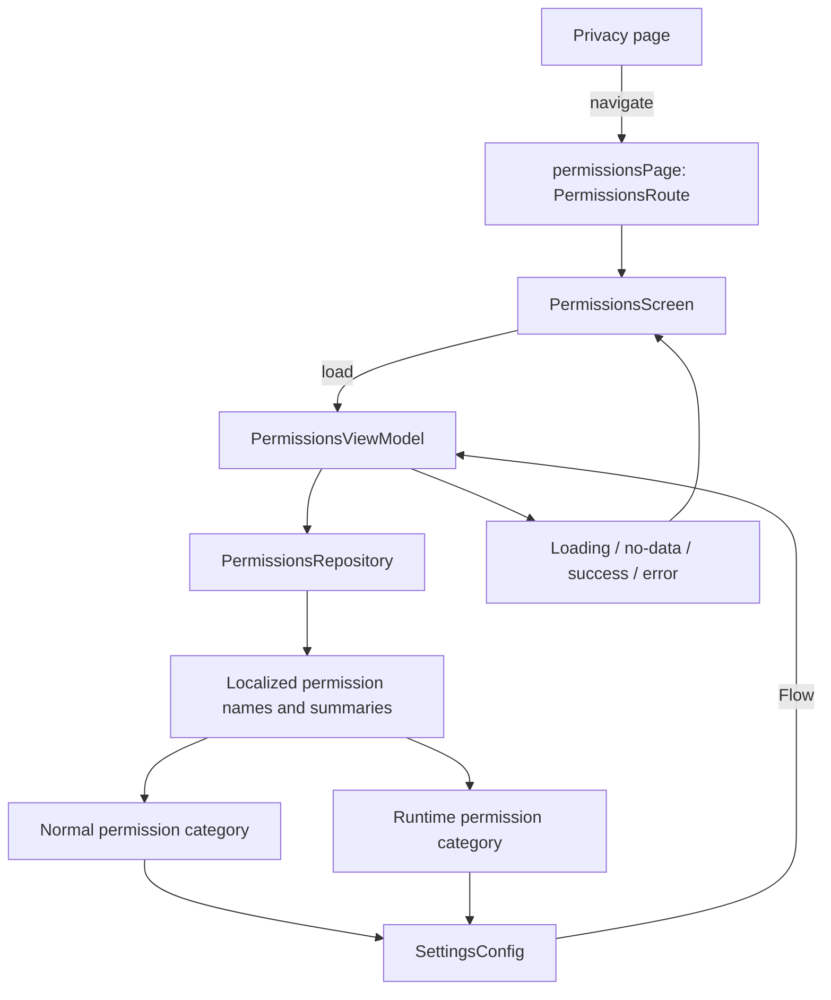

# `:library:feature:permissions` Logic Graph

## Purpose

Displays a localized explanation of the permissions used by AppToolkit hosts.

## Owns

- `PermissionsScreen`, `PermissionsViewModel` and their event and action contracts.
- `permissionsPage()`, the registration of `PermissionsRoute`.
- `PermissionsRepository` and its resource-backed implementation, which builds the normal/runtime
  permission catalog.

## Does not own

- The privacy page that links here, owned by [`:library:feature:privacy`](../privacy/README.md).
- The screen Android's permission manager opens for the app. That is the privacy page, opened by
  `PermissionUsageActivity` in [`:library:apptoolkit`](../../apptoolkit/README.md), which links
  here.
- Generic permission helpers/constants, owned by `:library:core:common`.
- Runtime grant inspection or system-settings actions; this screen is descriptive and does not
  claim to report current grant state.

## Depends on

- `:library:core:common`, `:library:core:network`, and `:library:core:ui` for platform helpers,
  dispatchers/errors, and presentation foundations.
- [`:library:navigation`](../../navigation/README.md) for the key and the graph builder.
- No other feature module. The catalog is described with the settings models of
  [`:library:core:ui`](../../core/ui/README.md).

## Used by

- [`:library:apptoolkit`](../../apptoolkit/README.md), which calls `permissionsPage()` from
  `toolkitPages()`.

## Flow chart

```mermaid
flowchart TD
    Privacy[Privacy page] -->|navigate| Page[permissionsPage: PermissionsRoute]
    Page --> Screen[PermissionsScreen]
    Screen -->|load| VM[PermissionsViewModel]
    VM --> Repo[PermissionsRepository]
    Repo --> Resources[Localized permission names and summaries]
    Resources --> Normal[Normal permission category]
    Resources --> Runtime[Runtime permission category]
    Normal --> Config[SettingsConfig]
    Runtime --> Config
    Config -->|Flow| VM
    VM --> State[Loading / no-data / success / error]
    State --> Screen
```

## Architectural decisions

- The page is `PaneRole.None`: it opens from the privacy page, itself a detail beside the settings
  list, and a detail opened from a detail would replace it instead of stacking on it.
- This feature intentionally has no `domain` package: its ViewModel consumes one repository and
  contains no reusable business rule or repository coordination that would justify a use case.
- The screen is a disclosure catalog, not a permission checker. It does not query `PackageManager`
  or infer whether a runtime permission is currently granted.
- Resource-backed catalog assembly stays in the repository so the ViewModel handles only
  loading/error state and the composable renders the shared settings models.
- The repository emits through a `Flow` on the injected IO dispatcher, matching the feature's
  screen-state pipeline even though the current catalog is produced in one shot.

## Public contracts

- `PermissionsRepository`, `PermissionsScreen`, `permissionsPage()` and the presentation contracts.

## Internal implementations

- Localized catalog assembly and screen rendering.

## Current risks

The catalog is descriptive and fixed at build time: a permission added to the app's manifest
appears here only once its name and summary are added to the resources.
