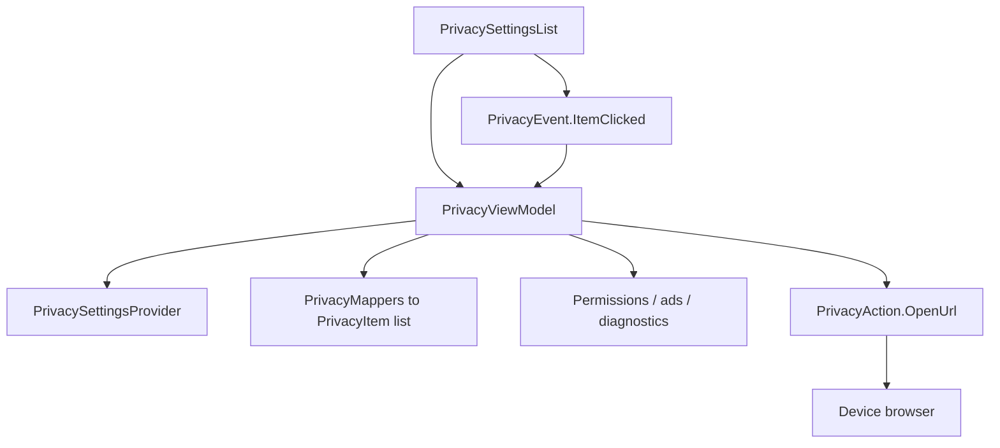

# `:library:feature:privacy` Logic Graph

## Purpose

Owns the privacy and legal preference surface: policy links, the host destinations reached from it,
and the strings that name them.

## Owns

- `PrivacySettingsList`, the data-driven privacy and legal preference list.
- `PrivacyViewModel`, `PrivacyUiState`, `PrivacyItem`, and the click routing between them.
- `PrivacySettingsProvider`, the host contract supplying URLs and the destinations to open.
- Privacy, legal, ads, permissions, and usage-and-diagnostics strings.

## Does not own

- The ads, permissions, and usage-and-diagnostics screens themselves, owned by
  `:library:integration:ads`, [`:library:feature:permissions`](../permissions/README.md), and the
  host.
- The settings destination that renders this list, owned by
  [`:library:feature:settings`](../settings/README.md).
- Consent collection, owned by `:library:integration:consent`.

## Depends on

- `:library:core:common` and `:library:core:ui` for shared state, platform helpers, and Compose.
- `:library:integration:consent` for the privacy flows hosts wire behind the provider.

## Used by

- `:library:apptoolkit`, `:library:feature:settings`, and `:sample`.

## Flow chart

## Architectural decisions

- The list is data-driven: `PrivacyViewModel` maps the host-supplied `PrivacySettingsProvider` into
  an ordered list of `PrivacyItem` models with pre-computed card positions, so the composable stays
  declarative and the entries are testable without Compose.
- Opening a URL needs a `Context`, so it leaves the ViewModel as a `PrivacyAction` the screen
  performs. Destinations the provider owns are invoked directly, because the host already holds
  whatever it needs to open them.
- Provider URLs keep interface defaults from `AppLinks`, so a host overrides only the links it
  actually changes.

## Public contracts

- `PrivacySettingsProvider`, `PrivacySettingsList`, `PrivacyViewModel`, `PrivacyUiState`,
  `PrivacyItem`, `PrivacyItemAction`, `PrivacyEvent`, `PrivacyAction`, and `privacyModule`.

## Internal implementations

- Privacy item assembly with grouped card position calculation, and preference tap analytics.

## Current risks

`PrivacySettingsProvider` mixes link configuration with navigation callbacks, so a host that only
wants different URLs still has to implement three navigation methods.
