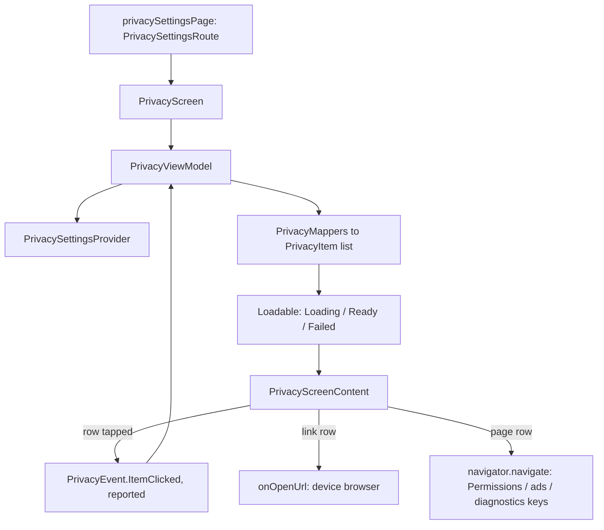

# `:library:feature:privacy` Logic Graph

## Purpose

Owns the privacy and legal preference surface: policy links, the host destinations reached from it,
and the strings that name them.

## Owns

- `PrivacyScreen`, the data-driven privacy and legal preference list, which opens each row's link
  or page, and `PrivacyScreenContent`, the stateless list with its loading and failure states.
- Its rows in the settings search, a `settingsSearchProvider` bound as `privacy`: permissions, ads
  and usage and diagnostics, each naming the page it opens instead of the privacy page.
- `PrivacyViewModel`, `PrivacyUiState` (whose `items` is a `Loadable`), `PrivacyEvent` and
  `PrivacyItem`.
- `PrivacySettingsProvider`, the host contract supplying the legal URLs.
- `privacySettingsPage()`, the registration of `PrivacySettingsRoute` as a detail of the settings
  list.
- Being the page Android's permission manager and privacy dashboard open from the information icon
  beside the app. `PermissionUsageActivity` in [`:library:apptoolkit`](../../apptoolkit/README.md)
  shows it on its own, with the pages it links to, over the system's settings.
- Privacy, legal, ads, permissions, and usage-and-diagnostics strings.

## Does not own

- The ads, permissions, and usage-and-diagnostics pages, owned by `:library:integration:ads`,
  [`:library:feature:permissions`](../permissions/README.md) and
  [`:library:feature:diagnostics`](../diagnostics/README.md). This list opens them by key.
- The settings list whose row opens this page, owned by
  [`:library:feature:settings`](../settings/README.md).
- Consent collection, owned by `:library:integration:consent`.

## Depends on

- `:library:core:common` and `:library:core:ui` for shared state, platform helpers, Compose and,
  through `:library:core:ui`, the keys and graph builder of `:library:navigation`.
- No other feature or integration module.

## Used by

- [`:library:apptoolkit`](../../apptoolkit/README.md), which calls `privacySettingsPage()` from
  `toolkitPages()`, and `:sample:core:apptoolkit`, which binds a default provider.

## Flow chart

```mermaid
flowchart TD
    Page[privacySettingsPage: PrivacySettingsRoute] --> Screen[PrivacyScreen]
    Screen --> VM[PrivacyViewModel]
    VM --> Provider[PrivacySettingsProvider]
    VM --> Mapper[PrivacyMappers to PrivacyItem list]
    Mapper --> State[Loadable: Loading / Ready / Failed]
    State --> Content[PrivacyScreenContent]
    Content -->|row tapped| Click[PrivacyEvent.ItemClicked, reported]
    Click --> VM
    Content -->|link row| OpenUrl[onOpenUrl: device browser]
    Content -->|page row| Navigate[navigator.navigate: Permissions / ads / diagnostics keys]
```

## Architectural decisions

- The list is data-driven: `PrivacyViewModel` maps the host-supplied `PrivacySettingsProvider` into
  an ordered list of `PrivacyItem` models with pre-computed card positions, so the composable stays
  declarative and the entries are testable without Compose.
- The page is on `core.ui.screen`. `PrivacyUiState.items` is a `Loadable`: the rows are `Ready`
  once built, and a provider that throws is `Loadable.Failed`, reported to telemetry, with a retry.
  The provider only returns URLs, so the ViewModel takes no dispatcher.
- Opening a URL needs a `Context`, and opening a page needs the shell's navigator, so
  `PrivacyScreen` does both from callbacks of the stateless `PrivacyScreenContent`: `onOpenUrl`,
  `onOpenPermissions`, `onOpenAds` and `onOpenUsageAndDiagnostics`. The ViewModel does not navigate.
  A tap still reaches it as `PrivacyEvent.ItemClicked`, which it reports as the `openPrivacyItem`
  operation the dashboards already count.
- The permissions, ads and diagnostics rows open their Toolkit keys, so the provider supplies no
  callback for each, and an app replaces one of those pages by registering its key.
- Provider URLs keep interface defaults from `AppLinks`, so a host overrides only the links it
  actually changes.

## Public contracts

- `PrivacySettingsProvider`, `PrivacyScreen`, `PrivacyViewModel`, `PrivacyUiState`,
  `PrivacyItem`, `PrivacyItemAction`, `PrivacyEvent`, `privacySettingsPage()` and `privacyModule`.
  `PrivacyScreenContent` is internal.

## Internal implementations

- Privacy item assembly with grouped card position calculation, and preference tap analytics.

## Current risks

The permissions, ads and diagnostics rows are always listed. An app without one of those pages has
to register its own page for the key, or the row opens nothing.
