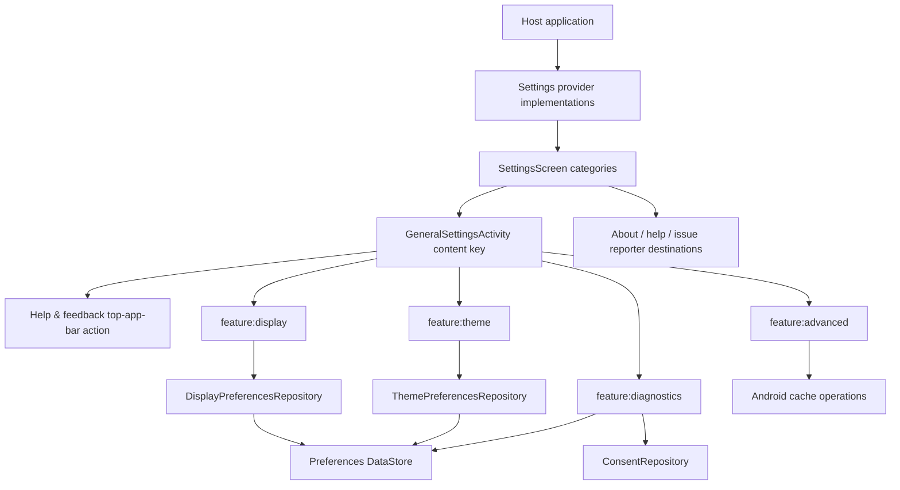

# `:library:feature:settings` Logic Graph

## Purpose

Composes the toolkit's root and general settings experiences, and integrates the dedicated display,
theme, advanced, and usage/diagnostics feature modules.

## Owns

- Settings screen/activity/ViewModel and configurable category/preference models.
- General settings repository/presentation flow, including the standalone screen's Help & feedback
  top-app-bar shortcut.
- `SettingsProvider`, and default content providers that integrate the dedicated settings modules.

## Does not own

- Host-specific settings categories/content, owned by `:sample` provider implementations.
- Host identity strings, supplied as overridable defaults by `:library:core:common`.
- Consent SDK operations, delegated to `:library:integration:consent`.
- About/help/issue-reporter feature implementations, owned by their modules.
- Theme primitives and persisted storage, owned by core design system/DataStore.

## Depends on

- `:library:core:common`, `:library:core:datastore`, `:library:core:network`, `:library:core:ui`,
  and `:library:navigation` for shared infrastructure.
- Each settings feature owns its localized resources in `src/main/res`; no shared settings resource
  subproject is required.
- `:library:feature:advanced`, `:library:feature:diagnostics`, `:library:feature:display`, and
  `:library:feature:theme` for dedicated settings surfaces.
- [`:library:integration:consent`](../../integration/consent/README.md) for diagnostics consent
  updates.
- `:library:feature:about`, `:library:feature:help`, and `:library:feature:issuereporter` to compose
  related settings destinations/content.

## Used by

- `:sample`, `:library:apptoolkit`, `:library:feature:onboarding`, and
  `:library:feature:permissions`.

## Flow chart

## Architectural decisions

- `ui/general` is the explicit category-content route: the root settings screen lists categories,
  and General Settings renders the selected content key, either embedded or in its own activity.
- Layers follow ownership, as described in [the architecture rules](../../../docs/notes/module-structure.md).
  Display and theme consume core preference repositories directly and do not duplicate data layers.
- Host provider contracts describe categories and callbacks; each settings feature module owns its
  own state holders, repositories, UI, and Koin bindings.
- Display and theme remain separate modules because they expose live preference state to more than
  one presentation surface, including onboarding.
- Content keys select a known toolkit surface instead of allowing providers to reach into internal
  composables.
- Cache work and consent application stay behind their repositories; settings UI coordinates them
  but does not become a platform or SDK data source.

## Public contracts

- Settings/provider interfaces, settings category/preference/config models, repository contracts,
  and screen/ViewModel contracts. Host startup dialogs receive the current route and return only a
  confirmed selection; the toolkit state holder performs persistence.

## Internal implementations

- Default content providers, the General Settings repository, category routing, and settings lists. Cache operations and consent UI belong to advanced and diagnostics respectively.

## Current risks

This composition module directly depends on seven other feature modules and is itself a dependency of onboarding
and permissions. The resulting feature-level coupling makes route/provider changes likely to ripple
across the graph.
