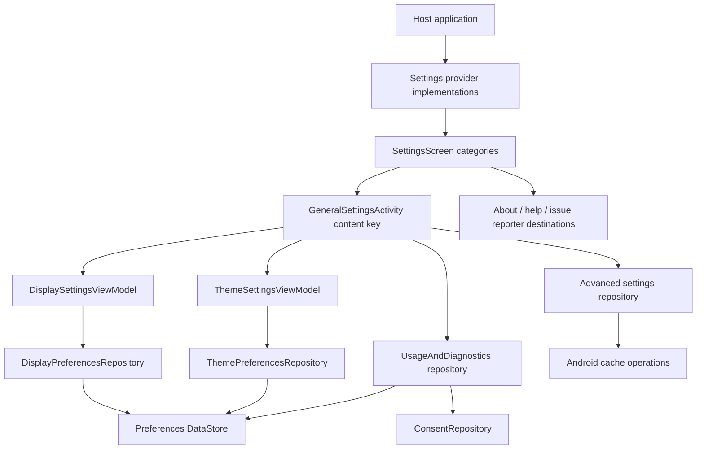

# `:library:feature:settings` Logic Graph

## Purpose

Composes the toolkit's root, general, display, advanced, and usage/diagnostics settings experiences
and exposes host provider extension points.

## Owns

- Settings screen/activity/ViewModel and configurable category/preference models.
- `DisplaySettingsViewModel`, which owns display-preference observation and persistence while the
  display list and selection dialogs remain presentation-only.
- `ThemeSettingsViewModel`, which owns theme preference observation and mutations for the dedicated
  theme settings surface.
- General settings repository/presentation flow.
- Advanced cache repository and settings flow.
- Usage-and-diagnostics repository/model/presentation flow.
- `SettingsProvider`, display/advanced provider contracts, and default content providers.

## Does not own

- Host-specific settings categories/content, owned by `:sample` provider implementations.
- Host identity strings, supplied as overridable defaults by `:library:core:common`.
- Consent SDK operations, delegated to `:library:integration:consent`.
- About/help/issue-reporter feature implementations, owned by their modules.
- Theme primitives and persisted storage, owned by core design system/DataStore.

## Depends on

- `:library:core:common`, `:library:core:datastore`, `:library:core:network`, `:library:core:ui`,
  and `:library:navigation` for shared infrastructure.
- [`:library:integration:consent`](../../integration/consent/README.md) for diagnostics consent
  updates.
- `:library:feature:about`, `:library:feature:help`, and `:library:feature:issuereporter` to compose
  related settings destinations/content.

## Used by

- `:sample`, `:library:apptoolkit`, `:library:feature:onboarding`, and
  `:library:feature:permissions`.

## Flow chart

## Architectural decisions

- Host provider contracts describe categories and callbacks; toolkit ViewModels remain the owners
  of observable state and persistence.
- Display and theme use dedicated state holders because they expose live preference state to more
  than one presentation surface, including onboarding.
- Content keys select a known toolkit surface instead of allowing providers to reach into internal
  composables.
- Cache work and consent application stay behind their repositories; settings UI coordinates them
  but does not become a platform or SDK data source.

## Public contracts

- Settings/provider interfaces, settings category/preference/config models, repository contracts,
  and screen/ViewModel contracts. Host startup dialogs receive the current route and return only a
  confirmed selection; the toolkit state holder performs persistence.

## Internal implementations

- Default content providers, cache operations, DataStore-backed repositories, settings lists, and
  consent-section UI.

## Current risks

This module directly depends on three other feature modules and is itself a dependency of onboarding
and permissions. The resulting feature-level coupling makes route/provider changes likely to ripple
across the graph.
