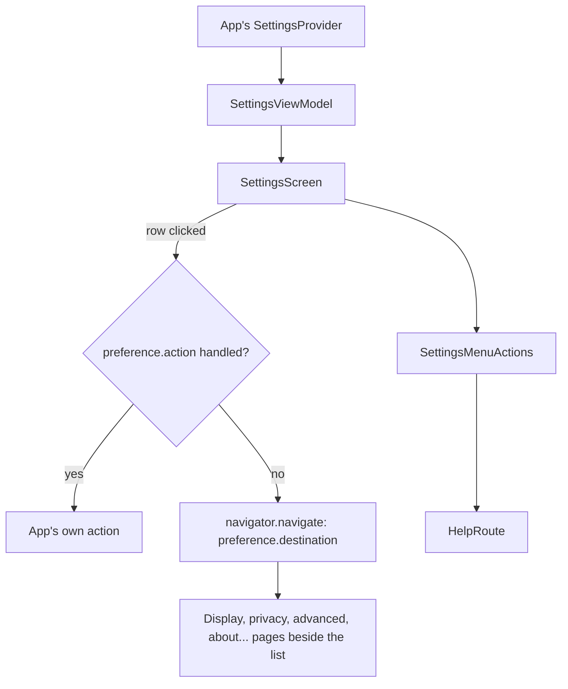

# `:library:feature:settings` Logic Graph

## Purpose

Draws the Toolkit's settings list: the categories and rows an app's `SettingsProvider` describes,
each row opening its destination in the shell.

## Owns

- `SettingsScreen`, `SettingsViewModel`, their action and event contracts, and the list's overflow
  menu (`SettingsMenuActions`, which opens Help and feedback).
- `SettingsProvider`, the contract an app implements to describe its settings.
- `settingsPage()`, the registration of `SettingsRoute` as a list page.
- Localized labels and summaries for the rows most apps list (Notifications, Display, Security and
  privacy, Advanced and About), so every host names them identically.

## Does not own

- The settings models (`SettingsConfig`, `SettingsCategory`, `SettingsPreference`), owned by
  [`:library:core:ui`](../../core/ui/README.md) so a provider can be written without this module's
  screens.
- The pages the rows open. Display, theme, privacy, advanced, diagnostics and about register their
  own keys; this module names them only through `:library:navigation`'s keys.
- Which rows an app lists, and in what order, owned by the app's provider.
- Host identity strings, supplied as overridable defaults by `:library:core:common`.

## Depends on

- `:library:core:common`, `:library:core:datastore`, `:library:core:network`, `:library:core:ui`,
  and [`:library:navigation`](../../navigation/README.md) for the keys and the graph builder.
- No other feature module.

## Used by

- [`:library:apptoolkit`](../../apptoolkit/README.md), which calls `settingsPage()` from
  `toolkitPages()`, and through it every app built on the Toolkit.
- `:sample:feature:settings`, which provides the sample's `SettingsProvider`.

## Flow chart


```mermaid
flowchart TD
    Host[App's SettingsProvider] --> VM[SettingsViewModel]
    VM --> Screen[SettingsScreen]
    Screen -->|row clicked| Action{preference.action handled?}
    Action -->|yes| Done[App's own action]
    Action -->|no| Navigate[navigator.navigate: preference.destination]
    Navigate --> Pages[Display, privacy, advanced, about... pages beside the list]
    Screen --> Menu[SettingsMenuActions] --> Help[HelpRoute]
```

## Using it

```kotlin
class AppSettingsProvider(private val context: Context) : SettingsProvider {
    override fun provideSettingsConfig() = SettingsConfig(
        title = context.getString(R.string.settings),
        categories = listOf(
            SettingsCategory(
                preferences = listOf(
                    SettingsPreference(
                        key = "notifications",
                        title = context.getString(SettingsR.string.notifications),
                        destination = PrivacySettingsRoute,
                        action = { context.openAppNotificationSettings() },
                    ),
                    SettingsPreference(
                        key = "display",
                        title = context.getString(SettingsR.string.display),
                        destination = DisplaySettingsRoute,
                    ),
                ),
            ),
        ),
    )
}
```

## Architectural decisions

- **A row carries a key, not a callback into another feature.** `SettingsPreference.destination`
  is a `NavKey`; the list navigates to it, and the module that registers that key draws the page.
  The list therefore depends on no other feature, and an app can replace any page by registering
  the same key.
- **An app action runs first.** `SettingsPreference.action` returns whether it handled the click;
  when it did not (or there is none), the destination opens. Notifications uses this to open the
  system's notification settings and fall back to the privacy page.
- **A list page.** `SettingsRoute` is registered with `PaneRole.List`, so on wide windows the
  category pages, registered as `PaneRole.Detail`, open beside it. Until one is, the detail side
  shows `SettingsDetailPlaceholder`: the settings illustration, the app's name and a Get help
  button that opens `HelpRoute`.
- Layers follow ownership, as described in [the architecture rules](../../../.agents/skills/architecture/layered-tree-review/references/android-tree-rules.md).

## Public contracts

- `SettingsProvider`, `SettingsScreen`, `SettingsViewModel`, `SettingsAction`, `SettingsEvent`,
  `SettingsMenuActions` and `settingsPage()`.
- The label and summary strings listed under Owns.

## Current risks

- A row whose destination no module registers opens nothing visible: the navigator keeps the key,
  but the graph has no page for it. `:sample:app`'s `AppGraphTest` checks the sample's rows.
