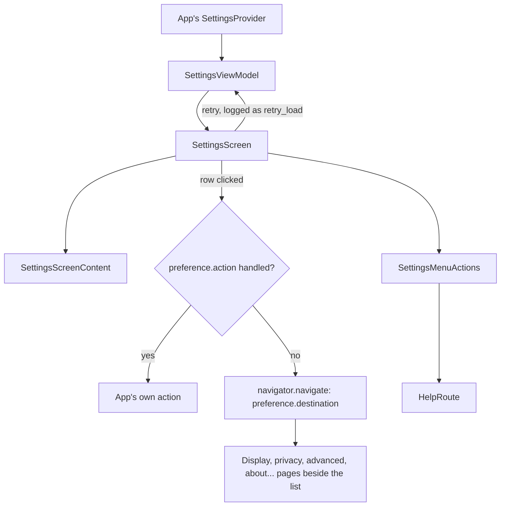

# `:library:feature:settings` Logic Graph

## Purpose

Draws the Toolkit's settings list: the categories and rows an app's `SettingsProvider` describes,
each row opening its destination in the shell.

## Owns

- `SettingsScreen`, `SettingsViewModel`, `SettingsUiState` (whose `config` is a `Loadable`),
  `SettingsEvent.Load`, and the list's overflow menu (`SettingsMenuActions`, which opens Help and
  feedback).
- `SettingsScreenContent`, the stateless list with its loading, empty and failure states, and
  `SettingsList`, the rows themselves.
- `SettingsProvider`, the contract an app implements to describe its settings.
- `settingsPage()`, the registration of `SettingsRoute` as a list page.
- The settings search: a field above the rows, not in the app bar, that searches the host's rows
  and every row the settings pages register as a `SettingsSearchProvider`, ignoring case and
  accents. Results replace the categories while there is a query; back clears it first, and a
  result opens the page that holds the setting, beside the list on a wide window. No result opens
  a page the app's graph does not register. See [Settings search](#settings-search).
- Localized labels and summaries for the rows most apps list (Notifications, Display, Security and
  privacy, Advanced and About), so every host names them identically.

## Does not own

- The settings models (`SettingsConfig`, `SettingsCategory`, `SettingsPreference`), owned by
  [`:library:core:ui`](../../core/ui/README.md) so a provider can be written without this module's
  screens.
- The pages the rows open. Display, theme, privacy, advanced, diagnostics and about register their
  own keys; this module names them only through `:library:navigation`'s keys.
- Which rows an app lists, and in what order, owned by the app's provider.
- Host identity strings, supplied as overridable defaults by `:library:core:common`.

## Depends on

- `:library:core:common`, `:library:core:datastore`, `:library:core:network`, `:library:core:ui`,
  and [`:library:navigation`](../../navigation/README.md) for the keys and the graph builder.
- No other feature module.

## Used by

- [`:library:apptoolkit`](../../apptoolkit/README.md), which calls `settingsPage()` from
  `toolkitPages()`, and through it every app built on the Toolkit.
- `:sample:feature:settings`, which provides the sample's `SettingsProvider`.

## Flow chart


```mermaid
flowchart TD
    Host[App's SettingsProvider] --> VM[SettingsViewModel]
    VM --> Screen[SettingsScreen]
    Screen --> Content[SettingsScreenContent]
    Screen -->|retry, logged as retry_load| VM
    Screen -->|row clicked| Action{preference.action handled?}
    Action -->|yes| Done[App's own action]
    Action -->|no| Navigate[navigator.navigate: preference.destination]
    Navigate --> Pages[Display, privacy, advanced, about... pages beside the list]
    Screen --> Menu[SettingsMenuActions] --> Help[HelpRoute]
```

## Using it

```kotlin
class AppSettingsProvider(private val context: Context) : SettingsProvider {
    override fun provideSettingsConfig() = SettingsConfig(
        title = context.getString(R.string.settings),
        categories = listOf(
            SettingsCategory(
                preferences = listOf(
                    SettingsPreference(
                        key = "notifications",
                        title = context.getString(SettingsR.string.notifications),
                        destination = PrivacySettingsRoute,
                        action = { context.openAppNotificationSettings() },
                    ),
                    SettingsPreference(
                        key = "display",
                        title = context.getString(SettingsR.string.display),
                        destination = DisplaySettingsRoute,
                    ),
                ),
            ),
        ),
    )
}
```

## Settings search

The field above the rows searches two kinds of rows. Each kind has its own declaration, and the
Toolkit indexes, matches, draws and opens them the same way.

### Rows of the root list: nothing to do

Every `SettingsPreference` in the `SettingsConfig` your `SettingsProvider` returns is searchable by
its title and summary, as it is. A result behaves like the row: its `action` runs first, and its
`destination` opens when the action does not handle the click.

### Rows of a page of your own: a provider

A row on a page the root list opens, or on a page it does not list at all, is only found when the
page declares it. Declare the page's rows with `settingsSearchProvider`, next to the page, in the
feature that owns it. The metadata stays separate from the page's Compose code: the search never
looks inside the page.

```kotlin
val readerSettingsSearch = settingsSearchProvider(
    section = R.string.reader_settings,
    destination = ReaderSettingsRoute,
) {
    preference(R.string.font_size, summary = R.string.font_size_summary)
    preference(R.string.line_spacing)
    preference(R.string.reader_theme, destination = ReaderThemeRoute)
}
```

- `section` is the page's title, shown under each result and searched with it.
- `destination` is the page itself, where each result goes. A row that opens a page of its own
  names it with `destination =`, as the privacy page's rows do.
- `summary` is optional and searched with the title.
- Strings are resources, resolved in the current locale each time the index is built, so a
  language change finds the new words.

### Binding it in Koin

Bind each provider as a `SettingsSearchProvider` under a name of its own:

```kotlin
val readerModule = module {
    single<SettingsSearchProvider>(named("reader")) { readerSettingsSearch }
}
```

Koin keeps only the last of two bindings with the same name, or with no name, so two unnamed
providers would hide each other. The Toolkit's pages bind theirs as `display`, `theme`, `privacy`,
`about` and `advanced`; binding one of those names replaces that page's rows.

### Conditional rows

A provider receives one `SettingsSearchContext`, built from the same `ShellHost` locals the
settings pages read:

- `capabilities`, the app's `ShellCapabilities`: what its declared graph and layout policy can show,
  such as `hasMultipleTabs`, `usesBottomNavigation`, `hasShellTopBars` or `hasAccessories`;
- `graph`, the app's `ShellGraph`, for rows that depend on which destinations it registers.

The block runs each time the index is built and reads both as `capabilities` and `graph`. Leave
rows out with plain Kotlin, under the same conditions the page shows them:

```kotlin
settingsSearchProvider(R.string.reader_settings, ReaderSettingsRoute) {
    preference(R.string.font_size)
    if (capabilities.hasMultipleTabs) preference(R.string.start_tab)
    if (Build.VERSION.SDK_INT >= Build.VERSION_CODES.S) preference(R.string.dynamic_colors)
}
```

The best way to keep a page and its search rows the same is to derive both from one list, as the
display settings do: `displayRows(capabilities, ...)` decides the rows, the page draws them, and its
provider adds a `preference` for each.

Capabilities describe the app as declared, not the window it is drawn in now and not the developer
options: an app whose policy shows a bottom bar on phones keeps its bottom bar rows on a tablet. A
condition that depends on state the page loads, such as an unlock, cannot be seen by the search;
leave such a row out, as the advanced page does with the developer options. The developer options
themselves are never searchable, since the page is reached only once unlocked.

### Destinations the graph does not register

Koin bindings are app-wide, while each activity builds its own graph, so a provider can name a page
an app leaves out of its graph. The search never offers a result that could only open such a page:

- a provider's row whose destination the graph does not register is left out;
- a root row that only opens such a page is left out;
- a root row with an `action` keeps it, since the action may handle the click, but its result loses
  the unregistered fallback, so the click does nothing rather than fail when the action does not
  handle it. The root list itself is unchanged.

Each such row is logged as a warning under the `SettingsSearch` tag. To fail fast instead, check
your providers in a unit test against the graph your app builds:

```kotlin
@Test
fun `every settings search result opens a registered page`() {
    val context = SettingsSearchContext(appGraph(), ShellCapabilities.of(appGraph(), appLayoutPolicy))
    assertEquals(emptyList(), readerSettingsSearch.unregisteredDestinations(context))
}
```

`SettingsSearchContext(graph)` alone uses the default layout policy. A provider written by hand,
`SettingsSearchProvider { context -> listOf(SettingsSearchEntry(...)) }`, receives the same context
and is checked the same way.

## Architectural decisions

- **A row carries a key, not a callback into another feature.** `SettingsPreference.destination`
  is a `NavKey`; the list navigates to it, and the module that registers that key draws the page.
  The list therefore depends on no other feature, and an app can replace any page by registering
  the same key.
- **An app action runs first.** `SettingsPreference.action` returns whether it handled the click;
  when it did not (or there is none), the destination opens. Notifications uses this to open the
  system's notification settings and fall back to the privacy page.
- **A list page.** `SettingsRoute` is registered with `PaneRole.List`, so on wide windows the
  category pages, registered as `PaneRole.Detail`, open beside it. Until one is, the detail side
  shows `SettingsDetailPlaceholder`: the settings illustration, the app's name and a Get help
  button that opens `HelpRoute`.
- **On `core.ui.screen`.** `SettingsViewModel` loads the provider's config on each `Load`, which
  the screen sends each time the list is shown so a row's summary follows a change made on its
  page. A config with no category is `Loadable.Empty` with "No settings found"; a provider that
  throws is `Loadable.Failed`, reported to telemetry. The provider builds from resources, which is
  main-safe, so the ViewModel takes no dispatcher.
- **The screen owns the search.** The query and the search index live in `SettingsScreen`, because
  the index reads the shell graph and Koin; `SettingsScreenContent` receives the query and the
  results and stays previewable. The rows themselves come from `searchRows`, a plain function of
  the config, the providers, the graph and a string lookup, so the index is unit tested without
  Compose, Koin or resources.
- **Pages declare their search rows.** The search does not read Compose UI and does not depend on
  any page: each page lists its rows as a `SettingsSearchProvider`, and the graph decides which of
  them can be opened. A result for an unregistered page is left out with a warning rather than a
  crash, the way `ShellGraph.keyFor` drops an intent's unregistered key: the providers are bound
  app-wide, and an app may legitimately leave a page out of a graph.
- Layers follow ownership, as described in [the architecture rules](../../../.agents/skills/architecture/layered-tree-review/references/android-tree-rules.md).

## Public contracts

- `SettingsProvider`, `SettingsScreen`, `SettingsList`, `SettingsViewModel`, `SettingsUiState`,
  `SettingsEvent`, `SettingsMenuActions` and `settingsPage()`. `SettingsScreenContent` is internal.
- The label and summary strings listed under Owns.

## Current risks

- A row whose destination no module registers opens nothing visible: the navigator keeps the key,
  but the graph has no page for it. `:sample:app`'s `AppGraphTest` checks the sample's rows.
