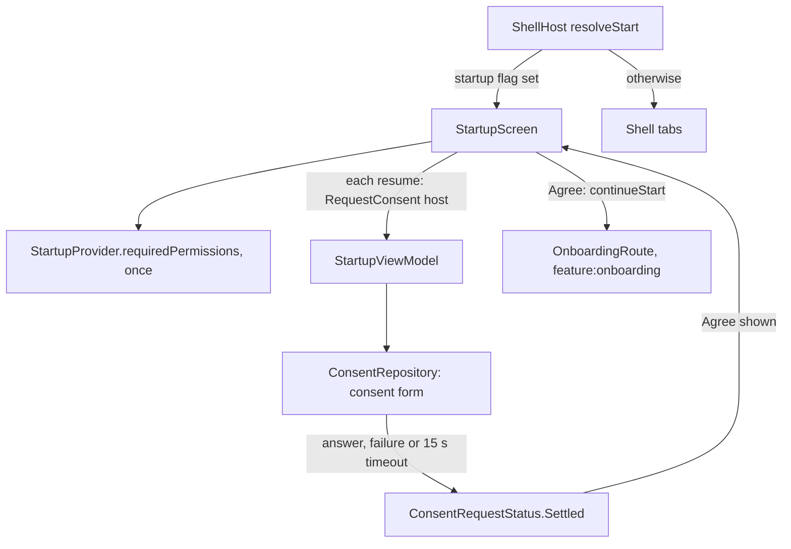

# `:library:feature:startup` Logic Graph

## Purpose

Owns the startup screen, the first start screen of a first launch: it asks for the host's runtime
permissions and the consent form, then hands over to onboarding. It is a start screen of the
shell, drawn before its tabs.

## Owns

- `startupPage()`, which registers `StartupRoute` as a page without a title and offers it as a
  start screen (`startScreens`).
- `StartupScreen`, with `StartupScreenContent` in the same file, `StartupViewModel`, its state
  (`StartupUiState`, `ConsentRequestStatus`) and `StartupEvent`. The screen asks for the
  permissions and consent on resume and hands over with `continueStart(OnboardingRoute)`.
- `StartupProvider`, the host extension contract: the runtime permissions to ask for.
- `startupModule(startupProviderFactory)`, which binds the host's provider and the ViewModel.
- The startup illustration and animation, and the welcome, agree, learn more and terms strings, in
  every supported locale.

## Does not own

- Deciding whether the first launch runs. The app starts on `StartupRoute` from
  `ShellHost(resolveStart = ...)` while its startup flag is set; see [Using it](#using-it).
- The onboarding pages that follow, owned by [`:library:feature:onboarding`](../onboarding/README.md).
  This module opens `OnboardingRoute` by key and does not depend on it.
- The host's provider, owned by the app (`:sample:feature:startup` in the sample).
- Consent SDK orchestration, owned by `:library:integration:consent`.

## Depends on

- `:library:core:common`, `:library:core:network` and `:library:core:ui` for shared contracts,
  the consent result type and UI.
- [`:library:navigation`](../../navigation/README.md) for the keys, the graph builder and the
  shell navigator.
- [`:library:integration:consent`](../../integration/consent/README.md) for `ConsentRepository`,
  which the ViewModel asks with a `ConsentHost` built from the activity.
- Lottie, for the welcome animation.
- No other feature module.

## Used by

- [`:library:apptoolkit`](../../apptoolkit/README.md), which calls `startupPage()` from
  `toolkitPages()` and `startupModule` from `appToolkitModules`, and `:sample:feature:startup`,
  which provides the permissions.

## Using it

```kotlin
ShellHost(
    graph = graph,
    resolveStart = { if (dataStore.startup.first()) StartupRoute else startKeyFor(storedTab) },
    onReady = { keepSplashVisible = false },
)
```

The screen has no shell under it, so back leaves the app. Continuing replaces it with
`OnboardingRoute`, whose completion enters the shell; the next launch then resolves past
`StartupRoute`.

## Flow chart



## Architectural decisions

- Its own module, not part of onboarding. Asking for permissions and consent is a different job
  from the onboarding pages, an app can replace one without the other, and the sample keeps the
  same split (`:sample:feature:startup`).
- A start screen, not an activity: consent and permission requests go through
  `LocalActivity.current`.
- Permissions are requested once per screen instance, saved across the resume the system dialog
  causes, so a person who declined is not asked again on the spot. The screen owns this, since the
  launcher is tied to the composition.
- Consent is asked for on each resume until it has settled. The ViewModel runs the request with
  the `ConsentHost` the screen sends, for that request only, and ignores later requests once
  consent has settled.
- Consent settles on any answer, on a failure, and after 15 seconds without one. This is the app's
  first screen and Agree is its only way forward, so a round trip that never reports back must not
  keep the person on a spinner. `screen_state` reports `loading` until then and `success` after.
- Agree is a callback from the content; the screen navigates with `continueStart(OnboardingRoute)`.
- On large screens the content keeps to a column at most 640dp wide, centred, as onboarding's
  pages do.

## Public contracts

- `startupPage()`, `startupModule`, `StartupProvider`, and `StartupScreen()`.
- `StartupViewModel(consentRepository, telemetryRepository)`, with `StartupUiState`,
  `ConsentRequestStatus` and `StartupEvent`.

## Internal implementations

- `StartupScreenContent` and the welcome layout.

## Current risks

- The app decides when the first launch runs. An app that forgets the `resolveStart` check never
  shows startup, and one that never clears its startup flag shows it on every launch.
- Handing over by key means an app that registers `StartupRoute` without `OnboardingRoute` sends
  the person to a key the graph does not know.
- `ConsentRepository` still returns `DataState`; the ViewModel waits for its first value that is
  not `Loading`.
