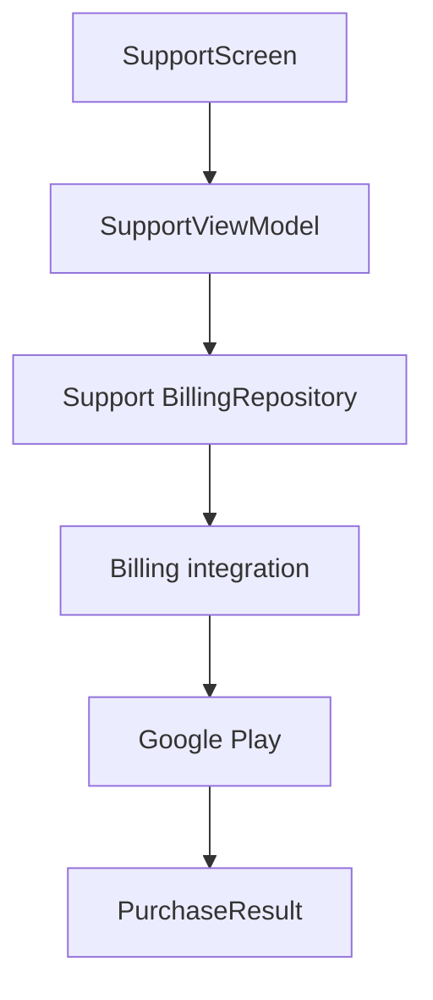

# `:library:feature:support` Logic Graph

## Purpose

Presents donation/support products and coordinates purchases through the billing integration.

## Owns

- Support screen/activity/ViewModel and state/event/action contracts.
- Donation product IDs, product-detail mapping helpers, and support-facing billing result types.
- The support-level billing repository abstraction consumed by its UI.

## Does not own

- Google Play BillingClient lifecycle, owned by `:library:integration:billing`.
- Generic shared UI/ad primitives, owned by `:library:core:ui`.

## Depends on

- `:library:core:common`, `:library:core:network`, and `:library:core:ui` for shared billing/Firebase contracts, errors, and Compose foundations.
- [`:library:integration:billing`](../../integration/billing/README.md) for Play Billing access.
- [`:library:navigation`](../../navigation/README.md) for navigation support.

## Used by

- `:sample`, `:library:apptoolkit`, and `:library:feature:about`.

## Flow chart

## Public contracts

- Support presentation entry points/contracts and its billing abstraction/result.

## Internal implementations

- Product grouping/formatting and donation UI behavior.

## Current risks

Billing contracts/results exist in common, integration, and support namespaces, creating overlapping concepts that can be confused during changes.
