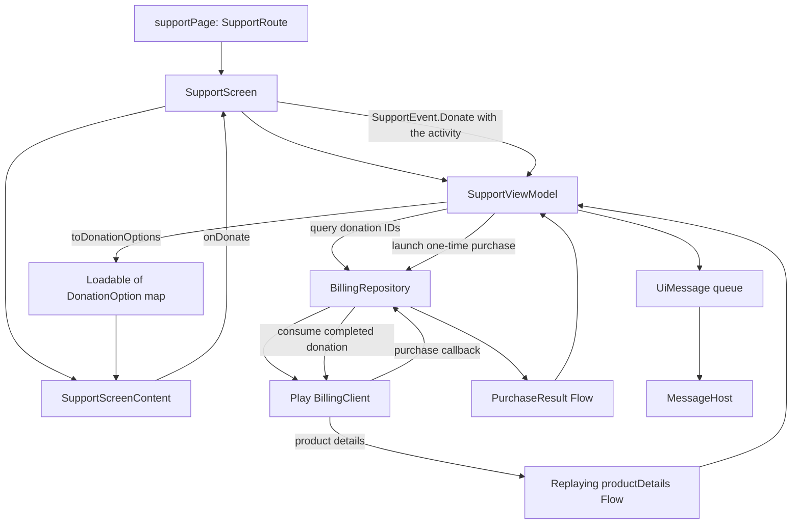

# `:library:feature:support` Logic Graph

## Purpose

Presents donation/support products and coordinates purchases through the billing integration.

## Owns

- `SupportScreen` and the stateless `SupportScreenContent`, `SupportViewModel`, and their state
  (`SupportUiState`, `DonationOption`) and event (`SupportEvent`) contracts.
- `supportPage()`, the registration of `SupportRoute`, which the overflow menu's `supportUs()`
  entry opens.
- Donation product IDs, the `ProductDetails` helpers in `data/mappers`, and the mapping of Play's
  products to `DonationOption` in `ui/mappers`.

## Does not own

- Google Play BillingClient lifecycle, owned by `:library:integration:billing`.
- Generic shared UI/ad primitives, owned by `:library:core:ui`.

## Depends on

- `:library:core:common`, `:library:core:network`, and `:library:core:ui` for shared
  billing/Firebase contracts, errors, and Compose foundations.
- [`:library:integration:billing`](../../integration/billing/README.md) for Play Billing access.
- [`:library:navigation`](../../navigation/README.md) for the key and the graph builder.

## Used by

- [`:library:apptoolkit`](../../apptoolkit/README.md), which calls `supportPage()` from
  `toolkitPages()`.

## Flow chart

```mermaid
flowchart TD
    Page[supportPage: SupportRoute] --> Screen[SupportScreen]
    Screen --> VM[SupportViewModel]
    Screen --> Content[SupportScreenContent]
    VM -->|query donation IDs| Billing[BillingRepository]
    Billing --> Play[Play BillingClient]
    Play -->|product details| ProductFlow[Replaying productDetails Flow]
    ProductFlow --> VM
    VM -->|toDonationOptions| Options[Loadable of DonationOption map]
    Options --> Content
    Content -->|onDonate| Screen
    Screen -->|SupportEvent.Donate with the activity| VM
    VM -->|launch one-time purchase| Billing
    Play -->|purchase callback| Billing
    Billing -->|consume completed donation| Play
    Billing --> Result[PurchaseResult Flow]
    Result --> VM
    VM --> Messages[UiMessage queue]
    Messages --> Host[MessageHost]
```

## Architectural decisions

- Donation catalog policy lives in `domain`, billing-SDK mapping lives in `data`, presentation
  constants and rendering live in `ui`, and feature bindings live in `di`.
- The support feature depends on the billing contract, not `BillingClient`. `BillingRepository`
  exposes Play's `ProductDetails`, so `SupportViewModel` keeps them privately for the launch and
  maps them to `DonationOption`, which is all the screen sees.
- Product IDs belong to the feature because they define the donation catalog. Connection lifecycle,
  retries, purchase recovery, and consumption belong to the billing integration.
- The screen is on `core.ui.screen`. `donationOptions` is a `Loadable` that stays loading until the
  first query publishes, then is `Empty` when Play returned no products and `Ready` otherwise.
  `SupportEvent.QueryProductDetails` is sent on start and by the failure state's Retry.
- `BillingRepository` reports a failed product query through `purchaseResult`, not by throwing. A
  failure that arrives while the options are still loading therefore becomes `Loadable.Failed` with
  Retry. Once the options show, a failed purchase is an error message and the options stay.
- A thrown query failure goes through `toFailed`, so an offline device sees the offline text.
  Billing errors are reported under the support screen's `Support` and `SupportViewModel` names.
- Purchase results are messages shown by `MessageHost` in the page's snackbar host, above the
  shell's bottom chrome.
- The purchase needs the activity, which the screen reads from `LocalActivity.current` and sends
  in `SupportEvent.Donate`. The ViewModel drops its reference once Play has it.
- A purchase launch is guarded against invalid activities and duplicate taps. The buttons stay
  disabled until a result arrives, or for 20 seconds so an absent SDK callback cannot leave the
  page busy.
- `SupportScreenContent` opens nothing. The donation and web ad taps reach `SupportScreen` as
  callbacks, and each button logs the same GA4 tap event as before through its `ga4Event`.

## Public contracts

- `SupportScreen`, `SupportComposable`, `supportPage()`, `SupportViewModel`, `SupportUiState`,
  `DonationOption`, `SupportEvent`, `SupportNativeAdCard`, `supportModule` and the donation product
  IDs. `SupportScreenContent` is internal.

## Internal implementations

- Product grouping/formatting and donation UI behavior.

## Current risks

Billing contracts/results exist in common, integration, and support namespaces, creating overlapping
concepts that can be confused during changes.

`PurchaseResult.Failed` carries Play's English debug message, which the page shows as it is. The
billing integration has no typed failure reason the page could translate.
