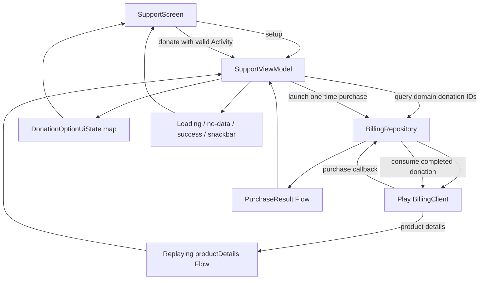

# `:library:feature:support` Logic Graph

## Purpose

Presents donation/support products and coordinates purchases through the billing integration.

## Owns

- `SupportScreen`, `SupportViewModel` and their state, event and action contracts.
- `supportPage()`, the registration of `SupportRoute`, which the overflow menu's `supportUs()`
  entry opens.
- Donation product IDs and product-detail mapping helpers.

## Does not own

- Google Play BillingClient lifecycle, owned by `:library:integration:billing`.
- Generic shared UI/ad primitives, owned by `:library:core:ui`.

## Depends on

- `:library:core:common`, `:library:core:network`, and `:library:core:ui` for shared
  billing/Firebase contracts, errors, and Compose foundations.
- [`:library:integration:billing`](../../integration/billing/README.md) for Play Billing access.
- [`:library:navigation`](../../navigation/README.md) for the key and the graph builder.

## Used by

- [`:library:apptoolkit`](../../apptoolkit/README.md), which calls `supportPage()` from
  `toolkitPages()`.

## Flow chart

```mermaid
flowchart TD
    Screen[SupportScreen] -->|setup| VM[SupportViewModel]
    VM -->|query domain donation IDs| Billing[BillingRepository]
    Billing --> Play[Play BillingClient]
    Play -->|product details| ProductFlow[Replaying productDetails Flow]
    ProductFlow --> VM
    VM --> Options[DonationOptionUiState map]
    Options --> Screen
    Screen -->|donate with valid Activity| VM
    VM -->|launch one-time purchase| Billing
    Play -->|purchase callback| Billing
    Billing -->|consume completed donation| Play
    Billing --> Result[PurchaseResult Flow]
    Result --> VM
    VM --> State[Loading / no-data / success / snackbar]
    State --> Screen
```

## Architectural decisions

- Donation catalog policy lives in `domain`, billing-SDK mapping lives in `data`, presentation
  constants and rendering live in `ui`, and feature bindings live in `di`.
- The support feature depends on the billing contract, not `BillingClient`; Play types are limited
  to the boundary values required to launch the actual offer.
- Product IDs belong to the feature because they define the donation catalog. Connection lifecycle,
  retries, purchase recovery, and consumption belong to the billing integration.
- Product details have no synthetic initial value. The screen remains loading until the first query
  emits, then distinguishes an empty catalog from available options.
- Purchase results are shown in the page's snackbar host (`rememberPageSnackbarHostState()`), so
  they sit above the shell's bottom chrome. The purchase itself needs the activity, which the screen
  reads from `LocalActivity.current`.
- A purchase launch is guarded against invalid activities and duplicate taps, with a UI timeout so
  an absent SDK callback cannot leave the screen permanently busy.

## Public contracts

- `SupportScreen`, `supportPage()`, the presentation contracts and the donation product IDs.

## Internal implementations

- Product grouping/formatting and donation UI behavior.

## Current risks

Billing contracts/results exist in common, integration, and support namespaces, creating overlapping
concepts that can be confused during changes.
