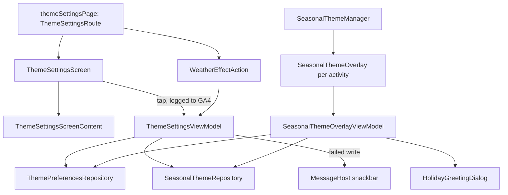

# `:library:feature:theme` Logic Graph

## Purpose

Owns the theme settings page and the seasonal themes: the color palette, theme mode and AMOLED
choices, the holiday greeting, the holiday snowfall, the weather effect, and what the About
screen's easter egg unlocks.

## Owns

- `ThemeSettingsScreen`, `ThemeSettingsViewModel`, `ThemeSettingsUiState` (whose `preferences` is a
  `Loadable`) and `ThemeSettingsEvent`.
- `ThemeSettingsScreenContent`, the stateless page with its loading and failure states, in
  `ThemeSettingsScreen.kt`.
- `WeatherEffectAction`, the weather effect button in the page's app bar, and its dialog.
- `themeSettingsPage()`, the registration of `ThemeSettingsRoute`. The display settings' dark theme
  row opens it by key. The page is `PaneRole.None`: display is itself a detail beside the settings
  list, and a detail opened from a detail would replace it instead of stacking on it.
- Its rows in the settings search, a `settingsSearchProvider` bound as `theme`: theme mode, AMOLED,
  wallpaper colors and palette.
- `SeasonalThemeManager`, `SeasonalThemeOverlay`, `SeasonalThemeOverlayViewModel`, its state and
  event, and `HolidayGreetingDialog`.
- `themeSettingsModule`, which registers the built-in qualified palettes and resolves the host's
  default palette override, falling back to blue.
- Localized resources for the page and the seasonal themes.

## Does not own

- The stored appearance and the holiday rules, owned by
  [`:library:core:datastore`](../../core/datastore/README.md) through `ThemePreferencesRepository`
  and `SeasonalThemeRepository`.
- Palette definitions, the application theme, the snow and the rain, owned by
  `:library:core:designsystem`.
- The easter egg gesture, owned by [`:library:feature:about`](../about/README.md), which records
  the unlock.
- The onboarding appearance step, owned by `:library:feature:onboarding`, which uses the same
  preferences.

## Depends on

- `:library:core:common`, `:library:core:datastore`, `:library:core:ui` and
  `:library:core:designsystem`.
- No other feature module. Only the ui and di layers are needed; there is no duplicate data layer
  or pass-through domain layer.

## Used by

- [`:library:apptoolkit`](../../apptoolkit/README.md), which calls `themeSettingsPage()` from the
  Toolkit graph and assembles `themeSettingsModule`.
- `:sample:app`, which installs `SeasonalThemeManager`.

## Flow chart



## Architectural decisions

- **On `core.ui.screen`.** Both ViewModels extend `LoggedScreenViewModel`, so every operation logs
  its start and every failure is reported with its action name. `ThemeSettingsViewModel` reports as
  screen `Theme`; a write is the `persistThemeSetting` action, with the setting in its `setting`
  parameter.
- **The page opens on the stored selection.** `ThemeSettingsUiState.preferences` stays
  `Loadable.Loading` until both the stored preferences and the easter egg unlock have arrived, and
  becomes `Ready` in the same update that sets them. The palette rows scroll to the first selection
  they see, and the unlock can add palettes to them, so a placeholder would scroll to the wrong one.
- **Failures are shown.** A failed read shows the failure screen with Retry, which sends
  `ThemeSettingsEvent.Load`. A failed write shows an error snackbar and leaves the page as it was.
- **The screen logs, the content renders.** Each tap is a named callback of
  `ThemeSettingsScreenContent`. `ThemeSettingsScreen` logs its GA4 event (`theme_tab_select`,
  `theme_palette_select`, `settings_theme_switch`, `theme_toggle_amoled`,
  `theme_open_display_settings`) and then sends the event, so the content needs no telemetry or
  `Context` and renders in a preview.
- **No per-frame allocation in the content.** The theme mode and tab lists are constants, and the
  palette pager's pages are remembered with the values they show as keys.
- **The overlay shows no failures.** It has nothing to show them on, and a failure only means a
  greeting or a restore waits for the next activity, so `SeasonalThemeOverlayViewModel` reports
  them and carries on. A failed restore still looks up the greeting, and a failed answer still
  frees the greeting slot.

## Seasonal themes

`SeasonalThemeManager` puts `SeasonalThemeOverlay` over every activity of the host, the same way
shake-to-report follows activities. A host opts in by calling `install()` from
`Application.onCreate`:

```kotlin
getKoin().get<SeasonalThemeManager>().install()
```

The overlay is a full-size `ComposeView` added on top of each resumed activity's content. It is
never added to an empty content view: `ComponentActivity.setContent` adopts the first child when it
is a `ComposeView`, so an activity that sets its content after resuming would otherwise run inside
the overlay without its navigation owners. Such activities get the overlay after their content's
first layout. It only draws, so touches reach the screen underneath, and it is hidden from
accessibility services and focus. Activities from Google Play services, Play Billing and Firebase
are skipped. The overlay composes no app theme of its own until a greeting is due, so outside
Christmas it costs one small composition per activity. A host that prefers to place the overlay
itself can compose `SeasonalThemeOverlay()` last in its root `Box` instead of installing the
manager.

What people see:

- On the first screen they open during Christmas (December 24 to January 7) or Halloween
  (October 31 to November 2), a greeting offers the holiday theme with a checkbox that starts
  ticked. It appears once per holiday occurrence.
- Accepting applies the holiday palette. When the holiday ends, the palette and wallpaper-colors
  setting they had before come back, unless they picked another palette during the holiday.
- Snow falls over the app while the Christmas palette is on screen, during the Christmas season.
  Snow is skipped when animations are turned off system-wide.
- Tapping the build version five times on the About screen unlocks the seasonal themes. From then
  on the Christmas and Halloween palettes stay in the palette list all year, snow follows the
  Christmas palette outside the season too, and the theme page's app bar gets a weather effect
  action. Its icon shows the effect in use, and it opens a dialog of radio rows, applied with Done,
  like the display settings' startup page dialog:
  - Automatic, the default: snow with the Christmas palette, as described above.
  - Snow: snow falls over the app, whatever the palette and the season.
  - Rain: rain falls over the app, whatever the palette. It gusts, comes and goes in showers,
    and splashes where it lands. While the Christmas palette is worn during the Christmas season,
    snow falls instead, and the rain comes back once the season is over.
  - Off: nothing falls, and the Christmas palette stays.

  The choice is stored with `SeasonalThemeRepository.setWeatherEffect` as a `WeatherEffect`. The
  action is `WeatherEffectAction`, which shares the page's `ThemeSettingsViewModel`.

## Public contracts

- `ThemeSettingsScreen`, `themeSettingsPage()`, `ThemeSettingsViewModel`, `ThemeSettingsUiState`,
  `ThemeSettingsEvent` and `themeSettingsModule`. `ThemeSettingsScreenContent` is internal.
- `SeasonalThemeManager`, `SeasonalThemeOverlay`, `SeasonalThemeOverlayViewModel`,
  `SeasonalThemeOverlayUiState`, `SeasonalThemeOverlayEvent` and `HolidayGreetingDialog`.
- The palette qualifiers. The purple and orange palettes are available through the `purple` and
  `orange` static IDs and the `purplePalette` and `orangePalette` qualifiers. Android and Halloween
  have qualifiers too.

## Validation and risks

`ThemeSettingsViewModelTest` covers the first load, waiting for the stored preferences, a failed
read and its retry, each event, and failed writes. `SeasonalThemeOverlayViewModelTest` covers when
snow or rain falls, the greeting flow, failed restores and answers, and that two activities never
stack two greetings. Both use hand-written fakes of the two repositories. Keep palette qualifiers,
stored identifiers, and default selection compatible with host overrides and existing preferences.
