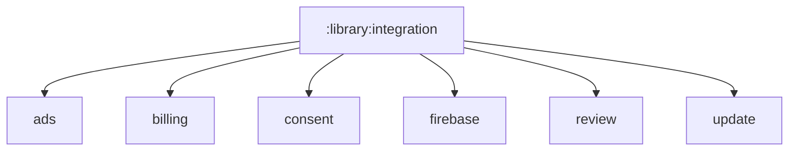

# `:library:integration` Logic Graph

## Purpose

Acts as the implicit Gradle parent for optional third-party and Google service integrations. It is
an organizational container, not a runtime artifact.

## Owns

- Grouping for ads, billing, consent, Firebase, review, and update integration modules.

## Does not own

- SDK code or contracts; each child integration owns its implementation and documents its boundary.
- Feature UI decisions about when integrations are invoked.

## Depends on

No internal Gradle modules.

## Used by

No internal module declares a dependency on `:library:integration`; consumers select child
integration modules.

## Flow chart

## Public contracts

No runtime contracts are exposed.

## Internal implementations

There is no implementation; this is an implicit Gradle hierarchy node.

## Current risks

No significant module-specific risks are currently identified.
