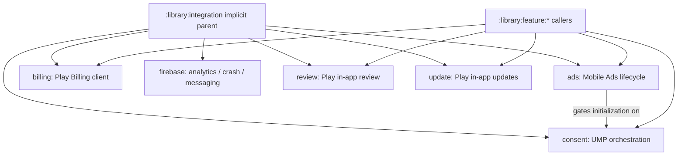

# `:library:integration` Logic Graph

## Purpose

Acts as the implicit Gradle parent for optional third-party and Google service integrations. It is
an organizational container, not a runtime artifact.

## Owns

- Grouping for ads, billing, consent, Firebase, review, and update integration modules.

## Does not own

- SDK code or contracts; each child integration owns its implementation and documents its boundary.
- Feature UI decisions about when integrations are invoked.

## Depends on

No internal Gradle modules.

## Used by

No internal module declares a dependency on `:library:integration`; consumers select child
integration modules.

## Flow chart

## Architectural decisions

- Each third-party SDK is isolated behind its own child module so ownership, manifests, lifecycle,
  and upgrade risk remain explicit.
- Features decide when an integration is invoked; integrations own how SDK work is performed.
- Ads depends on consent because ad requests must not bypass the consent state. Other integrations
  remain independent siblings.

## Public contracts

No runtime contracts are exposed.

## Internal implementations

There is no implementation; this is an implicit Gradle hierarchy node.

## Current risks

SDK-owned manifest entries merge into every consuming host without a compile-time call site. Each
child README therefore documents the permissions, metadata, and lifecycle behavior it contributes.
