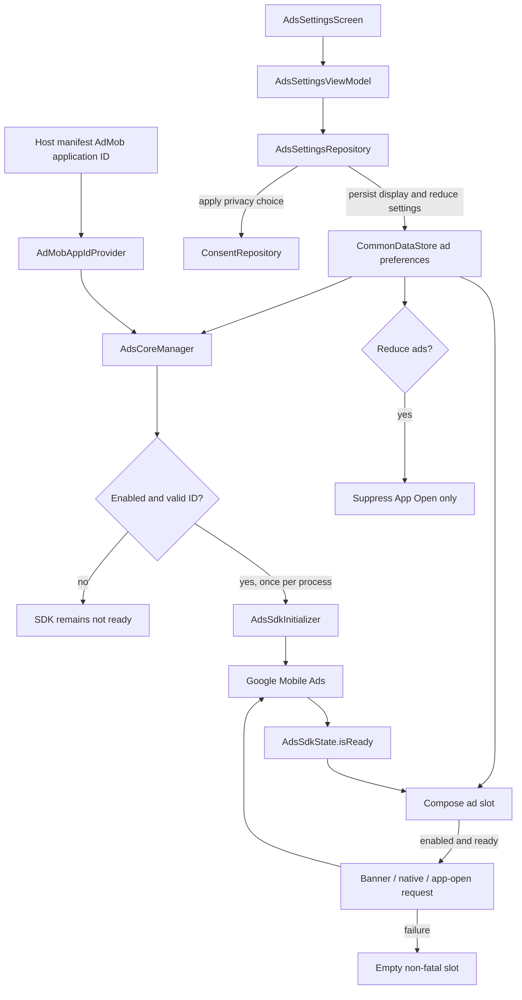

# `:library:integration:ads` Logic Graph

## Purpose

Owns ad enablement settings and Google Mobile Ads integration UI used by AppToolkit hosts.

## Owns

- `di.adsIntegrationModule()` binds the ads manager, settings repository, and ViewModel. The main toolkit
  module composes it; hosts supply their placement configuration and foundation providers.
- Ads settings repository, ViewModel, screen, and activity.
- `AdsCoreManager`, `AdsSdkInitializer`, and Google Mobile Ads SDK initialization.
- App-open ad lifecycle; the `INTERNET`, `ACCESS_NETWORK_STATE`, and `AD_ID` permissions required by
  the SDK; and default Mobile Ads initialization/loading metadata.

## Does not own

- Consent acquisition, owned by `:library:integration:consent`.
- Generic native-ad rendering primitives, currently owned by `:library:core:ui`. See
  [Where an ad placement lives](#where-an-ad-placement-lives) for the split, and
  [Current risks](#current-risks) for why the primitives are still there.
- Host ad-unit IDs and host-specific ad policies, owned by the host/common configuration.

## Depends on

- [`:library:core:common`](../../core/common/README.md) for ads/Firebase contracts and host
  constants.
- [`:library:core:datastore`](../../core/datastore/README.md) for persisted ads enablement.
- [`:library:core:network`](../../core/network/README.md) for shared result/error types.
- [`:library:core:ui`](../../core/ui/README.md) for screen contracts and reusable Compose UI.
- [`:library:integration:consent`](../consent/README.md) so ad state respects consent.

## Used by

- `:sample` and `:library:apptoolkit`.

## Flow chart



## Architectural decisions

- Persisted ads enablement is the single source of truth for settings, initialization, and UI
  requests. No consumer chooses a local default.
- Release builds expose the reduce-ads setting, while debug builds expose display-ads for testing.
  Display ads continues to gate all ad surfaces; reduce ads gates only App Open display.
- Both preferences start in the same place in every build: display ads on, reduce ads off. A fresh
  debug install therefore renders ads, which is the point of having the switch there at all. Once
  either is changed the stored value wins, in every build, forever.
- SDK initialization is idempotent, mutex-protected, and conditional on a valid host-manifest app
  ID; the toolkit never supplies a fallback publisher ID.
- Readiness is explicit state because enablement and asynchronous SDK initialization are different
  facts. Ad slots wait and retry when readiness changes.
- Ad rendering fails closed: SDK exceptions or unavailable consent produce an empty slot, never a
  process-fatal composition error.

## Ad unit IDs a host must provide

The toolkit ships no ad unit IDs. A host supplies its own, and the two halves are supplied
differently.

### 1. The AdMob application id, manifest meta-data

```xml

<meta-data android:name="com.google.android.gms.ads.APPLICATION_ID"
    android:value="@string/ad_mob_app_id" />
```

`ManifestAdMobAppIdProvider` reads it from there and nowhere else, and `AdsCoreManager` refuses to
initialize the SDK without a valid one rather than falling back to a sample id. Declare the string
in the **host**, never in a library module: a library-owned `ad_mob_app_id` is inherited by every
consumer app that does not declare the same name, silently pointing that app's consent request and
SDK initialization at the wrong publisher account.

### 2. Ad unit IDs, Koin `AdsConfig` bindings

Each placement resolves an `AdsConfig` by qualifier:

```kotlin
single<AdsConfig>(named(name = AdsQualifiers.SUPPORT_NATIVE_AD)) {
    AdsConfig(bannerAdUnitId = "ca-app-pub-.../...")
}
```

**Required if the host ships the screen.** These are injected with `koinInject`, which throws
`NoDefinitionFoundException` when the binding is missing, the screen crashes rather than rendering
without an ad, so bind every qualifier whose screen you include:

| Qualifier           | Injected by                                     | Format          |
|---------------------|-------------------------------------------------|-----------------|
| `NO_DATA_NATIVE_AD` | `NoDataScreen`, in `:library:core:ui`           | Native advanced |
| `HELP_NATIVE_AD`    | `HelpScreenContent`, in `:library:feature:help` | Native advanced |
| `SUPPORT_NATIVE_AD` | `SupportScreen`, in `:library:feature:support`  | Native advanced |

`NoDataScreen` is the one to watch: it is a shared empty/error state rather than a screen a host
opts into, so almost every host reaches it eventually.

**Optional.** Offered for host placements; nothing in the toolkit injects them, so leaving them
unbound costs nothing: `NATIVE_AD`, `BOTTOM_NAV_BAR_NATIVE_AD`, and the size-named `BANNER_AD`,
`LARGE_BANNER_AD`, `MEDIUM_RECTANGLE_AD`, `FULL_BANNER_AD`, `LEADERBOARD_AD`, `FLUID_AD`.

Hosts add their own qualifiers for their own screens rather than extending `AdsQualifiers`; the
sample keeps `AppAdsQualifiers` for its apps list and app details placements.

### Choosing the format

`AdsConfig.adSize` applies to `AdBanner` only. Native slots, `NativeAdSlot` and the
`*NativeAdCard` wrappers, ignore it, so a native placement should leave it at its default and bind
a **Native advanced** unit id. Binding a banner unit id to a native slot, or the reverse, produces
no fill rather than an error.

### App Open

`AdsCoreManager.initializeAds(appOpenUnitId = ...)` takes the id directly; there is no qualifier.
The
host decides whether it wants the ad at all, see the toggle table above.

## Rendering an ad

Start with `NativeAdSlot`. It is the recommended way, and for most placements it is the only thing
you need. It is not the only way, and it is not meant to be: an ad should look like it belongs in
your app, and a shared component cannot know what your app looks like. There are three levels, and
moving to a lower one is expected rather than a workaround.

### Level 1: `NativeAdSlot`, recommended

Pick a `NativeAdPresentation` and place it. The slot does the loading, the retrying, the lifecycle,
the disclosure label, the failure reporting, and the debug placeholder.

```kotlin
NativeAdSlot(
    adUnitId = adUnitId,
    presentation = NativeAdPresentation.Compact,
    position = GroupedItemPosition.MIDDLE,
    containerColor = MaterialTheme.colorScheme.surfaceContainerLow,
    onAdLoaded = { visible -> },
)
```

What you can change here: which shape the ad takes, where it sits in a grouped list, its corner
radius, its container colour, and whether it draws a container at all. That covers a card that has
to match surfaces your app already uses.

What you cannot change here: the arrangement inside the ad. If the headline is heavier than your
screen's titles, or the row is taller than the rows beside it, Level 1 has run out. Go to Level 2.

### Level 2: your own view tree, the toolkit's loading

Implement `NativeAdViewFactory` and provide it through `LocalNativeAdViewFactory`. Your factory
decides the layout for the presentations it cares about and hands the rest back to
`DefaultNativeAdViewFactory`. Everything else, loading included, stays where it is.

```kotlin
class MyAdViewFactory : NativeAdViewFactory {
    private val default = DefaultNativeAdViewFactory()

    override fun createViewHolder(
        context: Context,
        presentation: NativeAdPresentation,
    ): NativeAdViewHolder = if (presentation is NativeAdPresentation.Compact) {
        buildMyCompactRow(context)
    } else {
        default.createViewHolder(context, presentation)
    }
}

CompositionLocalProvider(LocalNativeAdViewFactory provides remember { MyAdViewFactory() }) {
    MyScreenContent()
}
```

The view builders are public for exactly this: `nativeAdRoot`, `iconFrameView`, `headlineView`,
`bodyView`, `advertiserView`, `callToActionView`, `sponsoredLabelView`, and the `dp` helper. Build
out of those and your row keeps the shared colours, disclosure chip, and binding while looking like
your screen.

The sample's Quick Tools screen is the worked example. Its rows are 44dp circular badges, its
headline is not bold because the screen's own titles are not bold, and its body is capped at two
lines so an ad with a long description does not grow taller than the rows around it. See
`ToolkitTilesNativeAdViewFactory` in `sample/feature/tiles`.

This is the level most host apps want. It is the one to reach for when "the built-in ad does not
look like my app".

### Level 3: your own everything

`rememberNativeAd(adUnitId)` returns a `NativeAd?` and imposes nothing at all. You get the request
lifecycle and nothing else, and you build the `NativeAdView` yourself.

```kotlin
val nativeAd: NativeAd = rememberNativeAd(adUnitId = adUnitId) ?: return

MyOwnCard {
    AndroidView(factory = ::buildMyAdView, update = { bind(it, nativeAd) })
}
```

Use `rememberNativeAdState` instead when you want to say something about an empty slot; it returns
the reason alongside the ad.

### The one rule at every level

Whatever you draw, the assets have to sit inside a `NativeAdView`, each one assigned to its slot
(`root.headlineView = view`), with a single `registerNativeAd(nativeAd, mediaView)` call. That is
what reports impressions and clicks. Drawing an ad's headline with a Compose `Text` outside a
registered `NativeAdView` reports nothing and breaks AdMob's native ad policy. Levels 1 and 2 handle
this for you. At Level 3 it is yours to get right.

For banners, `AdBanner` is the equivalent of Level 1 and there is rarely a reason to go lower.

### Where an ad placement lives

The toolkit owns *primitives*; a feature owns its *placements*. The rule:

| Kind                                                    | Lives in                                | Example                          |
|---------------------------------------------------------|-----------------------------------------|----------------------------------|
| Loading, lifecycle, view tree, palette, disclosure       | `:library:core:ui`, `views/ads`         | `NativeAdSlot`, `NativeAdRenderer` |
| A shape an ad can take                                   | `NativeAdPresentation`                   | `Featured`, `Compact`, `GridRow`  |
| A card only one screen draws                             | that feature's own `ui/views/ads`        | `HelpNativeAdCard`                |
| A card only the sample draws                             | the sample feature's `ui/views/ads`      | `AppsListNativeAdCard`            |

A one-screen wrapper in shared UI looks harmless and is not: it makes the toolkit carry a layout
decision that belongs to a screen, and it teaches hosts to look for their placement in the library
rather than to compose one. If a new placement is only a `NativeAdSlot` call with a presentation
and a container colour, write it next to the screen. Add a `NativeAdPresentation` instead when the
*shape* is new, so every surface keeps rendering through the same view tree.

The sample is where a host reads how these APIs are meant to be used, so its placements live in the
sample, not in the library.

### `NativeAdRenderer`, the view tree every ad is drawn in

One renderer builds every native ad in the toolkit, programmatically, in Kotlin. There are no ad
layout XML files and no `findViewById`, and adding a surface must not reintroduce either.

**Why it exists.** Each surface used to inflate its own `R.layout.native_ad_*` and bind it by id,
which meant six copies of the same "render nothing until loaded" logic, six chances to forget to
register an asset with the `NativeAdView`, and a disclosure label that was an English literal in
some of them. `NativeAdRenderer` is that logic, once.

**How it is put together:**

- `DefaultNativeAdViewFactory` maps a `NativeAdPresentation` to a `NativeAdViewHolder`, built by one
  `create*` function per presentation out of the shared `headlineView`/`bodyView`/`iconFrameView`/
  `callToActionView` builders. A new shape is a new entry there, not a new component.
- `NativeAdViewHolder` holds strong references to every bound view, so `bind` never searches for
  one. It also assigns the SDK's asset slots (`root.headlineView = …`) and makes the single
  `registerNativeAd(nativeAd, mediaView)` call that attributes impressions and clicks.
- The tree is created once per presentation in the `AndroidView` **factory**, keyed on the
  presentation. `applyPalette` and `bind` run in **update**, so a theme change or a new ad repaints
  the existing views instead of rebuilding them. Rebuilding would discard the loaded ad.
- `LocalNativeAdViewFactory` lets a host swap the whole factory for its own view trees while keeping
  the toolkit's loading, lifecycle, and reporting.

**What it deliberately does not do.** It does not decide whether an ad may be requested, own the ad
object's lifetime, or report failures. Those are `NativeAdSlot`, `rememberNativeAd`, and
`AdLoadReporter` respectively. The renderer is handed a loaded `NativeAd` and draws it.

**If you are adding a presentation:** add the entry to `NativeAdPresentation`, a `create*` function
to the renderer, and, if the shape needs a container of its own, a branch in `NativeAdSurface`.
Reuse the view builders rather than constructing `TextView`s by hand, so text sizes, the disclosure
chip, and the CTA stay consistent. `GridRow` is the one presentation that takes metrics from its
caller, because it has to match the grid it is interleaved with.

### What the toolkit is doing for you

Worth knowing, because these are the failures a hand-rolled loader ships with:

- **It waits for the SDK.** `MobileAds.initialize` runs asynchronously from the host's startup
  coroutine, so a screen composed early reaches its ad slot before the SDK exists. The loaders throw
  `IllegalStateException("MobileAds.initialize must be called before using the Google Mobile Ads
  SDK.")` when asked too early, and the SDK offers no way to ask whether it is ready. That is what
  `AdsSdkState` exists for.
- **It asks again when the SDK comes up.** Readiness is part of the effect key, not just the ad
  unit.
  A request keyed on the ad unit alone makes one attempt at the earliest possible moment and never
  retries, so the slot stays blank for the life of the composition even though the SDK came up a
  moment later. The signature of this bug is a running native ad validator over empty slots: the
  validator flag can only be applied by an `initialize` call that ran, so seeing it rules out the
  SDK
  and points at the slot.
- **It catches the loader's throw.** The load happens during composition, where an unhandled
  `IllegalStateException` takes the process down. An ad slot that cannot load renders nothing; it is
  never a crash.
- **It owns the ad's lifetime.** Re-keying destroys the previous `NativeAd` before requesting
  another, and an ad that arrives after disposal is destroyed rather than retained.

If you are ever tempted to call `NativeAdLoader.load` or `MobileAds.initialize` directly from a
host,
that list is what you are signing up to reimplement, and the second item is the one nobody remembers
until an app ships with silent, empty ad slots.

### When a slot is empty

An empty ad slot is silent by design: the SDK hands the failure to a callback and the UI renders
nothing. That is right for users and useless for debugging, because no fill, a wrong ad unit id and
an SDK that was never initialized all look identical from the outside. The toolkit routes every ad
failure through `AdLoadReporter`, in `:library:core:ui`, so they can be told apart:

- **Logcat**, tag `AdSlot`, carries the slot name, the ad unit and the SDK's error code on every
  failure.
- **A Crashlytics breadcrumb** is logged for every failure, so a crash report shows what the ad
  slots were doing beforehand.
- **A non-fatal** is recorded only for failures a developer can act on. No fill is expected on small
  apps and on devices Google has no inventory for, so it is logged but never reported. Two markers
  exist: `AdSlotLoadException` for an SDK error other than no fill, and
  `AdSlotNotRequestedException` for a request that was never made.

`rememberNativeAdState` is the variant that returns the reason as well as the ad, for a caller that
wants to say something about an empty slot. `rememberNativeAd` returns just the ad and is what most
callers want.

### Debug placeholders

On a debug build, `NativeAdSlot` draws `AdSlotDebugPlaceholder` where an empty slot would be: the
slot name, whether the request came back without an ad or was never made, and the SDK's own words.
Release renders nothing, exactly as before. The switch is `AdLoadReporter.showsDebugPlaceholder`,
which reads `BuildInfoProvider.isDebugBuild`, so the placeholder cannot reach a release build.

A host drawing its own ad view can use the same placeholder:

```kotlin
val slot = rememberNativeAdState(adUnitId = adUnitId, slotName = "dashboard_large")
val ad = slot.ad
if (ad == null) {
    slot.failure?.takeIf { reporter.showsDebugPlaceholder }?.let { reason ->
        AdSlotDebugPlaceholder(slotName = "dashboard_large", reason = reason, detail = slot.detail)
    }
    return
}
```

### The native ad validator

The validator is the SDK's own debug overlay, configured at initialization:
`initializeAds(appOpenUnitId, disableNativeValidator = true)` turns it off. It is left on by
default.

## FAQ: are the ads written in Compose?

Short answer: **no, and they cannot be.** They are Compose-*hosted* Android views. This trips
everyone up once, so it is worth writing down.

### Why an ad cannot be pure Compose

`ads-mobile-sdk` ships no Compose API at all. Not one of its ~4,900 classes references
`androidx.compose`. The types an ad is rendered through are views:

- `NativeAdView` extends `BaseAdAssetViewContainer`, which extends `android.widget.FrameLayout`.
- Every asset slot on it is typed `android.view.View`: `headlineView`, `bodyView`, `iconView`,
  `callToActionView`, `advertiserView`, `priceView`, `starRatingView`.
- `MediaView` is a view too, and `registerNativeAd(nativeAd, mediaView)` takes those views.

That registration is what attributes impressions and clicks, so it is not optional decoration: an
"ad" drawn with Compose `Text` and `Image` and no registered `NativeAdView` reports nothing and
breaks AdMob's native ad policy. Whatever the UI toolkit, the assets end up inside a view tree the
SDK owns.

### So how do Google's own Compose samples do it?

Compose on the outside, views underneath. In
[gma-next-gen-sdk-android-examples](https://github.com/googleads/gma-next-gen-sdk-android-examples),
`NativeComposeUtility.kt` nests them:

```
AndroidView                       ← Compose hosts a view
└── NativeAdView (FrameLayout)    ← the SDK's container, registered
    └── ComposeView               ← a view hosting Compose again
        ├── NativeAdHeadlineView  ← AndroidView { ComposeView } → nativeAdView.headlineView = it
        ├── NativeAdIconView      ← AndroidView { ComposeView } → nativeAdView.iconView = it
        └── NativeAdMediaView     ← the SDK's real MediaView, never Compose
```

Each asset wrapper creates a `ComposeView`, assigns **that view** to the SDK slot, and calls
`setContent { }` on it. So Compose draws the pixels while an Android view remains the registered
asset. Your instinct was right: written in Compose, still based on Android views.

### What this library does instead, and why

The toolkit builds the view tree in Kotlin once per `NativeAdPresentation` and skips the per-asset
`ComposeView` layer entirely. See `NativeAdRenderer` in `:library:core:ui`.

|                  | Google's sample                        | This toolkit                            |
|------------------|----------------------------------------|-----------------------------------------|
| Asset containers | one `ComposeView` per asset            | one `TextView`/`ImageView` per asset     |
| Compositions     | one per asset, nested                  | none below the slot                      |
| Asset content    | Compose, with Material styling         | view properties: sp sizes, `Typeface`    |
| Theme            | see the trap below                     | pushed in as a palette, see below        |

The trade is deliberate. One view tree per presentation costs less than a nested composition per
asset, and it keeps ad policy, lifecycle and disclosure in one place. The price is that Compose
niceties do not reach inside an ad: no `MaterialTheme.typography`, no `Shape`, no `basicMarquee`.
That is why `NativeAdPresentation.GridRow` takes explicit sp and dp metrics, and why a badge
silhouette has to be flattened by `rememberNativeAdBadgeShape` before a view can be drawn with it.

### Then how does an ad follow a custom color scheme?

**It never reads the theme. The theme is pushed into it.**

`nativeAdPalette()` is a `@Composable` function, so it runs in the composition where `MaterialTheme`
*is* in scope. It snapshots the handful of roles an ad needs into ARGB ints with `toArgb()`,
`remember`ed against the `colorScheme`, and hands them to the renderer as a plain `NativeAdPalette`
data class. The views are then coloured with `setTextColor` and drawables built from those ints.

The important half is *where* it is applied: in the `AndroidView` **update** block, never the
factory. So a theme change repaints the existing ad view instead of rebuilding it, whether that is
dynamic colour, light/dark, or an in-app switch that does not recreate the activity. Rebuilding
would throw away
the loaded ad and restart the request.

Compose owns the colour decision; the view only ever receives integers.

### The trap, if you do reach for a `ComposeView`

A `ComposeView` created inside an `AndroidView` factory starts its **own** composition, rooted at
the window recomposer. It does not inherit `CompositionLocal`s from the composition around it, and
`MaterialTheme` is a `CompositionLocal`, so `MaterialTheme.colorScheme` inside it resolves to
Material's *default* scheme, not your app's. The ad quietly comes out purple.

Three ways out, in order of preference:

1. `composeView.setParentCompositionContext(rememberCompositionContext())`, which links the
   compositions so locals flow through.
2. Re-apply the app theme inside `setContent { AppTheme { … } }`.
3. Resolve the colours in the outer composition and pass them in, which is exactly
   what `NativeAdPalette` is.

Google's sample does none of the three because its host applies no custom theme, so copying it into
a themed app is where the purple comes from.

### What *is* pure Compose

The parts that are not ads: `NativeAdSurface`, the card around a slot; `NativeAdPlaceholder`, what a
slot draws under `LocalInspectionMode`; and `AdSlotDebugPlaceholder`. None of them render ad assets,
so none of them need a `NativeAdView`.

## Public contracts

- Ads settings screen/activity, repository contract, and UI event/action/state contracts.
- `AdsCoreManager` and its replaceable `AdsSdkInitializer` test seam.

## Internal implementations

- `DefaultAdsSettingsRepository` and SDK/persistence coordination.

## Current risks

Ad rendering is split between this integration and `:library:core:ui`, which weakens the integration
boundary and makes the generic UI module depend conceptually on an optional SDK concern.

The rendering primitives belong here, not in `:library:core:ui`. Two things pin them where they are:

1. **The dependency runs the wrong way.** This module has `api(project(":library:core:ui"))`, for
   the settings screen's contracts and components. Moving `NativeAdSlot` and friends here while two
   composables in `:library:core:ui` still call them, `NoDataScreen` and `GroupedGrid`'s ad row,
   makes the graph circular.
2. **The SDK is on everyone's classpath already.** `:library:core:common` declares
   `api(libs.google.ads.mobile.sdk)`, so every module in the library can see `NativeAd`. That is
   what let ad code drift into the shared UI module in the first place, and moving the primitives
   without demoting that dependency to the modules that need it only hides the problem.

Untangling it means inverting both call sites so the layout takes the ad as a slot rather than an
ad unit id. That is `NoDataScreen(adContent = { … })` instead of `showAd`, and the same for
`GroupedGrid`. After that the primitives can move here and `:library:core:ui` can drop the SDK
entirely. Both are
breaking changes to published APIs, so they are worth doing in one deliberate pass rather than
alongside a feature.

Placements are already where they belong: the Help and Support cards live in their features, and the
sample's cards live in the sample.

## Migration notes

### Fixed:

`IllegalStateException: MobileAds.initialize must be called before using the Google Mobile Ads SDK`

Reported from `NativeAdLoader.load` inside a Compose `DisposableEffect`, which made it fatal: the
throw happened during composition, so it took the process down instead of failing one ad slot.

Two independent causes, both fixed:

- The ads-enabled preference had two sources with different defaults. `AdsCoreManager` gated SDK
  initialization on one and the ad views read the other, so in a debug build the views could believe
  ads were on while the SDK had never been initialized. Both now read
  `CommonDataStore.adsEnabledFlow`, and only the default is shared.
- Even with one source, initialization is asynchronous. An ad slot composed during startup could
  request before the SDK was up. Requests now wait on `AdsSdkState.isReady` and re-key when
  readiness
  changes, so a slot composed early starts by itself rather than throwing and never retrying.

`rememberNativeAd` additionally wraps the load in `runCatching`, so any remaining synchronous SDK
throw renders an empty slot instead of killing the host. An ad is never worth a crash.

Ads, consent, and Mobile Ads initialization previously diverged in ways that could terminate every
consumer app. The durable safeguards are documented at the modules that own them:

- [`:library:core:common`](../../core/common/README.md) owns host-manifest AdMob ID validation and
  the narrowly scoped UMP crash guard.
- [`:library:core:datastore`](../../core/datastore/README.md) owns the single ads-enabled preference
  source, idempotent initialization, and SDK readiness publication.
- [`:library:integration:consent`](../consent/README.md) owns consent single-flight and
  host-lifecycle
  validation.
- [`:library:core:ui`](../../core/ui/README.md) owns fail-closed ad loading and host-overridable
  native-ad surfaces.

Changes to ads enablement must preserve all four boundaries; fixing only the settings repository is
not sufficient.

The separately reported `HsdpShimActivity` failure (`targetPackageName is null`) is unresolved
and is not covered by those initialization fixes. See the
[SDK activity crash investigation](../../../docs/crashes/open/billing-proxy-activity-null-intent/README.md) before applying
workarounds or describing it as fixed in consuming apps.
