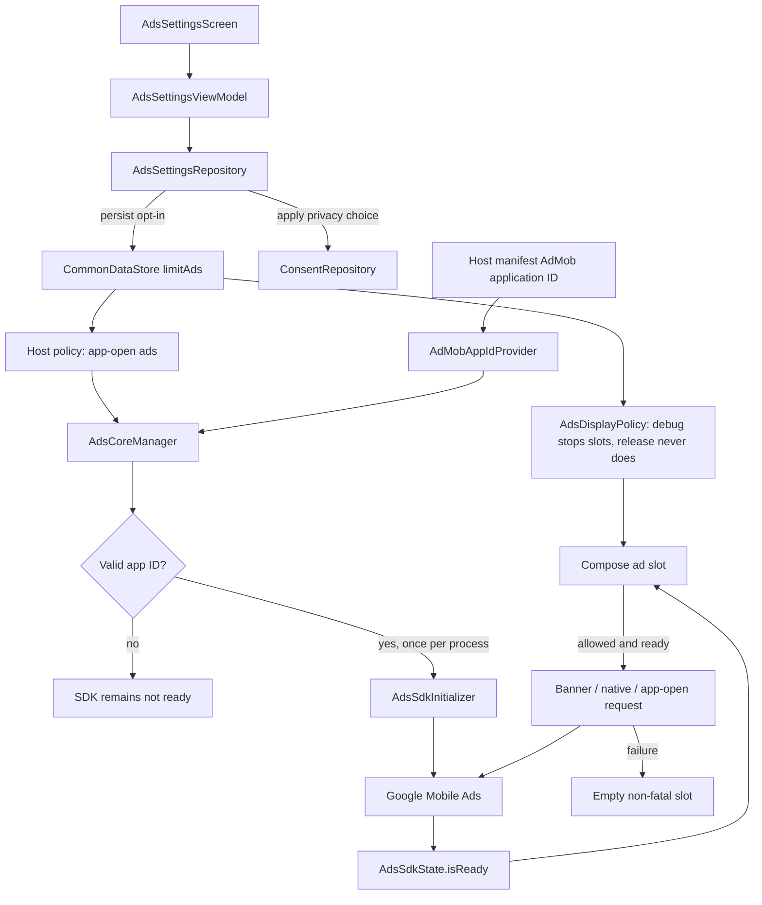

# `:library:integration:ads` Logic Graph

## Purpose

Owns ad preference settings and Google Mobile Ads integration UI used by AppToolkit hosts.

## Owns

- Ads settings repository, ViewModel, screen, and activity.
- `AdsCoreManager`, `AdsSdkInitializer`, and Google Mobile Ads SDK initialization.
- App-open ad lifecycle; the `INTERNET`, `ACCESS_NETWORK_STATE`, and `AD_ID` permissions required by
  the SDK; and default Mobile Ads initialization/loading metadata.

## Does not own

- Consent acquisition, owned by `:library:integration:consent`.
- Generic native-ad rendering primitives, currently owned by `:library:core:ui`.
- Host ad-unit IDs and host-specific ad policies, owned by the host/common configuration. That
  includes which ads the opt-in suppresses: this module toggles the preference, `AdsDisplayPolicy`
  and the host's own policy decide what it does.

## Depends on

- [`:library:core:common`](../../core/common/README.md) for ads/Firebase contracts and host
  constants.
- [`:library:core:datastore`](../../core/datastore/README.md) for the persisted limit-ads opt-in.
- [`:library:core:network`](../../core/network/README.md) for shared result/error types.
- [`:library:core:ui`](../../core/ui/README.md) for screen contracts and reusable Compose UI.
- [`:library:integration:consent`](../consent/README.md) so ad state respects consent.

## Used by

- `:sample` and `:library:apptoolkit`.

## Flow chart

## Architectural decisions

- One stored ads preference, `limit_ads`, and one switch over it. This module stores and toggles it
  and interprets it nowhere; `AdsDisplayPolicy` in `:library:core:common` is the single place that
  turns it into a rendering decision. `AdsSettingsUiState` carries the opt-in and the toggle's
  wording, so every control on the screen is live at all times.
- Installs that had switched ads off under the removed enablement preference are carried onto the
  opt-in by `LimitAdsMigration` in `:library:core:datastore`.
- SDK initialization is idempotent, mutex-protected, and conditional on a valid host-manifest app
  ID; the toolkit never supplies a fallback publisher ID. That id check is the only thing that can
  stop it.
- Readiness is explicit state because asynchronous SDK initialization is a different fact from
  wanting an ad. Ad slots wait and retry when readiness changes.
- Ad rendering fails closed: SDK exceptions or unavailable consent produce an empty slot, never a
  process-fatal composition error.

## One toggle, two behaviours

The ads screen shows a single switch over a single preference. Its wording and its effect differ by
build type:

| Build   | Toggle reads | Opt-in on                                                             |
|---------|--------------|-----------------------------------------------------------------------|
| Release | Reduce ads   | app-open ads stop; native and banner slots render                     |
| Debug   | Disable ads  | app-open ads stop; nothing else renders; personalized ads goes inert  |

App-open ads are suppressed identically in both, by the host's own `SampleAdsPolicy`. The *only*
behavioural difference is whether native and banner slots may render, and `AdsDisplayPolicy` is the
one place that decides it.

The personalized-ads row follows from that: personalization shapes the ads that get shown, so the
row is disabled exactly where none are. `AdsSettingsUiState.personalizedAdsEnabled` restates the
condition rather than reading the policy, so the row and the switch move together during the
optimistic update instead of the row lagging a write — the two must stay in step.

### What existing installs get on update

| Stored before update | After `LimitAdsMigration`        | Release behaviour              |
|----------------------|----------------------------------|--------------------------------|
| `ads = false`        | `limit_ads = true`, `ads` dropped | no app-open ads, ads elsewhere |
| `ads = true`         | `ads` dropped, no opt-in written  | ads, unchanged                 |
| nothing stored       | untouched, migration never runs   | ads, unchanged                 |

The opt-in defaults to `false`, so ads are shown by default and only the population that had
explicitly switched them off is carried onto the new toggle.

### Why debug differs

Checking how the app looks and behaves with no ads at all needs a switch that actually stops them,
and a developer build is the right place for it. Shipping that switch is what the removed
ads-enabled preference did, and it handed every user a permanently ad-free build.

### Where premium fits

A paid ad-free tier is the planned third answer to the same question, and it belongs in
`AdsDisplayPolicy`: the release branch becomes "allowed unless the user has bought ad removal". No
ad slot, no settings screen, no SDK code and no new preference changes. Resist adding a second
preference that ad slots also consult — see the migration notes below for what that costs.

### Rules this arrangement depends on

- **One preference.** The two behaviours are two readings of `limit_ads`, never two flags. Neither
  mode may reference the other.
- **The preference never gates SDK initialization.** `AdsCoreManager` reads no preference at all;
  initialization is conditional only on a valid host-manifest AdMob app id. Skipping initialization
  when ads are off is exactly the optimisation that used to crash host processes.
- **One reader for ad slots.** Every slot resolves the same process-scoped `AdsDisplayPolicy`
  through `rememberAdsAllowed()`. A slot that decides for itself is the other half of that crash.
- **The debug label is not translated.** `disable_ads`/`summary_disable_ads` exist in the default
  locale only; no shipped build can reach them.

## Public contracts

- Ads settings screen/activity, repository contract (`observeLimitAds`/`setLimitAds`), and UI
  event/action/state contracts.
- `AdsCoreManager` and its replaceable `AdsSdkInitializer` test seam.

## Internal implementations

- `DefaultAdsSettingsRepository` and SDK/persistence coordination.

## Current risks

Ad rendering is split between this integration and `:library:core:ui`, which weakens the integration
boundary and makes the generic UI module depend conceptually on an optional SDK concern.

## Migration notes

### Fixed:
`IllegalStateException: MobileAds.initialize must be called before using the Google Mobile Ads SDK`

Reported from `NativeAdLoader.load` inside a Compose `DisposableEffect`, which made it fatal: the
throw happened during composition, so it took the process down instead of failing one ad slot.

Two independent causes, both fixed:

- The ads-enabled preference had two sources with different defaults. `AdsCoreManager` gated SDK
  initialization on one and the ad views read the other, so in a debug build the views could believe
  ads were on while the SDK had never been initialized. The preference was removed outright, and the
  debug-only stop that replaced part of it never reaches initialization: `AdsCoreManager` reads no
  preference, and every slot reads one shared `AdsDisplayPolicy`. There is no second reading left to
  disagree.
- Even with one source, initialization is asynchronous. An ad slot composed during startup could
  request before the SDK was up. Requests now wait on `AdsSdkState.isReady` and re-key when
  readiness
  changes, so a slot composed early starts by itself rather than throwing and never retrying.

`rememberNativeAd` additionally wraps the load in `runCatching`, so any remaining synchronous SDK
throw renders an empty slot instead of killing the host. An ad is never worth a crash.

Ads, consent, and Mobile Ads initialization previously diverged in ways that could terminate every
consumer app. The durable safeguards are documented at the modules that own them:

- [`:library:core:common`](../../core/common/README.md) owns host-manifest AdMob ID validation and
  the narrowly scoped UMP crash guard.
- [`:library:core:datastore`](../../core/datastore/README.md) owns the limit-ads preference and the
  migration off the removed enablement key.
- [`:library:integration:consent`](../consent/README.md) owns consent single-flight and
  host-lifecycle
  validation.
- [`:library:core:ui`](../../core/ui/README.md) owns fail-closed ad loading and host-overridable
  native-ad surfaces.

Changes to ad initialization or rendering must preserve all four boundaries; fixing only the
settings repository is not sufficient.
