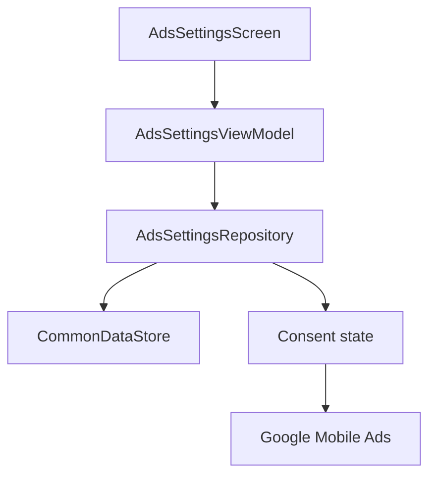

# `:library:integration:ads` Logic Graph

## Purpose

Owns ad enablement settings and Google Mobile Ads integration UI used by AppToolkit hosts.

## Owns

- Ads settings repository, ViewModel, screen, and activity.
- `AdsCoreManager`, `AdsSdkInitializer`, and Google Mobile Ads SDK initialization.
- App-open ad lifecycle; the `INTERNET`, `ACCESS_NETWORK_STATE`, and `AD_ID` permissions required by
  the SDK; and default Mobile Ads initialization/loading metadata.

## Does not own

- Consent acquisition, owned by `:library:integration:consent`.
- Generic native-ad rendering primitives, currently owned by `:library:core:ui`.
- Host ad-unit IDs and host-specific ad policies, owned by the host/common configuration.

## Depends on

- [`:library:core:common`](../../core/common/README.md) for ads/Firebase contracts and host
  constants.
- [`:library:core:datastore`](../../core/datastore/README.md) for persisted ads enablement.
- [`:library:core:network`](../../core/network/README.md) for shared result/error types.
- [`:library:core:ui`](../../core/ui/README.md) for screen contracts and reusable Compose UI.
- [`:library:integration:consent`](../consent/README.md) so ad state respects consent.

## Used by

- `:sample` and `:library:apptoolkit`.

## Flow chart

## Public contracts

- Ads settings screen/activity, repository contract, and UI event/action/state contracts.
- `AdsCoreManager` and its replaceable `AdsSdkInitializer` test seam.

## Internal implementations

- `DefaultAdsSettingsRepository` and SDK/persistence coordination.

## Current risks

Ad rendering is split between this integration and `:library:core:ui`, which weakens the integration
boundary and makes the generic UI module depend conceptually on an optional SDK concern.

## Migration notes

### Fixed:
`IllegalStateException: MobileAds.initialize must be called before using the Google Mobile Ads SDK`

Reported from `NativeAdLoader.load` inside a Compose `DisposableEffect`, which made it fatal: the
throw happened during composition, so it took the process down instead of failing one ad slot.

Two independent causes, both fixed:

- The ads-enabled preference had two sources with different defaults. `AdsCoreManager` gated SDK
  initialization on one and the ad views read the other, so in a debug build the views could believe
  ads were on while the SDK had never been initialized. Both now read
  `CommonDataStore.adsEnabledFlow`, and only the default is shared.
- Even with one source, initialization is asynchronous. An ad slot composed during startup could
  request before the SDK was up. Requests now wait on `AdsSdkState.isReady` and re-key when
  readiness
  changes, so a slot composed early starts by itself rather than throwing and never retrying.

`rememberNativeAd` additionally wraps the load in `runCatching`, so any remaining synchronous SDK
throw renders an empty slot instead of killing the host. An ad is never worth a crash.

Ads, consent, and Mobile Ads initialization previously diverged in ways that could terminate every
consumer app. The durable safeguards are documented at the modules that own them:

- [`:library:core:common`](../../core/common/README.md) owns host-manifest AdMob ID validation and
  the narrowly scoped UMP crash guard.
- [`:library:core:datastore`](../../core/datastore/README.md) owns the single ads-enabled preference
  source, idempotent initialization, and SDK readiness publication.
- [`:library:integration:consent`](../consent/README.md) owns consent single-flight and
  host-lifecycle
  validation.
- [`:library:core:ui`](../../core/ui/README.md) owns fail-closed ad loading and host-overridable
  native-ad surfaces.

Changes to ads enablement must preserve all four boundaries; fixing only the settings repository is
not sufficient.
