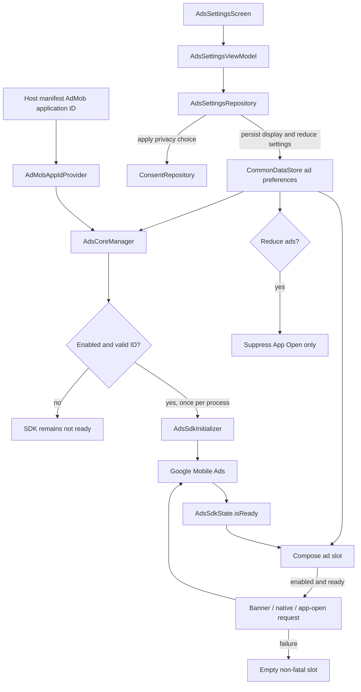

# `:library:integration:ads` Logic Graph

## Purpose

Owns ad enablement settings and Google Mobile Ads integration UI used by AppToolkit hosts.

## Owns

- Ads settings repository, ViewModel, screen, and activity.
- `AdsCoreManager`, `AdsSdkInitializer`, and Google Mobile Ads SDK initialization.
- App-open ad lifecycle; the `INTERNET`, `ACCESS_NETWORK_STATE`, and `AD_ID` permissions required by
  the SDK; and default Mobile Ads initialization/loading metadata.

## Does not own

- Consent acquisition, owned by `:library:integration:consent`.
- Generic native-ad rendering primitives, currently owned by `:library:core:ui`.
- Host ad-unit IDs and host-specific ad policies, owned by the host/common configuration.

## Depends on

- [`:library:core:common`](../../core/common/README.md) for ads/Firebase contracts and host
  constants.
- [`:library:core:datastore`](../../core/datastore/README.md) for persisted ads enablement.
- [`:library:core:network`](../../core/network/README.md) for shared result/error types.
- [`:library:core:ui`](../../core/ui/README.md) for screen contracts and reusable Compose UI.
- [`:library:integration:consent`](../consent/README.md) so ad state respects consent.

## Used by

- `:sample` and `:library:apptoolkit`.

## Flow chart



## Architectural decisions

- Persisted ads enablement is the single source of truth for settings, initialization, and UI
  requests. No consumer chooses a local default.
- Release builds expose the reduce-ads setting, while debug builds expose display-ads for testing.
  Display ads continues to gate all ad surfaces; reduce ads gates only App Open display.
- SDK initialization is idempotent, mutex-protected, and conditional on a valid host-manifest app
  ID; the toolkit never supplies a fallback publisher ID.
- Readiness is explicit state because enablement and asynchronous SDK initialization are different
  facts. Ad slots wait and retry when readiness changes.
- Ad rendering fails closed: SDK exceptions or unavailable consent produce an empty slot, never a
  process-fatal composition error.

## Ad unit IDs a host must provide

The toolkit ships no ad unit IDs. A host supplies its own, and the two halves are supplied
differently.

### 1. The AdMob application id, manifest meta-data

```xml

<meta-data android:name="com.google.android.gms.ads.APPLICATION_ID"
    android:value="@string/ad_mob_app_id" />
```

`ManifestAdMobAppIdProvider` reads it from there and nowhere else, and `AdsCoreManager` refuses to
initialize the SDK without a valid one rather than falling back to a sample id. Declare the string
in the **host**, never in a library module: a library-owned `ad_mob_app_id` is inherited by every
consumer app that does not declare the same name, silently pointing that app's consent request and
SDK initialization at the wrong publisher account.

### 2. Ad unit IDs, Koin `AdsConfig` bindings

Each placement resolves an `AdsConfig` by qualifier:

```kotlin
single<AdsConfig>(named(name = AdsQualifiers.SUPPORT_NATIVE_AD)) {
    AdsConfig(bannerAdUnitId = "ca-app-pub-.../...")
}
```

**Required if the host ships the screen.** These are injected with `koinInject`, which throws
`NoDefinitionFoundException` when the binding is missing, the screen crashes rather than rendering
without an ad, so bind every qualifier whose screen you include:

| Qualifier           | Injected by                                     | Format          |
|---------------------|-------------------------------------------------|-----------------|
| `NO_DATA_NATIVE_AD` | `NoDataScreen`, in `:library:core:ui`           | Native advanced |
| `HELP_NATIVE_AD`    | `HelpScreenContent`, in `:library:feature:help` | Native advanced |
| `SUPPORT_NATIVE_AD` | `SupportScreen`, in `:library:feature:support`  | Native advanced |

`NoDataScreen` is the one to watch: it is a shared empty/error state rather than a screen a host
opts into, so almost every host reaches it eventually.

**Optional.** Offered for host placements; nothing in the toolkit injects them, so leaving them
unbound costs nothing: `NATIVE_AD`, `BOTTOM_NAV_BAR_NATIVE_AD`, and the size-named `BANNER_AD`,
`LARGE_BANNER_AD`, `MEDIUM_RECTANGLE_AD`, `FULL_BANNER_AD`, `LEADERBOARD_AD`, `FLUID_AD`.

Hosts add their own qualifiers for their own screens rather than extending `AdsQualifiers`; the
sample keeps `AppAdsQualifiers` for its apps list and app details placements.

### Choosing the format

`AdsConfig.adSize` applies to `AdBanner` only. Native slots, `NativeAdSlot` and the
`*NativeAdCard` wrappers, ignore it, so a native placement should leave it at its default and bind
a **Native advanced** unit id. Binding a banner unit id to a native slot, or the reverse, produces
no fill rather than an error.

### App Open

`AdsCoreManager.initializeAds(appOpenUnitId = ...)` takes the id directly; there is no qualifier.
The
host decides whether it wants the ad at all, see the toggle table above.

## Rendering an ad

**Use the toolkit's own ad composables.** Every app in this family depends on this library, so no
host has to write its own loading code, and every host that has written one has eventually
rediscovered the same handful of bugs. Reach for these in this order:

| Want                                   | Use                                                | Where              |
|----------------------------------------|----------------------------------------------------|--------------------|
| A finished native card                 | `NativeAdSlot` and the `*NativeAdCard` wrappers    | `:library:core:ui` |
| Your own layout, the toolkit's loading | `rememberNativeAd(adUnitId)` returning `NativeAd?` | `:library:core:ui` |
| A banner                               | `AdBanner`                                         | `:library:core:ui` |

`rememberNativeAd` is the one to know about. It returns a `NativeAd?` and imposes nothing on the
layout, so a host that wants a card of its own design still gets the whole request lifecycle for
free:

```kotlin
val nativeAd: NativeAd = rememberNativeAd(adUnitId = adUnitId) ?: return

MyOwnCard {
    AndroidView(factory = ::buildMyAdView, update = { bind(it, nativeAd) })
}
```

That is the entire integration. Nothing below this line is something a host should be writing.

### What the toolkit is doing for you

Worth knowing, because these are the failures a hand-rolled loader ships with:

- **It waits for the SDK.** `MobileAds.initialize` runs asynchronously from the host's startup
  coroutine, so a screen composed early reaches its ad slot before the SDK exists. The loaders throw
  `IllegalStateException("MobileAds.initialize must be called before using the Google Mobile Ads
  SDK.")` when asked too early, and the SDK offers no way to ask whether it is ready. That is what
  `AdsSdkState` exists for.
- **It asks again when the SDK comes up.** Readiness is part of the effect key, not just the ad
  unit.
  A request keyed on the ad unit alone makes one attempt at the earliest possible moment and never
  retries, so the slot stays blank for the life of the composition even though the SDK came up a
  moment later. The signature of this bug is a running native ad validator over empty slots: the
  validator flag can only be applied by an `initialize` call that ran, so seeing it rules out the
  SDK
  and points at the slot.
- **It catches the loader's throw.** The load happens during composition, where an unhandled
  `IllegalStateException` takes the process down. An ad slot that cannot load renders nothing; it is
  never a crash.
- **It owns the ad's lifetime.** Re-keying destroys the previous `NativeAd` before requesting
  another, and an ad that arrives after disposal is destroyed rather than retained.

If you are ever tempted to call `NativeAdLoader.load` or `MobileAds.initialize` directly from a
host,
that list is what you are signing up to reimplement, and the second item is the one nobody remembers
until an app ships with silent, empty ad slots.

### The native ad validator

The validator is the SDK's own debug overlay, configured at initialization:
`initializeAds(appOpenUnitId, disableNativeValidator = true)` turns it off. It is left on by
default.

## Public contracts

- Ads settings screen/activity, repository contract, and UI event/action/state contracts.
- `AdsCoreManager` and its replaceable `AdsSdkInitializer` test seam.

## Internal implementations

- `DefaultAdsSettingsRepository` and SDK/persistence coordination.

## Current risks

Ad rendering is split between this integration and `:library:core:ui`, which weakens the integration
boundary and makes the generic UI module depend conceptually on an optional SDK concern.

## Migration notes

### Fixed:

`IllegalStateException: MobileAds.initialize must be called before using the Google Mobile Ads SDK`

Reported from `NativeAdLoader.load` inside a Compose `DisposableEffect`, which made it fatal: the
throw happened during composition, so it took the process down instead of failing one ad slot.

Two independent causes, both fixed:

- The ads-enabled preference had two sources with different defaults. `AdsCoreManager` gated SDK
  initialization on one and the ad views read the other, so in a debug build the views could believe
  ads were on while the SDK had never been initialized. Both now read
  `CommonDataStore.adsEnabledFlow`, and only the default is shared.
- Even with one source, initialization is asynchronous. An ad slot composed during startup could
  request before the SDK was up. Requests now wait on `AdsSdkState.isReady` and re-key when
  readiness
  changes, so a slot composed early starts by itself rather than throwing and never retrying.

`rememberNativeAd` additionally wraps the load in `runCatching`, so any remaining synchronous SDK
throw renders an empty slot instead of killing the host. An ad is never worth a crash.

Ads, consent, and Mobile Ads initialization previously diverged in ways that could terminate every
consumer app. The durable safeguards are documented at the modules that own them:

- [`:library:core:common`](../../core/common/README.md) owns host-manifest AdMob ID validation and
  the narrowly scoped UMP crash guard.
- [`:library:core:datastore`](../../core/datastore/README.md) owns the single ads-enabled preference
  source, idempotent initialization, and SDK readiness publication.
- [`:library:integration:consent`](../consent/README.md) owns consent single-flight and
  host-lifecycle
  validation.
- [`:library:core:ui`](../../core/ui/README.md) owns fail-closed ad loading and host-overridable
  native-ad surfaces.

Changes to ads enablement must preserve all four boundaries; fixing only the settings repository is
not sufficient.
