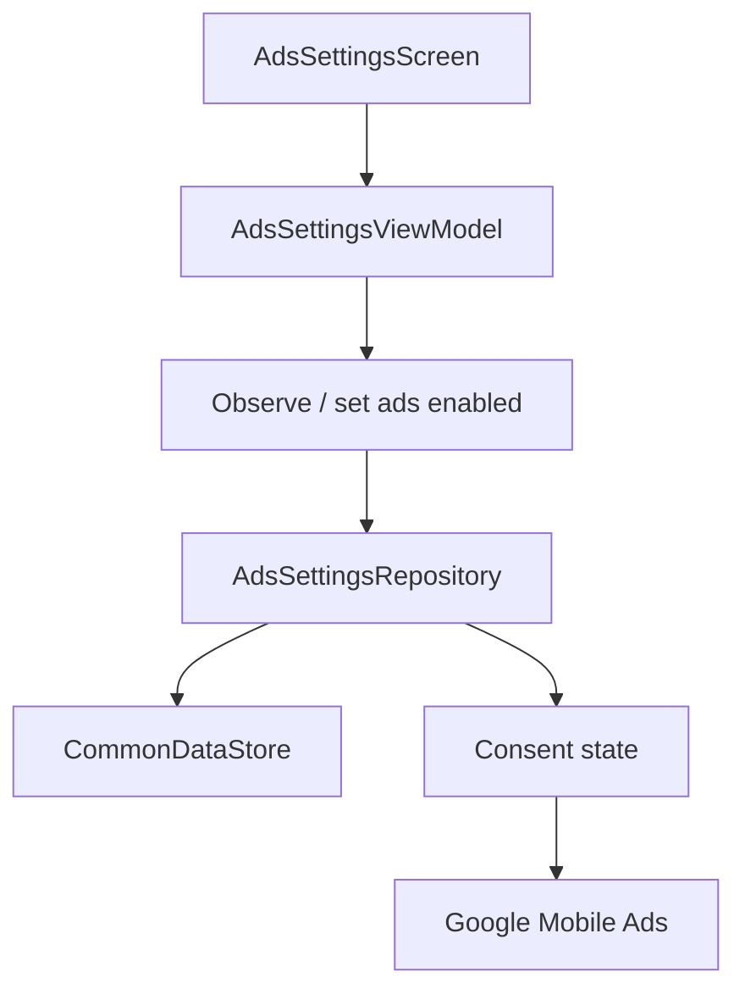

# `:library:integration:ads` Logic Graph

## Purpose

Owns ad enablement settings and Google Mobile Ads integration UI used by AppToolkit hosts.

## Owns

- Ads settings repository, observe/set use cases, ViewModel, screen, and activity.
- Google Mobile Ads SDK exposure needed by reusable ad rendering.

## Does not own

- Consent acquisition, owned by `:library:integration:consent`.
- Generic native-ad rendering primitives, currently owned by `:library:core:ui`.
- Host ad-unit IDs and host-specific ad policies, owned by the host/common configuration.

## Depends on

- [`:library:core:common`](../../core/common/README.md) for ads/Firebase contracts and host constants.
- [`:library:core:datastore`](../../core/datastore/README.md) for persisted ads enablement.
- [`:library:core:network`](../../core/network/README.md) for shared result/error types.
- [`:library:core:ui`](../../core/ui/README.md) for screen contracts and reusable Compose UI.
- [`:library:integration:consent`](../consent/README.md) so ad state respects consent.

## Used by

- `:sample` and `:library:apptoolkit`.

## Flow chart

## Public contracts

- Ads settings screen/activity, repository contract, use cases, and UI event/action/state contracts.

## Internal implementations

- `AdsSettingsRepositoryImpl` and SDK/persistence coordination.

## Current risks

Ad rendering is split between this integration and `:library:core:ui`, which weakens the integration boundary and makes the generic UI module depend conceptually on an optional SDK concern.

## Migration notes

Ads, consent, and Mobile Ads initialization previously diverged in ways that could terminate every
consumer app. The durable safeguards are documented at the modules that own them:

- [`:library:core:common`](../../core/common/README.md) owns host-manifest AdMob ID validation and
  the narrowly scoped UMP crash guard.
- [`:library:core:datastore`](../../core/datastore/README.md) owns the single ads-enabled preference
  source, idempotent initialization, and SDK readiness publication.
- [`:library:integration:consent`](../consent/README.md) owns consent single-flight and host-lifecycle
  validation.
- [`:library:core:ui`](../../core/ui/README.md) owns fail-closed ad loading and host-overridable
  native-ad surfaces.

Changes to ads enablement must preserve all four boundaries; fixing only the settings repository is
not sufficient.
