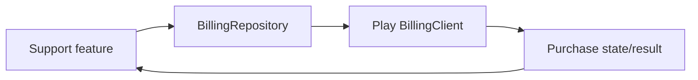

# `:library:integration:billing` Logic Graph

## Purpose

Wraps Google Play Billing behind a reusable repository and Koin module.

## Owns

- Billing client lifecycle, product queries, purchase launches, and purchase-state exposure.
- The `BillingRepository` contract and its `BillingRepositoryImpl` Play Billing implementation.

## Does not own

- Donation product IDs or support-screen behavior, owned by `:library:feature:support`.
- Generic purchase models/contracts, owned by `:library:core:common`.

## Depends on

- [`:library:core:common`](../../core/common/README.md) for `BillingCore`, purchase results, and shared lifecycle helpers.
  `BillingRepository` extends `BillingCore`, so the core manager can close billing without seeing the purchase surface.

## Used by

- `:sample` and `:library:apptoolkit` for application/integration assembly.
- `:library:feature:support` to query products and launch support purchases.

## Flow chart

## Public contracts

- `BillingRepository` and `BillingModule`. Consumers inject the interface: the implementation is a
  process-wide singleton behind a private constructor, which a feature module can neither substitute
  nor fake in a test.

## Internal implementations

- `BillingRepositoryImpl`: BillingClient callbacks, connection management, product-detail caching, and purchase acknowledgement/query behavior.

## Current risks

Billing client and callback behavior is compatibility-sensitive to Play Billing Library upgrades.
