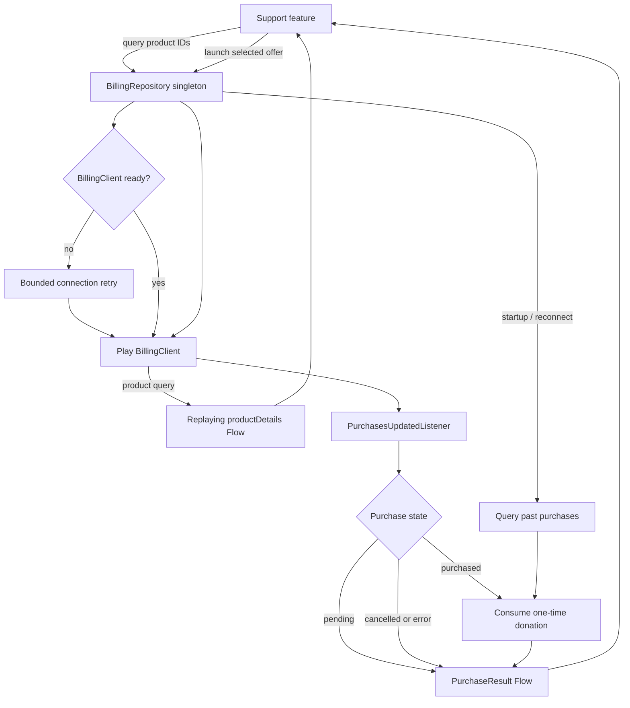

# `:library:integration:billing` Logic Graph

## Purpose

Wraps Google Play Billing behind a reusable repository and Koin module.

## Owns

- Billing client lifecycle, product queries, purchase launches, and purchase-state exposure.
- The `BillingRepository` contract and its `DefaultBillingRepository` Play Billing implementation.
- The Play Billing manifest permission merged into consuming applications.

## Does not own

- Donation product IDs or support-screen behavior, owned by `:library:feature:support`.
- Generic purchase models/contracts, owned by `:library:core:common`.

## Depends on

- [`:library:core:common`](../../core/common/README.md) for `BillingCore`, purchase results, and
  shared lifecycle helpers.
  `BillingRepository` extends `BillingCore`, so the core manager can close billing without seeing
  the purchase surface.

## Used by

- `:sample` and `:library:apptoolkit` for application/integration assembly.
- `:library:feature:support` to query products and launch support purchases.

## Flow chart

## Architectural decisions

- One process-scoped repository owns the single `BillingClient`, its callback listener, connection
  retries, and purchase recovery.
- One-time support purchases are consumable donations. Completed unconsumed purchases are recovered
  on setup/reconnect and consumed before success is emitted.
- Product details replay the latest query result; purchase outcomes do not replay because they are
  one-off events.
- `BillingRepository` extends the narrow `BillingCore` teardown contract so common lifecycle code
  can close billing without depending on Play Billing APIs.

## Public contracts

- `BillingRepository` and `BillingModule`. Consumers inject the interface: the implementation is a
  process-wide singleton behind a private constructor, which a feature module can neither substitute
  nor fake in a test.

## Internal implementations

- `DefaultBillingRepository`: BillingClient callbacks, connection management, product-detail
  replay, retry policy, past-purchase queries, and donation consumption.

## Current risks

### Duplicate purchase-query callbacks

Cleaner issue `05c41df9eee5b548ee99decabc40eb68` reports `Already resumed` from
`BillingRepository.processPastPurchases` after a `SERVICE_UNAVAILABLE` timeout. This is a Toolkit
callback-to-coroutine defect, separate from the unresolved proxy-activity crash below. The
published `3.0.0-pre12` billing AAR still contains the unguarded continuation resume.

The local fix uses `awaitBillingCallback` for purchase queries, product queries, and consumption.
Each request attempt accepts its first callback atomically and ignores duplicates and callbacks
after cancellation. It preserves the first response and existing retry policy. Regression tests
cover duplicate timeout responses, concurrent responses, cancellation, and isolation between retries.
Consumers need a newly published Toolkit version containing this fix; an app version increase alone
does not establish that it has shipped. See [the incident report](../../../docs/notes/billing-duplicate-callback.md).

Billing client and callback behavior is compatibility-sensitive to Play Billing Library upgrades.

The reported `ProxyBillingActivity.onCreate` null-`PendingIntent` crash remains unresolved.
Expanded `configChanges` overrides currently present in the working tree are an unverified
proposal, not a demonstrated fix. See [SDK activity crash investigation](../../../docs/notes/sdk-activity-crashes.md)
for the bytecode evidence, limits of existing safeguards, and consumer validation requirements.
