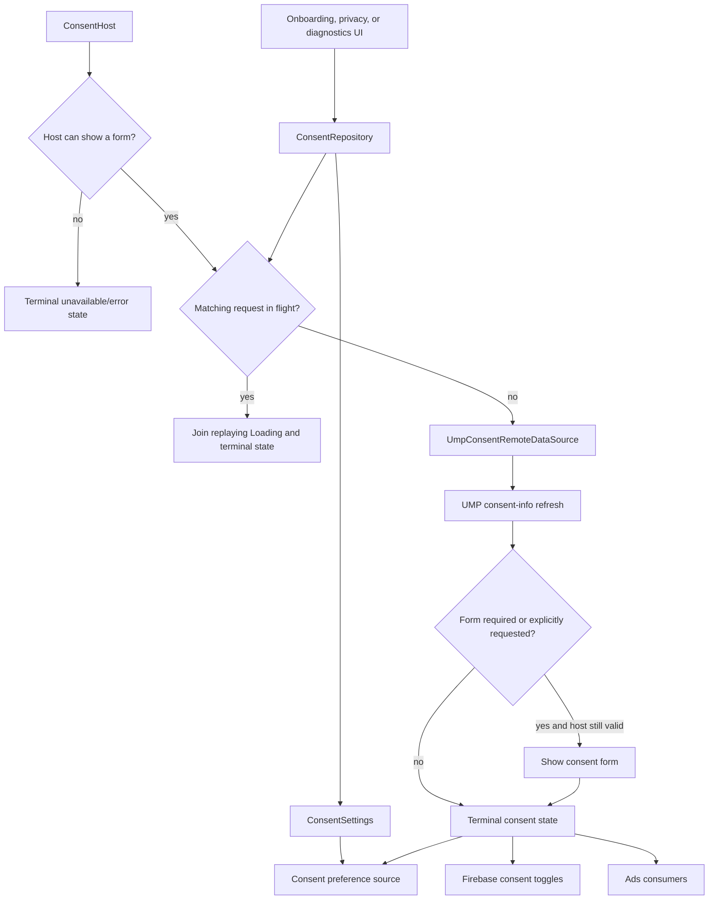

# `:library:integration:consent` Logic Graph

## Purpose

Coordinates user consent state between persisted toolkit preferences and Google's User Messaging
Platform (UMP).

## Owns

- `di.consentModule()` binds the consent repository and UMP remote source; foundation providers and
  preferences are supplied by the composing host graph.
- Consent domain models and the repository contract covering apply/request.
- `DefaultConsentRepository` and the UMP remote data source abstraction/implementation.
- Mapping host availability into consent behavior.

## Does not own

- Ads loading/presentation, owned by `:library:integration:ads`.
- Diagnostics screen UI, owned by `:library:feature:diagnostics`.
- Preference storage implementation, owned by `:library:core:datastore`.

## Depends on

- [`:library:core:common`](../../core/common/README.md) for Firebase and shared contracts.
- [`:library:core:datastore`](../../core/datastore/README.md) for consent preference persistence.
- [`:library:core:network`](../../core/network/README.md) for shared error/result handling.

## Used by

- `:sample` and `:library:apptoolkit`.
- `:library:feature:about`, `:library:feature:onboarding`, and `:library:feature:settings` for
  privacy/diagnostics flows.
- `:library:integration:ads` before enabling ads.

## Flow chart

## Architectural decisions

- The repository owns one consent round trip at a time. Matching callers join replaying state rather
  than launching overlapping UMP requests.
- `showIfRequired` is part of the in-flight key because an explicit privacy-form request cannot be
  satisfied by a weaker conditional request.
- Host validity is checked both before SDK work and immediately before form display; asynchronous
  callbacks must not retain permission to use a destroyed activity.
- Persistence records the resolved choice, while UMP remains the authority for whether a form is
  currently available or required.

## Public contracts

- `ConsentRepository`, `ConsentSettings`, `ConsentHost`, and `ConsentHostAvailability`.

## Internal implementations

- `DefaultConsentRepository` and UMP SDK orchestration.

## Current risks

Consent behavior spans persistence, host callbacks, UMP state, Firebase toggles, and ads consumers;
changes require coordinated validation across those boundaries.

## Migration notes

### Fixed: UMP 4.0.0 empty-error-body process crash

Reported as `NoSuchElementException` from `Scanner.next()` on a UMP `ThreadPoolExecutor` thread,
with
no toolkit frame in the stack.

The toolkit previously encountered a process-killing failure after a consent request failed. UMP
4.0.0 performs a metrics request on its own executor and reads a non-success response body with
`Scanner.next()`. An empty body throws `NoSuchElementException` on that executor thread. Because the
throw happens outside the toolkit coroutine/callback path, catches in the remote source or the
repository cannot intercept it.

The following invariants reduce failed/overlapping UMP requests and must be preserved:

- `DefaultConsentRepository` permits one consent round trip at a time. A caller joins the replaying
  in-flight state instead of launching another request.
- The in-flight request is keyed by `showIfRequired`; an explicit form request must not join a
  request that only shows a form when required.
- A host that is finishing or destroyed is rejected before UMP is called.
- `UmpConsentRemoteDataSource` checks `ConsentHost.canShowConsentForm` again in the asynchronous
  callback before displaying a form.
- Every starter or joining caller observes `Loading` followed by one terminal state.
- UMP receives an AdMob application ID only when the host-manifest provider resolves a valid value;
  there is no library fallback ID.

[`ConsentSdkCrashGuard`](../../core/common/README.md) narrowly covers any remaining SDK telemetry
failure. Remove that guard only after the exact empty-body read is verified as fixed in the released
UMP artifact, preferably by inspecting the artifact rather than relying only on release notes.
