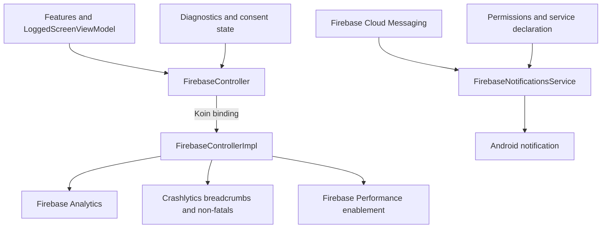

# `:library:integration:firebase` Logic Graph

## Purpose

Implements the toolkit's Firebase analytics/crash-reporting contract and provides Firebase messaging
service wiring.

## Owns

- `FirebaseControllerImpl` for analytics events, breadcrumbs, and crash reporting.
- `firebaseModule` Koin bindings.
- `FirebaseNotificationsService` and its notification/wake-lock manifest permissions.

## Does not own

- The SDK-neutral `FirebaseController` contract, owned by `:library:core:common`.
- User consent decisions and persisted diagnostics preferences, owned by consent/settings/DataStore
  modules.

## Depends on

- [`:library:core:common`](../../core/common/README.md) for the controller contract and shared
  analytics values.

Firebase Analytics, Crashlytics, Performance, and Messaging materially define this module.

## Used by

- `:sample` and `:library:apptoolkit` to install the production Firebase implementation.

## Flow chart

## Architectural decisions

- Features depend on the SDK-neutral `FirebaseController`; only this module imports concrete
  Firebase products.
- Consent updates are applied through the same controller as analytics/crash/performance calls so
  enablement policy does not leak into every feature.
- Messaging remains a framework-created service and is wired through the manifest rather than the
  Koin-created controller lifecycle.

## Public contracts

- `firebaseModule` and the Android messaging service declared in the manifest.

## Internal implementations

- Firebase SDK calls and notification handling.

## Current risks

The module bundles several Firebase products, so hosts cannot currently select analytics, crash
reporting, performance, and messaging independently at the module boundary.
