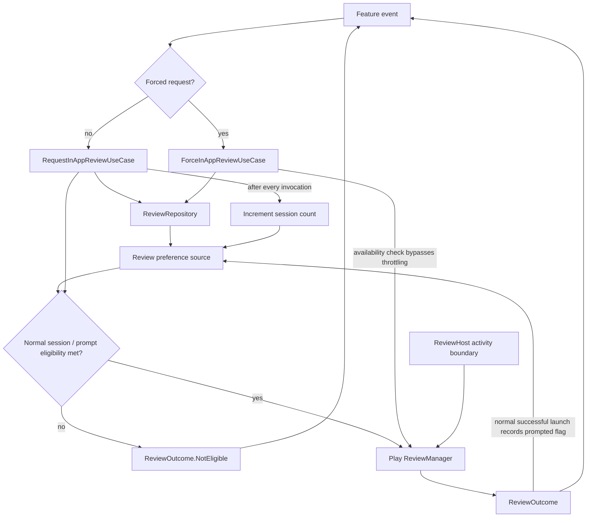

# `:library:integration:review` Logic Graph

## Purpose

Encapsulates Google Play in-app review eligibility, prompting, and persisted request throttling.

## Owns

- Review repository contract/implementation and review outcome/host models.
- Normal and forced in-app-review use cases.
- Activity extension helpers for the Play review flow.

## Does not own

- UI decisions about when to ask for a review, owned by consuming features.
- Preference storage implementation, owned by `:library:core:datastore`.

## Depends on

- [`:library:core:common`](../../core/common/README.md) for shared contracts and results.
- [`:library:core:datastore`](../../core/datastore/README.md) for prompt history/eligibility
  persistence.

## Used by

- `:sample` and `:library:apptoolkit`.
- `:library:feature:about` for shared application flows.
- `:library:feature:help` to request a review after relevant help interactions.

## Flow chart

## Architectural decisions

- The normal use case owns the three-session/previous-prompt eligibility rule; the repository owns
  prompt-history persistence and Play Review calls, so every caller observes the same stored facts.
- Forced and normal use cases express different product intent while sharing one SDK/repository
  implementation.
- Activity access is represented by `ReviewHost`; the repository does not retain a feature screen
  or assume a global activity.

## Public contracts

- `ReviewRepository`, review use cases, `ReviewHost`, and `ReviewOutcome`.

## Internal implementations

- Eligibility/throttling persistence and Play ReviewManager calls.

## Current risks

Repository packages retain the historical `playservices` name even though the active Gradle module
is `:library:integration:review`, which can obscure current ownership.
