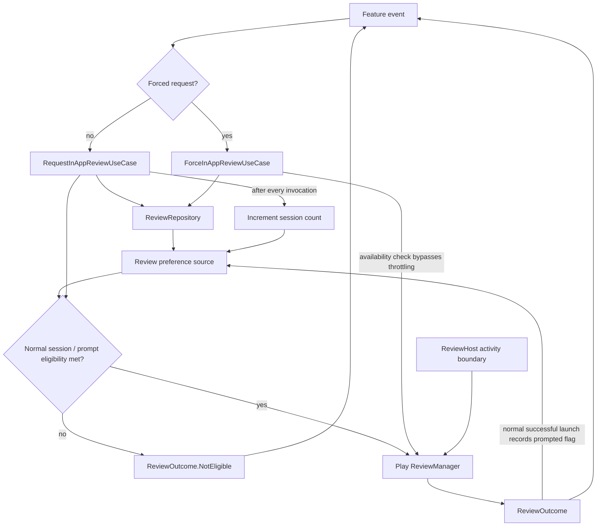

# `:library:integration:review` Logic Graph

## Purpose

Encapsulates Google Play in-app review eligibility, prompting, and persisted request throttling.

## Owns

- Review repository contract/implementation and review outcome/host models.
- Normal and forced in-app-review use cases.
- Activity extension helpers for the Play review flow.

## Does not own

- UI decisions about when to ask for a review, owned by consuming features.
- Preference storage implementation, owned by `:library:core:datastore`.

## Depends on

- [`:library:core:common`](../../core/common/README.md) for shared contracts and results.
- [`:library:core:datastore`](../../core/datastore/README.md) for prompt history/eligibility
  persistence.

## Used by

- `:sample` and `:library:apptoolkit`.
- `:library:feature:about` for shared application flows.
- `:library:feature:faq` to request a review after relevant FAQ interactions.

## Flow chart

## Architectural decisions

- The normal use case owns the three-session/previous-prompt eligibility rule; the repository owns
  prompt-history persistence and Play Review calls, so every caller observes the same stored facts.
- Both use cases check availability before launching, so an eligible user on an install Play cannot
  serve gets `Unavailable` rather than `Failed`. The two mean different things to a caller: a device
  that was never going to show a dialog, versus a launch that should have worked. Neither sets the
  prompt flag, so the user still gets their one prompt once Play can serve it.
- The repository dispatches its own work rather than trusting callers to. `launchReviewFlow` puts a
  dialog in front of an activity, so it runs on the main thread whatever dispatcher it is called
  from; the availability check reads the package manager over binder, so it runs on IO. A caller
  wrapping the use case in its own `withContext(io)` no longer decides where the dialog is shown.
- Forced and normal use cases express different product intent while sharing one SDK/repository
  implementation.
- Activity access is represented by `ReviewHost`; the repository does not retain a feature screen
  or assume a global activity.

## Public contracts

- `ReviewRepository`, review use cases, `ReviewHost`, and `ReviewOutcome`.

## Internal implementations

- Eligibility/throttling persistence and Play ReviewManager calls.

## Host checklist

`RequestInAppReviewUseCase` records a session on every invocation, so **call it once per app
session**. A host that sends the request from `onResume` sends it again on every return from another
activity, which counts resumes as sessions: the three-session threshold is then reached in the first
minute after install, and the in-flight flow is cancelled and restarted each time. Guard the request
where it survives configuration change — the ViewModel, not an Activity field — as `:sample` does.

## Current risks

Repository and use-case packages follow integration.review. Prompting still requires a valid ReviewHost and Google Play availability; eligibility does not guarantee that Play displays a prompt: Play applies its own quota and silently shows nothing when it is spent, and the returned task completes successfully either way, so `Launched` means the flow was handed to Play, not that a dialog appeared.
