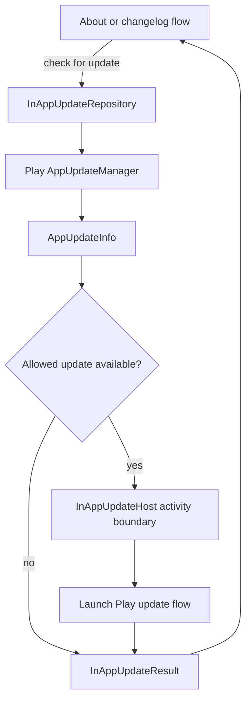

# `:library:integration:update` Logic Graph

## Purpose

Encapsulates Google Play in-app update checks and update-flow launches behind a repository contract.

## Owns

- `InAppUpdateRepository`, its Play implementation, and host/result models.

## Does not own

- Changelog retrieval or UI, owned by `:library:feature:about`.
- Host navigation and activity lifecycle beyond the explicit update-host contract.

## Depends on

- [`:library:core:common`](../../core/common/README.md) for shared platform/result contracts.

## Used by

- `:sample` and `:library:apptoolkit`.
- `:library:feature:about` through its in-app-update use case and changelog flow.

## Flow chart

## Architectural decisions

- Update availability and Play flow launch stay behind one repository so About/changelog UI does
  not import `AppUpdateManager`.
- The host boundary supplies only the lifecycle-capable activity needed by Play; navigation and
  changelog decisions remain in the consuming feature.
- Results are explicit values, allowing callers to distinguish unavailable, not allowed, started,
  and failed outcomes without interpreting SDK callbacks.

## Public contracts

- `InAppUpdateRepository`, `InAppUpdateHost`, and `InAppUpdateResult`.

## Internal implementations

- `DefaultInAppUpdateRepository` and Play update-manager interactions.

## Current risks

Repository packages retain the historical `playservices` name, which does not match the active
integration module path.
