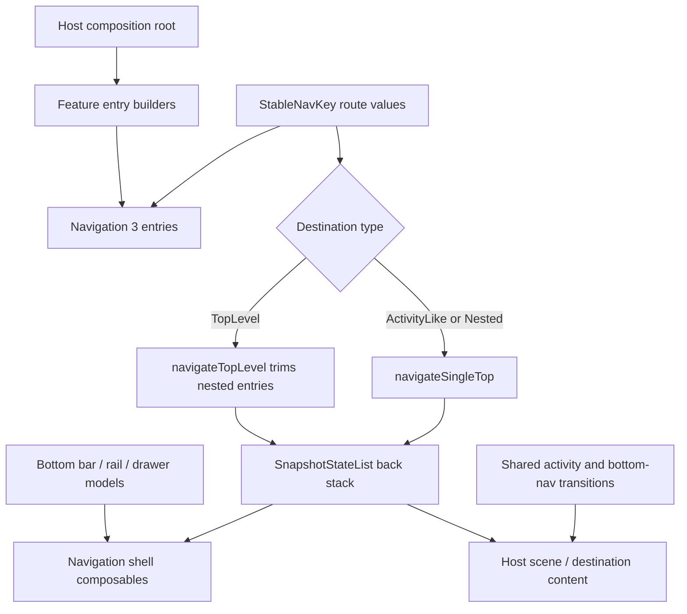

# `:library:navigation` Logic Graph

## Purpose

Defines navigation models, route identifiers, repository contracts, back-stack operations, icons,
and transition helpers shared by host and feature UI.

## Owns

- `NavigationDestination`, `MainNavigationItem`, `NavigationDrawerItem`, and `BottomBarItem` models.
- `StableNavKey` and the reusable typed AppToolkit route keys.
- Drawer route identifiers and the repository contract hosts implement to supply items.
- Back-stack mutation helpers.
- Shared activity and bottom-navigation transitions.
- Navigation icon rendering.
- Bottom navigation, navigation rail, drawer-item content, and hide-on-scroll shell rendering.

## Does not own

- Destination registration, owned by `:library:apptoolkit` and host composition roots.
- The standard four-item drawer implementation, owned by `:library:feature:about` because its labels
  are feature resources.
- Host-app routes and the root navigation graph, owned by `:sample`.

## Depends on

- [`:library:core:common`](../core/common/README.md) for shared sizing constants.
- [`:library:core:designsystem`](../core/designsystem/README.md) for interaction feedback and global
  UI preference values.
- Navigation 3, Compose, and immutable collections materially define the module's public role.

## Used by

- `:sample` for host navigation.
- `:library:apptoolkit` and `:library:core:ui` for shared destination registration and navigation
  UI.
- `:library:feature:about`, `:library:feature:help`, `:library:feature:issuereporter`,
  `:library:feature:onboarding`, `:library:feature:permissions`, `:library:feature:settings`, and
  `:library:feature:support` for feature routes and navigation surfaces.

## Flow chart

## Architectural decisions

- Route keys are typed, parcelable, and Compose-stable so host and library destinations share one
  Navigation 3 vocabulary without string parsing.
- Destination type is data on the route contract. Back-stack helpers validate top-level navigation
  and suppress duplicate single-top entries.
- This module owns shell rendering and mutation primitives but not destination registration; only
  the host/facade composition roots know the complete feature set.
- The standard drawer repository contract is host-facing, while its default localized item list
  remains in the About feature that owns those labels and actions.

## Public contracts

- Navigation destination/item models, including `NavigationDrawerItem` and `BottomBarItem`.
- `StableNavKey` and `AppToolkitNavKey` route implementations.
- `NavigationDrawerRoutes` and `navigation.data.repositories.NavigationRepository`.
- Back-stack action extensions and transition helpers.
- `NavigationIcon`.
- `BottomNavigationBar`, `LeftNavigationRail`, `NavigationDrawerItemContent`, `NavigationDrawerSheet`, and
  `HideOnScrollBottomBar`.

## Internal implementations

- Compose rendering and transition specifications remain implementation helpers; destination
  registration stays with consumers.

## Current risks

The module mixes navigation models with Compose rendering and animation, so non-UI consumers still
receive a UI-oriented artifact.
