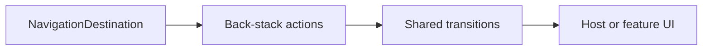

# `:library:navigation` Logic Graph

## Purpose

Defines navigation-neutral models, back-stack operations, icons, and transition helpers shared by host and feature UI.

## Owns

- `NavigationDestination` and `MainNavigationItem` models.
- Back-stack mutation helpers.
- Shared activity and bottom-navigation transitions.
- Navigation icon rendering.

## Does not own

- AppToolkit route keys and destination registration, owned by `:library:feature:about` and `:library:apptoolkit` respectively.
- Host-app routes and the root navigation graph, owned by `:sample`.

## Depends on

No internal Gradle modules. Navigation 3 and Compose materially define its role.

## Used by

- `:sample` for host navigation.
- `:library:apptoolkit` and `:library:core:ui` for shared destination registration and navigation UI.
- `:library:feature:about`, `:library:feature:help`, `:library:feature:issuereporter`, `:library:feature:onboarding`, `:library:feature:permissions`, `:library:feature:settings`, and `:library:feature:support` for feature routes and navigation surfaces.

## Flow chart

## Public contracts

- Navigation destination/item models.
- Back-stack action extensions and transition helpers.
- `NavigationIcon`.

## Internal implementations

- Compose rendering and transition specifications remain implementation helpers; route ownership stays with consumers.

## Current risks

The module mixes navigation models with Compose rendering and animation, so non-UI consumers still receive a UI-oriented artifact.
