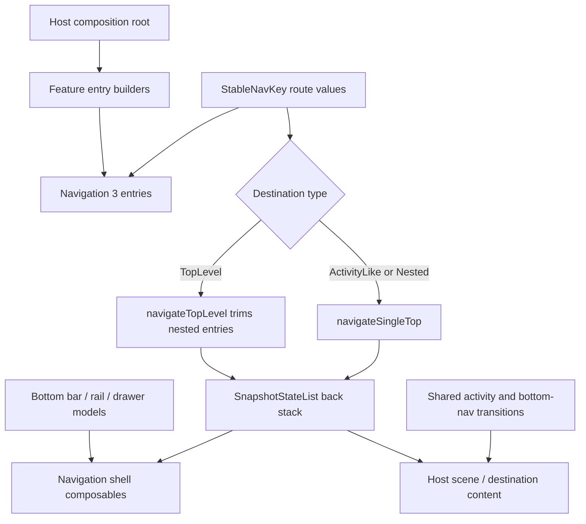

# `:library:navigation` Logic Graph

## Purpose

Defines navigation models, route identifiers, repository contracts, back-stack operations, and
transition helpers shared by host and feature UI.

## Owns

- `NavigationDestination`, `MainNavigationItem`, `NavigationDrawerItem`, and `BottomBarItem` models.
- `StableNavKey` and the reusable typed AppToolkit route keys.
- Drawer route identifiers and the repository contract hosts implement to supply items.
- Back-stack mutation helpers.
- Shared activity and bottom-navigation transitions.
- Click and selection state for navigation icons; reusable AVD resources live in DesignSystem.
- Bottom navigation, navigation rail, drawer-item content, and hide-on-scroll shell rendering.
- `DefaultNavigationRepository`, the standard four-entry drawer list, and the labels that name it.
- `NavigationDrawerRoutes.StandardRoutes`, and the drawer layout that follows from it.
- `NavigationDrawerHeader` and `NavigationDrawerBranding`, the app's logo and name at the top of a
  drawer.

## Does not own

- Destination registration, owned by `:library:apptoolkit` and host composition roots.
- The icon slot and its rendering, owned by [`:library:core:designsystem`](../core/designsystem/README.md).
- `MainTopAppBar`, owned by [`:library:core:ui`](../core/ui/README.md).
- Host-app routes and the root navigation graph, owned by `:sample`.

## Depends on

- [`:library:core:common`](../core/common/README.md) for shared sizing constants.
- [`:library:core:designsystem`](../core/designsystem/README.md) for interaction feedback, global
  UI preference values, and the `ToolkitIcon` slot navigation items expose.
- Navigation 3, Compose, and immutable collections materially define the module's public role.

## Used by

- `:sample` for host navigation.
- `:library:apptoolkit` and `:library:core:ui` for shared destination registration and navigation
  UI.
- `:library:feature:about`, `:library:feature:faq`, `:library:feature:issuereporter`,
  `:library:feature:onboarding`, `:library:feature:permissions`, `:library:feature:settings`, and
  `:library:feature:support` for feature routes and navigation surfaces.

## Flow chart

## Architectural decisions

- Route keys are typed, parcelable, and Compose-stable so host and library destinations share one
  Navigation 3 vocabulary without string parsing.
- Destination type is data on the route contract. Back-stack helpers validate top-level navigation
  and suppress duplicate single-top entries.
- This module owns shell rendering and mutation primitives but not destination registration; only
  the host/toolkit composition roots know the complete feature set.
- The drawer repository contract and its default four-entry implementation live together here,
  because the entries name navigation destinations this module already owns. Keeping the default in
  a feature module forced that feature to own navigation labels it did not otherwise use.
- `MainTopAppBar` lives in [`:library:core:ui`](../core/ui/README.md), not here. It is built from
  that module's buttons and dropdown, and `:library:core:ui` already depends on this module for
  `StableNavKey`, so hosting the app bar here would invert that edge into a dependency cycle.

## Public contracts

- Navigation destination/item models, including `NavigationDrawerItem` and `BottomBarItem`, whose
  `icon` and `selectedIcon` are `ToolkitIcon` values. The `animatedIcon` constructor accepts a single
  `ToolkitIcon.Animated` and uses it for both states, preserving Restart/Reverse behavior. See [the design system README](../core/designsystem/README.md#toolkit-icon-api).
- `StableNavKey` and `AppToolkitNavKey` route implementations.
- `NavigationDrawerRoutes`, including `StandardRoutes`, and
  `navigation.data.repositories.NavigationRepository`.
- `NavigationDrawerBranding`, the title resource and `ToolkitIcon` naming an app in its drawer.
- Back-stack action extensions and transition helpers.
- `BottomNavigationBar`, `LeftNavigationRail`, `NavigationDrawerItemContent`,
  `NavigationDrawerHeader`, `NavigationDrawerSheet`, and `HideOnScrollBottomBar`.

## Drawer layout

`NavigationDrawerSheet` adds two behaviours to the plain list, and they are independent of each
other. A host can take either, both, or neither.

`branding` draws the app's logo and name above the items. It is null by default, which draws no
header at all, so a drawer that does not name its app renders exactly as it did before the header
existed. Passing one always shows it, whatever else the drawer contains.

`pinStandardRoutes` moves the entries named by `pinnedRoutes`, which defaults to
`NavigationDrawerRoutes.StandardRoutes`, to the bottom edge of the drawer. It is true by default.
Pinning only does something once the host adds a destination outside that set: the app's
destinations take the top and Settings, Help, Updates and Share become the drawer's footer. A drawer
holding nothing but the standard entries has nothing to separate them from, so it renders as one
top-aligned block either way. Pass `false` to render `items` in the order given.

Which items land where is `navigationDrawerPlan`, which is unit tested; the composable renders the
plan it returns.

The footer is pinned with a weighted spacer rather than a scroll container, so the two groups
together have to fit the drawer's height. The standard entries plus a handful of app destinations
do; a drawer long enough to need scrolling wants its own sheet.

`NavigationDrawerHeader` is separately public, for a host that wants its logo and name somewhere the
sheet does not put them. It takes either a `NavigationDrawerBranding` or an already-resolved title
and icon, and sizes the logo to the title's line height so the pair stays balanced as the person
scales their font up.

The logo is a `ToolkitIcon`, the same slot every other toolkit component takes, so an app can name
itself with a drawable, a Compose vector, a bitmap resolved at runtime, or an animated mark without
the header knowing which. It is drawn untinted unless `logoTint` says otherwise, so a multi-colour
brand mark arrives intact. Give it artwork cropped to the mark: a launcher foreground still carries
its adaptive-icon safe zone, which renders here as padding and leaves the logo looking smaller than
the title beside it. `:sample` crops its own rather than reusing `ic_launcher_foreground`.

## Internal implementations

- Compose rendering and transition specifications remain implementation helpers; destination
  registration stays with consumers.

## Current risks

The module mixes navigation models with Compose rendering and animation, so non-UI consumers still
receive a UI-oriented artifact.
