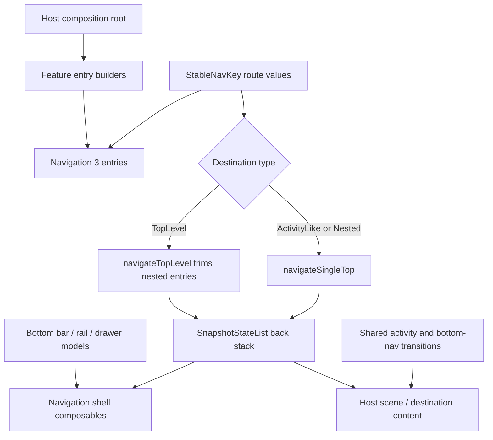

# `:library:navigation` Logic Graph

## Purpose

Defines navigation models, route identifiers, repository contracts, back-stack operations, and
transition helpers shared by host and feature UI.

It also holds the shell's navigation core, ported from NavTest in phase 1 of the one-activity
migration: the graph an app describes, the navigator that moves through it, the scenes that lay
pages out, and the transitions and predictive back that move between them. The shell core lives
beside the older navigation code below until every host and feature has moved to it; nothing uses
it yet. See [Shell navigation](#shell-navigation).

## Owns

- `NavigationDestination`, `MainNavigationItem`, `NavigationDrawerItem`, and `BottomBarItem` models.
- `StableNavKey` and the reusable typed AppToolkit route keys.
- Drawer route identifiers and the repository contract hosts implement to supply items.
- Back-stack mutation helpers.
- Shared activity and bottom-navigation transitions.
- Click and selection state for navigation icons; reusable AVD resources live in DesignSystem.
- Bottom navigation, navigation rail, drawer-item content, and hide-on-scroll shell rendering.
- `DefaultNavigationRepository`, the standard four-entry drawer list, and the labels that name it.
- `NavigationDrawerRoutes.StandardRoutes`, and the drawer layout that follows from it.
- `NavigationDrawerHeader` and `NavigationDrawerBranding`, the app's logo and name at the top of a
  drawer.
- The shell core, in the `graph`, `scenes`, `motion` and `layout` packages and the module's root
  package: `ShellGraph` and its builder, `ShellNavigator`, `ShellNavDisplay`, `ShellBackHandler`,
  `ShellSearch`, `ShellHomeRoute`, the page and list-detail scenes, the transitions and the
  cross-activity back motion, and the layout policy.
- `@Serializable` on every `AppToolkitNavKey`, and one key per Toolkit page that will be registered
  in the shell graph (`AboutRoute`, `ThemeSettingsRoute`, `DisplaySettingsRoute`,
  `PrivacySettingsRoute`, `AdvancedSettingsRoute`, `DiagnosticsSettingsRoute`,
  `DeveloperOptionsRoute`, `StartupRoute`, `OnboardingRoute`).

## Does not own

- Destination registration, owned by `:library:apptoolkit` and host composition roots. With the
  shell graph, each feature registers its own pages and the host assembles the graph.
- The shell's chrome and host (app bar, navigation bar, rail, drawers, player and banner slots),
  which a later phase adds as `:library:shell`.
- The icon slot and its rendering, owned by [`:library:core:designsystem`](../core/designsystem/README.md).
- `MainTopAppBar`, owned by [`:library:core:ui`](../core/ui/README.md).
- Host-app routes and the root navigation graph, owned by `:sample`.

## Depends on

- [`:library:core:common`](../core/common/README.md) for shared sizing constants.
- [`:library:core:designsystem`](../core/designsystem/README.md) for interaction feedback, global
  UI preference values, and the `ToolkitIcon` slot navigation items expose.
- Navigation 3, Compose, and immutable collections materially define the module's public role.
- kotlinx.serialization, exposed as `api`: the shell's back stacks save their keys with it.
- AndroidX Core, for the display's rounded corners the page scenes clip to.

## Used by

- `:sample` for host navigation.
- `:library:apptoolkit` and `:library:core:ui` for shared destination registration and navigation
  UI.
- `:library:feature:about`, `:library:feature:faq`, `:library:feature:issuereporter`,
  `:library:feature:onboarding`, `:library:feature:permissions`, `:library:feature:settings`, and
  `:library:feature:support` for feature routes and navigation surfaces.

## Flow chart


```mermaid
flowchart TD
    Host[Host composition root] --> Builders[Feature entry builders]
    Builders --> Entries[Navigation 3 entries]
    Keys[StableNavKey route values] --> Entries
    Keys --> Type{Destination type}
    Type -->|TopLevel| Top[navigateTopLevel trims nested entries]
    Type -->|ActivityLike or Nested| Single[navigateSingleTop]
    Top --> Stack[SnapshotStateList back stack]
    Single --> Stack
    Stack --> Scenes[Host scene / destination content]
    Items[Bottom bar / rail / drawer models] --> Shell[Navigation shell composables]
    Stack --> Shell
    Transitions[Shared activity and bottom-nav transitions] --> Scenes
```

## Architectural decisions

- Route keys are typed, parcelable, and Compose-stable so host and library destinations share one
  Navigation 3 vocabulary without string parsing.
- Destination type is data on the route contract. Back-stack helpers validate top-level navigation
  and suppress duplicate single-top entries.
- This module owns shell rendering and mutation primitives but not destination registration; only
  the host/toolkit composition roots know the complete feature set.
- The drawer repository contract and its default four-entry implementation live together here,
  because the entries name navigation destinations this module already owns. Keeping the default in
  a feature module forced that feature to own navigation labels it did not otherwise use.
- `MainTopAppBar` lives in [`:library:core:ui`](../core/ui/README.md), not here. It is built from
  that module's buttons and dropdown, and `:library:core:ui` already depends on this module for
  `StableNavKey`, so hosting the app bar here would invert that edge into a dependency cycle.

## Public contracts

- Navigation destination/item models, including `NavigationDrawerItem` and `BottomBarItem`, whose
  `icon` and `selectedIcon` are `ToolkitIcon` values. The `animatedIcon` constructor accepts a single
  `ToolkitIcon.Animated` and uses it for both states, preserving Restart/Reverse behavior. See [the design system README](../core/designsystem/README.md#toolkit-icon-api).
- `StableNavKey` and `AppToolkitNavKey` route implementations.
- `NavigationDrawerRoutes`, including `StandardRoutes`, and
  `navigation.data.repositories.NavigationRepository`.
- `NavigationDrawerBranding`, the title resource and `ToolkitIcon` naming an app in its drawer.
- The shell core: the graph DSL (`ShellGraphBuilder`, `DrawerBuilder`, `DeepLinkBuilder`),
  `ShellGraph`, `ShellNavigator` and `rememberShellNavigator`, `ShellNavDisplay`,
  `ShellBackHandler`, `ShellHomeRoute`, the scenes and their strategies, `ScreenTransition`,
  `ShellTransitions`, `CrossActivityBackMotion`, `ShellLayoutPolicy`, and the composition locals
  `LocalShellNavigator`, `LocalShellGraph`, `LocalPageKey`, `LocalPaneRole`,
  `LocalSelectedDetail`, `LocalShellSearch`, `LocalShellLayout` and `LocalShellMotion`.
- Back-stack action extensions and transition helpers.
- `BottomNavigationBar`, `LeftNavigationRail`, `NavigationDrawerItemContent`,
  `NavigationDrawerHeader`, `NavigationDrawerSheet`, and `HideOnScrollBottomBar`.

## Drawer layout

`NavigationDrawerSheet` adds two behaviours to the plain list, and they are independent of each
other. A host can take either, both, or neither.

`branding` draws the app's logo and name above the items. It is null by default, which draws no
header at all, so a drawer that does not name its app renders exactly as it did before the header
existed. Passing one always shows it, whatever else the drawer contains.

`pinStandardRoutes` moves the entries named by `pinnedRoutes`, which defaults to
`NavigationDrawerRoutes.StandardRoutes`, to the bottom edge of the drawer. It is true by default.
Pinning only does something once the host adds a destination outside that set: the app's
destinations take the top and Settings, Help, Updates and Share become the drawer's footer. A drawer
holding nothing but the standard entries has nothing to separate them from, so it renders as one
top-aligned block either way. Pass `false` to render `items` in the order given.

Which items land where is `navigationDrawerPlan`, which is unit tested; the composable renders the
plan it returns.

The footer is pinned with a weighted spacer rather than a scroll container, so the two groups
together have to fit the drawer's height. The standard entries plus a handful of app destinations
do; a drawer long enough to need scrolling wants its own sheet.

`NavigationDrawerHeader` is separately public, for a host that wants its logo and name somewhere the
sheet does not put them. It takes either a `NavigationDrawerBranding` or an already-resolved title
and icon, and sizes the logo to the title's line height so the pair stays balanced as the person
scales their font up.

The logo is a `ToolkitIcon`, the same slot every other toolkit component takes, so an app can name
itself with a drawable, a Compose vector, a bitmap resolved at runtime, or an animated mark without
the header knowing which. It is drawn untinted unless `logoTint` says otherwise, so a multi-colour
brand mark arrives intact. Give it artwork cropped to the mark: a launcher foreground still carries
its adaptive-icon safe zone, which renders here as padding and leaves the logo looking smaller than
the title beside it. `:sample` crops its own rather than reusing `ic_launcher_foreground`.

## Shell navigation

The shell treats every screen as a destination of one activity, and moves between them the way
Android moves between activities. A host describes its app once:

```kotlin
val graph = ShellGraphBuilder(appTitle = R.string.app_name).apply {
    tab(HomeRoute, R.string.home, ToolkitIcon.AnimatedVector(R.drawable.anim_home)) { HomeScreen() }
    child<ItemRoute>(title = { it.name }) { ItemScreen(it) }
    page<LicensesRoute>(paneRole = PaneRole.Detail, title = { stringResource(R.string.licenses) }) { LicensesScreen() }
    drawer { settings(); spacer(); link(HelpRoute, R.string.help_and_feedback, ToolkitIcon.Vector(Icons.Outlined.HelpOutline)) }
    overflow { supportUs() }
    deepLinks { action(ACTION_OPEN_SETTINGS) { SettingsRoute } }
}.build()
```

Screens then call `LocalShellNavigator.current.navigate(key)` with any registered key.

### Architectural decisions

- **The navigator decides where a key goes.** Screens call `navigate(key)`; the key's
  `DestinationKind` selects a tab, pushes a child on the current tab, or opens a page over the
  shell.
- **Tabs keep a true back stack.** Back from a tab's root returns to the tab visited before it,
  each tab remembered once and moved to the top when revisited, the first tab included. When the
  history runs out on another tab, back goes to the first tab, from which the app closes.
- **An app starts on a tab or on a screen of its own.** A start screen, such as `StartupRoute`,
  has no shell under it, so back from it leaves the app. `continueStart(next)` hands over to the
  next start screen (`OnboardingRoute`), and navigating to a tab, or `enterShell()`, replaces the
  last with the shell for good. This replaces `StartupActivity` and `OnboardingActivity` chaining
  through intents.
- **Intents are destinations too.** `deepLinks { }` maps an intent's action, data or extras to a
  key, so a shortcut, a notification, a widget or a system entry point such as
  `VIEW_PERMISSION_USAGE` opens a page instead of an activity of its own. `keyFor` drops keys the
  graph does not register.
- **Every icon is a `ToolkitIcon`.** Tabs, drawer entries and overflow entries take the same icon
  slot as every other Toolkit component, so an animated vector drawable or a Lottie icon plays
  when the entry is clicked or selected. `settings()` uses the `anim_settings` drawable that
  `DefaultNavigationRepository` uses.
- **Every transition is a choice.** A child or a page enters and leaves with a
  `ScreenTransition`: `Activity` (the activity transition, and the system's cross-activity back
  animation on the gesture), `Slide`, `FadeThrough`, `Fade` or `None`. `ShellTransitions` holds
  the defaults, children `Slide` and pages `Activity`, optionally per `ShellLayoutMode`; a
  destination's own `transition` wins.
- **Predictive back is Android's, rectangle for rectangle.** Android's cross-activity animation
  is two movements: toward one set of rectangles while the finger is down, and from wherever the
  pages are toward another once back is invoked, with a spring carrying the gesture's speed. No
  single `ContentTransform` can seek both, so `ShellNavDisplay` has `NavDisplay` compose and hold
  the two scenes, and `CrossActivityBackMotion`, a port of AOSP's
  `DefaultCrossActivityBackAnimation`, places them each frame. The AOSP classes, their values and
  how each maps to the shell are in [BACK_ANIMATION.md](BACK_ANIMATION.md).
- **Right-edge swipes follow the finger.** Android shrinks a page in place for a swipe from the
  right; by default `CrossActivityBackMotion.mirrorRightEdge` draws it as a mirrored left swipe,
  so the page follows the finger from either edge.
- **List and detail share the window.** A `PaneRole.List` page shows the `PaneRole.Detail` page
  opened from it beside it from 600dp, under one app bar titled over each pane, with a separator
  that can be dragged to resize the panes or to the end to close the detail. The back gesture on
  the detail slides the separator the same way. This replaces the settings feature's tablet
  layout and `GeneralSettingsRoute`'s content keys.
- **Covered displays stand down.** A scene stays composed while another opens over it, so
  `ShellNavDisplay(backEnabled = false)` keeps a covered display from taking a back gesture meant
  for what covers it.
- **Overlays register late.** A display inside a `Scaffold` is composed during layout, after what
  is composed beside it. `ShellBackHandler` waits a frame before registering, so overlay handlers
  always come after, and win over, the displays.
- **Keys are serializable and parcelable.** `rememberNavBackStack` saves keys with
  kotlinx.serialization, the older stacks with `Parcelable`. Every `AppToolkitNavKey` is both until
  the older stacks are removed.

### What is not ported from NavTest

NavTest's graph also carries a settings list model and a donation hook. The Toolkit keeps its own:
`:library:feature:settings` owns the settings list, and `:library:feature:support` owns donations
through `:library:integration:billing`. `settings()` and `supportUs()` link to `SettingsRoute` and
`SupportRoute`, which those features register.

### Sources

The per-tab stacks and the list-detail scene are adapted from
[android/nav3-recipes](https://github.com/android/nav3-recipes) (Apache License 2.0), and the back
motion is a port of AOSP's `CrossActivityBackAnimation` and `DefaultCrossActivityBackAnimation`
(Apache License 2.0); the adapted files say so. Slide to pop and driving a dispatcher with
`DirectNavigationEventInput` come from *3 unique predictive back animations you can create with
the Navigation Events library* (tunjid.com).

## Internal implementations

- Compose rendering and transition specifications remain implementation helpers; destination
  registration stays with consumers.

## Current risks

The module mixes navigation models with Compose rendering and animation, so non-UI consumers still
receive a UI-oriented artifact.

Until the migration finishes, the module has two navigation models side by side. New code uses
the shell core; the older models, `NavigationBackStackActions` and the string drawer routes, are
removed once nothing uses them.

The back motion relies on `NavDisplay`'s `sceneState` overload and on navigation event's
`DirectNavigationEventInput`, both public but young APIs. `ShellNavDisplay` wraps every scene in
its own `Scene` class, so code that checks a scene's type sees the wrapper; read entries and
metadata instead.
