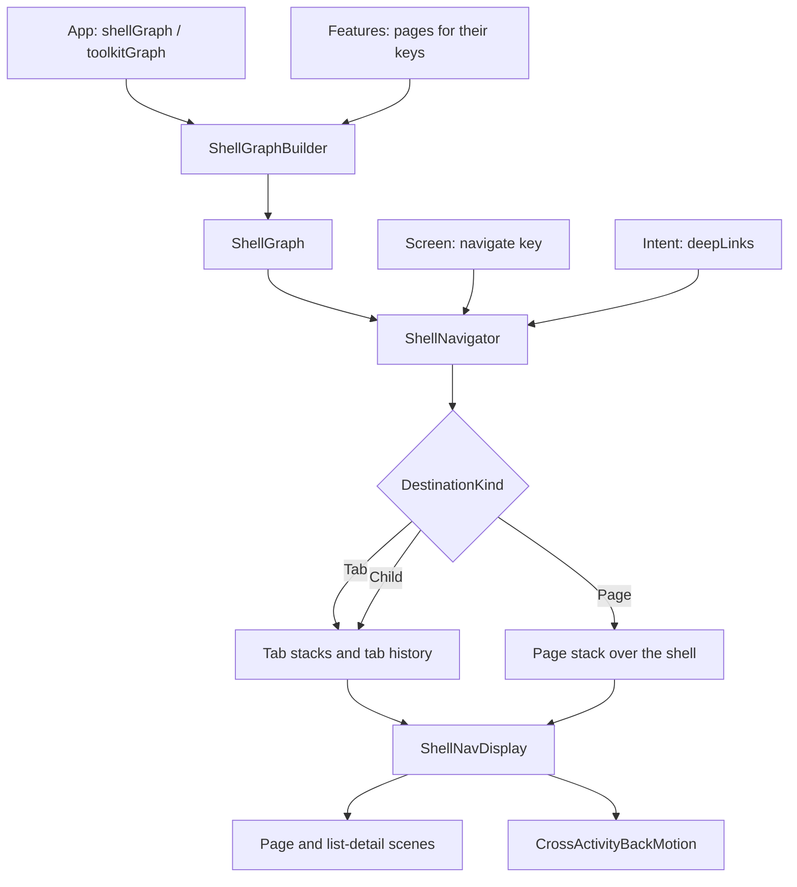

# `:library:navigation` Logic Graph

## Purpose

Holds the navigation core of the one-activity shell: the graph an app describes, the navigator that
moves through it, the scenes that lay pages out, and the transitions and predictive back that move
between them. It also owns the Toolkit's route keys.

`:library:shell` draws the graph (bars, rail, drawers, overflow menu, banner and player) and hosts
it in the activity; this module has no chrome of its own.

## Owns

- The graph and its builder DSL: `ShellGraph`, `ShellGraphBuilder`, `DrawerBuilder`,
  `DeepLinkBuilder`, `Destination`, `DestinationKind`, `ShellTab`, `DrawerEntry`, `PaneRole`,
  `TopBarStyle`, `ContentWidth` and `ShellPlayer`, in the `graph` package, and `shellGraph { }`.
- `ShellNavigator`, `rememberShellNavigator`, `ShellHomeRoute`, `ShellNavDisplay`,
  `ShellBackHandler` and `ShellSearch`, in the root package.
- The page and list-detail scenes and their strategies, in `scenes`.
- `ScreenTransition`, `ShellTransitions`, the tab transitions and `CrossActivityBackMotion`, in
  `motion`.
- `ShellLayoutPolicy`, `ShellLayoutMode` and `ShellLayout`, in `layout`.
- `AppToolkitNavKey`, one `@Serializable` key per Toolkit page: `SettingsRoute`,
  `GeneralSettingsRoute`, `HelpRoute`, `SupportRoute`, `AdsSettingsRoute`, `PermissionsRoute`,
  `LicensesRoute`, `LibraryExtrasRoute`, `AboutRoute`, `ThemeSettingsRoute`,
  `DisplaySettingsRoute`, `PrivacySettingsRoute`, `AdvancedSettingsRoute`,
  `DiagnosticsSettingsRoute`, `DeveloperOptionsRoute`, `StartupRoute` and `OnboardingRoute`.
- The strings the graph's built-in entries use: settings, support us, navigate back and the pane
  separator's description.

## Does not own

- The chrome and the host composable, owned by [`:library:shell`](../shell/README.md).
- The page frame (`PageScaffold`, the app bar, content padding), owned by
  [`:library:core:ui`](../core/ui/README.md).
- The pages behind the Toolkit's keys. Each feature owns its screen, and `toolkitGraph { }` in
  [`:library:apptoolkit`](../apptoolkit/README.md) registers them.
- The icon slot and its rendering, owned by [`:library:core:designsystem`](../core/designsystem/README.md).
- An app's own keys and graph, owned by the app (`:sample:app` in this repository).

## Depends on

- [`:library:core:common`](../core/common/README.md) for shared sizing constants.
- [`:library:core:designsystem`](../core/designsystem/README.md) for `ToolkitIcon`, the slot every
  tab, drawer entry and overflow entry takes, and the `anim_settings` drawable.
- Navigation 3, with the navigation event library it brings, and Compose, which define the
  module's public role.
- kotlinx.serialization, exposed as `api`: the back stacks save their keys with it, so every key an
  app declares needs it.
- AndroidX Core, for the display's rounded corners the page scenes clip to.

## Used by

- [`:library:shell`](../shell/README.md), which hosts the graph.
- [`:library:core:ui`](../core/ui/README.md), whose page frame reads the navigator and the layout.
- `:library:apptoolkit`, `:library:feature:*` and `:sample` for keys and page registration.

## Flow chart


```mermaid
flowchart TD
    App[App: shellGraph / toolkitGraph] --> Builder[ShellGraphBuilder]
    Features[Features: pages for their keys] --> Builder
    Builder --> Graph[ShellGraph]
    Graph --> Navigator[ShellNavigator]
    Screen[Screen: navigate key] --> Navigator
    Intent[Intent: deepLinks] --> Navigator
    Navigator --> Kind{DestinationKind}
    Kind -->|Tab| Tabs[Tab stacks and tab history]
    Kind -->|Child| Tabs
    Kind -->|Page| Pages[Page stack over the shell]
    Tabs --> Display[ShellNavDisplay]
    Pages --> Display
    Display --> Scenes[Page and list-detail scenes]
    Display --> Back[CrossActivityBackMotion]
```

## Using it

A host describes its app once:

```kotlin
val graph = shellGraph(appTitle = R.string.app_name) {
    tab(HomeRoute, R.string.home, ToolkitIcon.AnimatedVector(R.drawable.anim_home)) { HomeScreen() }
    child<ItemRoute>(title = { it.name }) { ItemScreen(it) }
    page<LicensesRoute>(paneRole = PaneRole.Detail, title = { stringResource(R.string.licenses) }) { LicensesScreen() }
    drawer { settings(); spacer(); link(HelpRoute, R.string.help_and_feedback, ToolkitIcon.Vector(Icons.Outlined.HelpOutline)) }
    overflow { supportUs() }
    deepLinks { action(ACTION_OPEN_SETTINGS) { SettingsRoute } }
}
```

An app built on the whole Toolkit calls `toolkitGraph { }` instead, which adds the Toolkit's pages.
Screens then call `LocalShellNavigator.current.navigate(key)` with any registered key, and
`close(key)` or `goBack()` to leave it.

## Architectural decisions

- **The navigator decides where a key goes.** Screens call `navigate(key)`; the key's
  `DestinationKind` selects a tab, pushes a child on the current tab, or opens a page over the
  shell. Keys carry their arguments, so no destination needs an intent extra or a string route.
- **Tabs keep a true back stack.** Back from a tab's root returns to the tab visited before it,
  each tab remembered once and moved to the top when revisited, the first tab included. When the
  history runs out on another tab, back goes to the first tab, from which the app closes.
- **An app starts on a tab or on a screen of its own.** A start screen, such as `StartupRoute`,
  has no shell under it, so back from it leaves the app. `continueStart(next)` hands over to the
  next start screen, and navigating to a tab, or `enterShell()`, replaces the last with the shell
  for good.
- **Intents are destinations too.** `deepLinks { }` maps an intent's action, data or extras to a
  key, so a shortcut, a notification, a widget or a system entry point such as
  `VIEW_PERMISSION_USAGE` opens a page instead of an activity of its own. `keyFor` drops keys the
  graph does not register.
- **Features register, apps decide.** `pageIfAbsent` registers a page only when the app has not
  registered the key itself, so an app replaces any Toolkit page by registering its key first. The
  app alone decides where a page is offered: drawer, overflow menu or a screen's button.
- **Every icon is a `ToolkitIcon`.** Tabs, drawer entries and overflow entries take the same icon
  slot as every other Toolkit component, so an animated vector drawable or a Lottie icon plays
  when the entry is clicked or selected. `settings()` uses the `anim_settings` drawable.
- **Every transition is a choice.** A child or a page enters and leaves with a
  `ScreenTransition`: `Activity` (the activity transition, and the system's cross-activity back
  animation on the gesture), `Slide`, `FadeThrough`, `Fade` or `None`. `ShellTransitions` holds
  the defaults, children `Slide` and pages `Activity`, optionally per `ShellLayoutMode`; a
  destination's own `transition` wins.
- **Predictive back is Android's, rectangle for rectangle.** See
  [Predictive back](#predictive-back-androids-cross-activity-animation) below.
- **List and detail share the window.** A `PaneRole.List` page shows the `PaneRole.Detail` page
  opened from it beside it from 600dp, under one app bar titled over each pane, with a separator
  that can be dragged to resize the panes or to the end to close the detail. The back gesture on
  the detail slides the separator the same way.
- **Covered displays stand down.** A scene stays composed while another opens over it, so
  `ShellNavDisplay(backEnabled = false)` keeps a covered display from taking a back gesture meant
  for what covers it.
- **Overlays register late.** A display inside a `Scaffold` is composed during layout, after what
  is composed beside it. `ShellBackHandler` waits a frame before registering, so overlay handlers
  always come after, and win over, the displays.
- **Keys are serializable.** `rememberNavBackStack` saves keys with kotlinx.serialization, so the
  stacks survive rotation and process death. A key that is not `@Serializable` fails at runtime
  when the stack is saved.

## Public contracts

- The graph DSL and `ShellGraph`, including `contains`, `destination`, `keyFor`, `startOptions`
  and `tabIndexOf`.
- `ShellNavigator` (`navigate`, `close`, `goBack`, `selectTab`, `continueStart`, `enterShell`, the
  page and tab stacks) and `rememberShellNavigator`.
- `ShellNavDisplay`, `ShellBackHandler`, `ShellHomeRoute`, the scenes and their strategies,
  `ScreenTransition`, `ShellTransitions`, `CrossActivityBackMotion` and `ShellLayoutPolicy`.
- The composition locals `LocalShellNavigator`, `LocalShellGraph`, `LocalPageKey`,
  `LocalPaneRole`, `LocalSelectedDetail`, `LocalShellSearch`, `LocalShellLayout` and
  `LocalShellMotion`.
- `AppToolkitNavKey` and its keys. Their class names are part of saved state: renaming or moving
  one loses a restored back stack that held it.

## Predictive back: Android's cross-activity animation

The back gesture between two activities is animated by the system, not by the app. This section
records where that happens in AOSP, what each class does with the gesture, and which part of this
module reproduces it for pages that are not activities. Read it before changing
`CrossActivityBackMotion` or `ShellNavDisplay`.

All paths are in `platform/frameworks/base` (Apache License 2.0).

### The classes

| Class | Where | Role |
|---|---|---|
| `BackAnimationController` | `libs/WindowManager/Shell/src/com/android/wm/shell/back/BackAnimationController.java` | Receives the system back gesture in the Shell (SystemUI) process. Decides what the back target is (another activity, another task, home, or the app's own callback), starts the matching `ShellBackAnimation`, and hands it the gesture. When the target is the app itself, the gesture goes to the app's `OnBackAnimationCallback` instead, which is the case for the shell's pages. |
| `BackProgressAnimator` | `core/java/android/window/BackProgressAnimator.java` | Smooths the raw gesture progress with a spring (`STIFFNESS_MEDIUM`, no bounce) before anyone sees it. Used on both sides: the Shell's animations and the app's `WindowOnBackInvokedDispatcher` both read progress through it. On cancel it springs the progress back to 0 and only then reports the cancel. With a swipe edge of `EDGE_NONE` (three-button navigation, from Android 16) it animates the progress toward 1 by itself with a low-stiffness spring while the button is held. |
| `BackTouchTracker` | `core/java/android/window/BackTouchTracker.java` | Turns touch positions into raw progress and the trigger threshold. |
| `WindowOnBackInvokedDispatcher` | `core/java/android/window/WindowOnBackInvokedDispatcher.java` | The app side: delivers `onBackStarted`, the smoothed `onBackProgressed`, `onBackCancelled` and `onBackInvoked` to the app's callback. AndroidX `navigationevent` receives these and passes them on as `NavigationEvent`s. |
| `CrossActivityBackAnimation` | `libs/WindowManager/Shell/src/com/android/wm/shell/back/CrossActivityBackAnimation.kt` | The base of the animation between two activities: the pre-commit phase, the vertical follow, the scrim, the post-commit timing and the fling spring. Works in rectangles: every frame places the closing and the entering window in a rectangle of the display. |
| `DefaultCrossActivityBackAnimation` | `libs/WindowManager/Shell/src/com/android/wm/shell/back/DefaultCrossActivityBackAnimation.kt` | The default subclass: where the rectangles start and end, and the post-commit movement. |
| `ProgressVelocityTracker` | `libs/WindowManager/Shell/src/com/android/wm/shell/back/ProgressVelocityTracker.kt` | Measures how fast the progress changes, in progress per second, for the fling. |
| `Interpolators` | `libs/WindowManager/Shell/shared/src/com/android/wm/shell/shared/animation/Interpolators.java` | `BACK_GESTURE` is `BackGestureInterpolator`, a `PathInterpolator(0.1, 0.1, 0, 1)`; `EMPHASIZED` is the two-segment `fast_out_extra_slow_in` path. |

### Pre-commit, while the finger is down

`CrossActivityBackAnimation.onGestureProgress`:

1. `progress = BACK_GESTURE(event.progress)`, where `event.progress` has already been smoothed by
   `BackProgressAnimator`. It is not smoothed a second time.
2. The closing rectangle goes from the full display to the display scaled by `MAX_SCALE` (0.9)
   around its centre, then, unless the swipe came from the right edge, moved so its right edge is
   `cross_task_back_vertical_margin` (8dp) from the display's right edge.
3. The entering rectangle starts `cross_activity_back_entering_start_offset` (96dp) to the left
   of the display and shrinks by the same 0.9 around its own centre.
4. Both are interpolated linearly by `progress` between start and target.
5. Both shift vertically by `getYOffset`: the finger's vertical travel, as a ratio of half the
   display's height, through a `DecelerateInterpolator`, times the room left by the **current**
   closing rectangle, `(displayHeight − currentHeight) / 2 − 8dp`, never below 0. At the start of
   a gesture the page is barely smaller than the display, so it can barely move up or down.
6. A black scrim sits under the closing window, over everything else, at 0.2 alpha in light mode
   and 0.8 in dark mode, from the first frame.
7. Every window keeps the display's corner radius.

### Commit

`DefaultCrossActivityBackAnimation.onGestureCommitted` takes the rectangles **where they are**:
`startClosingRect = currentClosingRect`, `startEnteringRect = currentEnteringRect`. The targets
are the full display for the entering window, and the full display moved right by
`currentClosingRect.left + 96dp` for the closing one. A release at 22% continues from 22%.

### Post-commit

Over `POST_COMMIT_DURATION` (450ms), with the `EMPHASIZED` interpolator:

- both rectangles move from their commit position to their target;
- the closing window's alpha is `max(1 − linearProgress × 5, 0)`, gone within the first 90ms;
- the scrim fades from its full alpha to 0 linearly.

On top of that, a spring (`STIFFNESS_LOW`, `DAMPING_RATIO_LOW_BOUNCY`) starts at 100 with the
gesture's velocity: `velocity × 100 × (1 − 0.9)`, doubled for a swipe from a side edge, at least
120 when the gesture had barely started, at most 1000. Both rectangles are scaled around their
centres by `min(springValue / 100, 1)`, so a quick flick makes them dip a little smaller before
they settle.

### Cancel

`BackProgressAnimator.onBackCancelled` springs the progress back to 0, reporting it along the way,
and the rectangles follow it. Only then is `onBackCancelled` delivered.

### A swipe from the right edge

`DefaultCrossActivityBackAnimation.preparePreCommitClosingRectMovement` moves the closing window
against the right edge only `if (swipeEdge != BackEvent.EDGE_RIGHT)`: *"scale closing target into
the middle for rhs and to the right for lhs"*. A swipe from the right shrinks the window in place,
centred, and never moves it sideways with the finger, which is why it feels less direct than a
swipe from the left. This is unchanged in Android 16 (checked against LineageOS 23.2, which
tracks Android 16 QPR2); `BackTouchTracker` computes progress the same way from both edges.

The shell departs from Android here, on purpose, and by default draws a swipe from the right as
the mirror image of one from the left (`CrossActivityBackMotion.mirrorRightEdge`): the page rests
against the left edge, following the finger, and the page underneath waits on the right, with
every AOSP value unchanged. Screens that use a seeked transition, such as `ScreenTransition.Slide`,
are mirrored the same way. Setting `mirrorRightEdge` to false (`BackEdgeStyle.System` in the
developer options of [`:library:feature:developer`](../feature/developer/README.md)) restores
Android's shrink in place.

### How the shell reproduces it

| AOSP | Shell |
|---|---|
| The windows | The scenes of a `NavDisplay`. `ShellNavDisplay` wraps every scene its strategies calculate in a layer that `CrossActivityBackMotion` places in a rectangle each frame. |
| `BackAnimationController` handing the gesture to the animation | `ShellNavDisplay`'s handler on the system dispatcher. It forwards the gesture to the display's own handler, on a private dispatcher, at progress 0, so the display composes the scene underneath and holds both with a transition that moves nothing. The gesture itself goes to `CrossActivityBackMotion`. |
| `CrossActivityBackAnimation` + `DefaultCrossActivityBackAnimation` | `CrossActivityBackMotion`: the same rectangles, vertical follow, scrim, commit from the current rectangles, emphasized post-commit, closing fade and fling spring. |
| `ProgressVelocityTracker` | A `VelocityTracker1D` fed with the eased progress and the event's frame time. |
| `BackProgressAnimator` | Not reimplemented: the platform has already applied it to the progress the app receives. |

A back between two tabs is not a back between activities. There, `ShellNavDisplay` passes the
gesture through untouched and the display seeks the tab transition, as `NavDisplay` would.

### Why one timeline was not enough

The first version seeked one `ContentTransform` timeline whose first half was the gesture and
whose second half was the post-commit phase. Three things made it feel close to Android but not
quite right, all fixed by the version above:

- **The commit boundary.** A release anywhere was first played on to the halfway point in 120ms,
  the canonical end of the gesture, before the post-commit half began. Android continues from
  where the finger let go. The same flaw made a three-button press, which reports a small
  progress and then invokes, visibly shrink the page and then grow it again.
- **The vertical room** was computed from the final 0.9 scale, not from the current rectangle, so
  pages could drift further early in a gesture than a window can, and the vertical ratio used the
  gesture curve instead of a `DecelerateInterpolator`.
- **The fling.** Android's post-commit carries the gesture's speed into a spring; the timeline
  had a fixed settle.

## Sources

The per-tab stacks and the list-detail scene are adapted from
[android/nav3-recipes](https://github.com/android/nav3-recipes) (Apache License 2.0), and the back
motion is a port of AOSP's `CrossActivityBackAnimation` and `DefaultCrossActivityBackAnimation`
(Apache License 2.0); the adapted files say so. Slide to pop and driving a dispatcher with
`DirectNavigationEventInput` come from *3 unique predictive back animations you can create with
the Navigation Events library* (tunjid.com).

## Migration

3.0.0 removed the navigation this module held before the shell: the `animations`, `backstack`,
`data`, `models` and `ui` packages, `NavigationDrawerRoutes` and `StableNavKey`. The
[3.0.0 migration guide](../../docs/migration/3.0.0.md) maps each to its replacement.

## Current risks

The back motion relies on `NavDisplay`'s `sceneState` overload and on navigation event's
`DirectNavigationEventInput`, both public but young APIs. `ShellNavDisplay` wraps every scene in
its own `Scene` class, so code that checks a scene's type sees the wrapper; read entries and
metadata instead.
