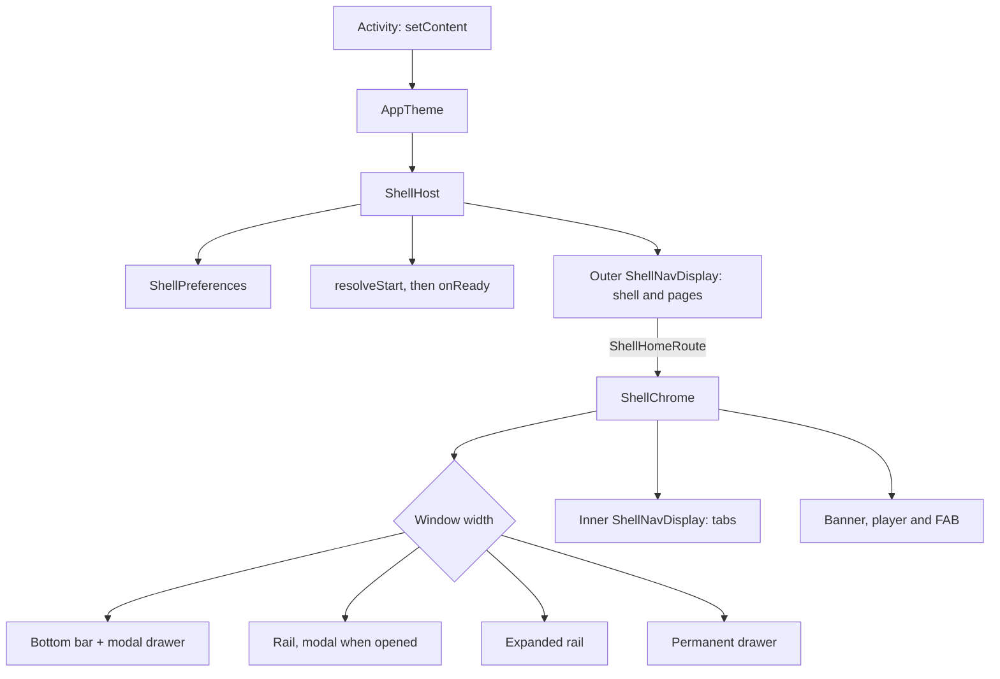

# `:library:shell` Logic Graph

## Purpose

Hosts an app's `ShellGraph` in its one activity: `ShellHost` draws every tab, page, bar, rail,
drawer and transition the graph describes. It is the chrome around the navigation core of
[`:library:navigation`](../navigation/README.md), drawn with the Toolkit's own components.

## Owns

- `ShellHost`: the settings store, layout, motion, navigator and the outer display.
- Deciding the start: the developer override, then the app's `resolveStart` or `start`, then the
  graph's own, awaited together with the settings before anything is drawn (`onReady`).
- Delivering intents: the launch intent once, and every later one from `onNewIntent`, through the
  graph's deep links to the navigator.
- Reporting the destination on top (`onDestinationChanged`).
- The snackbars: the tabs' scaffold draws them above the bottom bar, the banner, the player and the
  floating action buttons, and gives the tab screens `rememberScaffoldSnackbars()`. The host is
  the one passed as `ShellHost(snackbarHostState)`, so the app can show its own messages there.
- The floating action buttons: above the bottom bar, the banner and the mini player on tabs and
  children, in the page frame on pages. A destination's `fab` slot and its `fabs` list come from
  the graph; a screen adds its own with `ScaffoldFabs`, through a `FabHost` the shell keeps per
  tab screen. The described ones are drawn as one `ToolkitFabColumn`.
- The frame (`ShellFrame`): beside a rail, an expanded rail or a permanent drawer, the navigation is
  drawn around the displays, so pages open next to it. See
  [Pages beside the navigation](#pages-beside-the-navigation).
- The chrome, in `chrome`: app bar (with the search field of searchable tabs and the overflow
  menu), navigation bar, rail, expanded rail, modal and permanent drawers with the app's header,
  banner slot, docked on the bottom navigation bar and nowhere else, docked player, and the inner
  display. `ShellChromeController` and
  `LocalShellChrome` let a page's own frame open the navigation.
- The shell's developer settings, in `settings`: `ShellSettings`, `ShellPreferences`, its DataStore
  and `InMemoryShellPreferences` for tests.
- The strings the chrome adds: open, expand and collapse navigation.

## Does not own

- The navigation model, scenes and motion, owned by [`:library:navigation`](../navigation/README.md).
- The page frame, app bar, content padding and width, owned by
  [`:library:core:ui`](../core/ui/README.md).
- The theme. The app wraps `ShellHost` in `AppTheme`; theme mode and dynamic colour stay in
  [`:library:feature:theme`](../feature/theme/README.md).
- The screens that change its settings. The person's layout choices are offered by the display
  settings of [`:library:feature:display`](../feature/display/README.md), which also keeps the
  bottom bar labels and the start page (reaching the shell through `LocalShowBottomBarLabels` and
  the app's `resolveStart`); the rest by the developer options page of
  [`:library:feature:developer`](../feature/developer/README.md).
- The Toolkit's pages and `toolkitGraph { }`, owned by [`:library:apptoolkit`](../apptoolkit/README.md).

## Depends on

- [`:library:navigation`](../navigation/README.md) and [`:library:core:ui`](../core/ui/README.md),
  both as `api`: an app writes its graph and pages against them.
- DataStore Preferences, for the shell's settings store.

## Used by

- [`:library:feature:display`](../feature/display/README.md) and
  [`:library:feature:developer`](../feature/developer/README.md), which read and write the
  settings.
- [`:library:apptoolkit`](../apptoolkit/README.md), which exposes it as `api`, and through it every
  app built on the Toolkit.

## Flow chart



## Using it

```kotlin
setContent {
    AppTheme {
        ShellHost(
            graph = graph,                // from toolkitGraph { } or shellGraph { }
            resolveStart = { startKeyFor(dataStore.startupPage.first()) },
            onReady = { keepSplashVisible = false },
            onDestinationChanged = { key -> analytics.screen(key) },
        )
    }
}
```

The activity is declared `launchMode="singleTop"` or `singleTask`, so intents that arrive while it
runs reach `onNewIntent` and the shell instead of a second activity.

## Pages beside the navigation

Below the rail's width the chrome is part of the shell's own screen: a bottom bar and a modal
drawer, which a page covers like an activity would. From the rail's width up, the navigation stays
on screen, and `ShellHost` draws it itself, around the displays:

- **A page opens in the space next to the navigation**, and moves, and answers the back gesture,
  there. The rail or drawer never moves.
- **The navigation shows where you are.** The drawer entry whose page is open is marked, and so is
  it while pages opened from that page stack above it; no tab is marked while a page is open.
- **The navigation replaces, it does not stack.** A tab closes the open pages and shows the tab;
  another entry swaps the open pages for its own. Its page already open alone, an entry does
  nothing.
- **The page it opened looks like a tab.** The page an entry opened stands in for a tab, so it
  gets the tab's small app bar with no back button and, when the navigation and the app bar share
  a colour, the tab's rounded content card over that colour. Pages opened from it keep their back
  button. `ShellFrame` provides `LocalBesideNavigation` for this, and `PageScaffold` and the
  list-detail scene read it through `isTopLevelPage`. A page keeps that look while another entry
  replaces it and it animates out, so it never grows a back button on the way.
- **The tabs and that page swap in place.** Nothing moves between them
  (`TabTransitions.inPlace()`), whatever the tab transition: the navigation and the app bar's
  place are already on screen, so the page does not slide in like a new window. Only the one on
  top fades, over one that stays opaque: an opening page fades in over the old, a closing one
  fades out over the tabs, so the display's backdrop never shows between them. Pages opened from
  it still slide in, and back from it keeps the system's gesture.
- **Its start corners are square.** A page clips to the display's rounded corners, as a window
  does, but beside the navigation its start edge meets the rail or drawer rather than the
  screen's corners, so only its end corners follow the display.
- **The expanded rail starts collapsed,** and collapses again whenever the layout changes, as a
  rotation does. Within one layout it keeps what its button left it at.
- **Start screens stay whole-window.** Before the shell is entered there is no navigation, so a
  welcome or onboarding page covers the window at every width.

Every page over the shell opens this way, not only the drawer's, so moving between them is always
one tap. The navigation keeps clear of the start edge's cutout and bars, and the space beside it
consumes that inset, so a page does not pad it twice.

## Screenshot tests

`ShellScreenshotTest` draws the chrome under Robolectric and compares it with the reference images
in `src/test/screenshots`: the phone, rail, expanded rail, landscape and desktop layouts, the modal
drawer, the overflow menu, list-detail, edge to edge, the app bar's buttons mid-move, and frames of
the predictive back gesture from either edge. They run with the unit tests.

```shell
./gradlew :library:shell:verifyRoborazziDebug   # fails when the chrome no longer matches
./gradlew :library:shell:recordRoborazziDebug   # rewrites the reference images after an intended change
```

The tests are JUnit 4, so this module, and only this one, adds the JUnit vintage engine beside
JUnit 5. They start Koin with a `CommonDataStore`, which `AppTheme` reads.

## Architectural decisions

- **Two displays.** The outer display holds the shell and its pages, the inner one the tabs, so
  each level has its own transition and its own predictive back while the chrome stays still.
  Beside a rail or permanent drawer both sit inside `ShellFrame`, next to the navigation, which
  therefore belongs to no entry and never moves with a page.
- **Toolkit components throughout.** Tab, rail and drawer icons are `AnimatedToolkitIcon`s with
  `bounceClick`, a click sound and haptic feedback, so an animated vector plays on each click; the
  drawer header sizes the app's `ToolkitIcon` to the title's line height; the app bar's buttons are
  `AnimatedIconButtonDirection`s.
- **The app bar's buttons move, not pop.** The navigation button is one
  `AnimatedIconButtonDirection` whose glyph crossfades between the menu and the back arrow as a
  child opens and closes; the overflow button slides out to the end while a child covers its tab
  and back in after, turning a quarter while its menu is open. The menu has Material 3 Expressive's
  `largeIncreased` corners.
- **The player sits under the navigation.** In the bottom bar layout it lives inside the modal
  drawer's content, and in the rail layouts it is drawn before the modal rail, so opening either
  covers it. On a permanent drawer it docks beside the drawer.
- **Insets are cutout-safe.** App bars, content and the rail keep clear of the display cutout as
  well as the system bars, on whichever side it is.
- **Search lives in the app bar.** A tab declared with `TabSearch` gets a field in the app bar's
  title slot, which crossfades with the title in place. The query is kept per tab and cleared by
  back. Between two tabs that both search, the field stays and only its hint and query change.
- **Content keeps a readable width.** Tabs, children and pages are centred in a column no wider
  than `ShellLayoutPolicy.contentMaxWidth`, unless they declare `ContentWidth.Full`.
- **The app is named once.** Where the navigation shows the app's name (the permanent drawer's
  header or the expanded rail's), the app bar names the tab instead. Where it does not, the app
  bar names the app.
- **Content passes under the bottom chrome.** Tabs reach the bottom of the window, behind the
  bottom bar, the banner, the mini player and the system bar; their total height reaches the tabs
  as `LocalContentPadding`.
- **The bars can hide on scroll, the whole chrome together.** The bottom bar slides away as
  content scrolls down (`hideBottomBarOnScroll`), and so, with `hideTopBarOnScroll`, does the app
  bar, whatever its style: a large bar collapses first. Both return as soon as content scrolls up,
  and the floating action buttons fold. Material's `Scaffold` places the buttons above the bottom
  bar as it is laid out, and the hiding bar takes the navigation bar's inset with it, so the
  buttons rise by whatever part of that inset the bar no longer covers, rather than sitting over
  the gesture bar.
- **Both scaffolds are Material's.** The tabs' scaffold here and `PageScaffold` are Material 3
  `Scaffold`s; the Toolkit supplies what goes in their slots.
- **Wide windows can frame the content.** Beside a rail or a permanent drawer, the navigation and
  the app bar can share one colour with the content in a card (`NavigationTint.Always`, the
  default), take it only once content scrolls (`OnScroll`), or keep Material's own behaviour
  (`None`). With `OnScroll`, the app bar on top drives the colour: the tab's, or that of the page
  the navigation opened beside it, list-detail pages included. Each joins through
  `FollowScrollWithFrameTint` in `:library:navigation`, and the tab's bar takes over again when the
  page leaves.
- **The banner shows on the bottom navigation bar only.** It docks there as a strip joined to the
  bar. Beside a rail or a drawer there is no bar to dock on, so the app shows no banner.
- **Navigating recomposes what changed.** The chrome keeps its callbacks and the
  `LocalShellChrome` controller across recompositions: that local is static, so a new controller
  would recompose every tab screen under it on each navigation. Animated values (the frame tint, the
  player's expansion) are read where they are drawn or through `derivedStateOf`, so an animation
  does not recompose the chrome on each frame.
- **The shell stands down under a page.** While a page is open, even one still opening, the tabs'
  display, the drawer and the search field leave back to the page.
- **One activity.** The launch intent and every later one are turned into keys by the graph's deep
  links, so app shortcuts, notifications, widgets and system entry points open destinations. The
  launch intent is handled once, not again after rotation or process death, since the restored
  stacks already hold it. Work that needs the activity (a permission request, a consent form, a
  review or update flow, a purchase) is done from the page, through `LocalActivity.current`.
  The exception is a screen another app opens over itself, where back must return to that app:
  that activity hosts its own `ShellHost` with a graph of pages only, as the Toolkit's
  `PermissionUsageActivity` does for Android's permission manager.
- **The start is decided before the first frame.** `resolveStart` may read stored state and is
  awaited with the settings; `onReady` then tells the activity it can drop its splash screen.
- **The shell keeps its own store.** Its settings describe the shell (layout choices the display
  settings offer, and developer options), so they live in a DataStore of their own rather than in
  `:library:core:datastore`; that also keeps the datastore module free of navigation types.
  `resetDeveloperOptions()` puts back only the developer options: the start, the forced layout,
  the accessories and the animation speed. `ShellHost(preferences = ...)`
  takes any `ShellPreferences`, and tests pass an `InMemoryShellPreferences`.
- **A tab is selected only while it shows.** No navigation item is highlighted while a child
  covers its tab.
- **Short windows get small bars.** A large app bar becomes a small one below
  `ShellLayoutPolicy.largeTopBarFrom`, such as a phone in landscape.

## Public contracts

- `ShellHost(graph, modifier, start, resolveStart, preferences, onReady, onDestinationChanged,
  layoutPolicy)`.
- `ShellChromeController` and `LocalShellChrome`.
- `ShellSettings` and its enums, `ShellPreferences`, `ShellPreferences(context)`,
  `InMemoryShellPreferences`, `LocalShellPreferences` and `LocalShellSettings`. The DataStore's key
  names are persisted: renaming one resets that option on update.

## Current risks

- The inner display is inside a `Scaffold`, so anything that must handle back ahead of it has to
  use `ShellBackHandler`, not the activity's `BackHandler`.
- A deep link is the app's own parsing of outside input: `keyFor` drops keys the graph does not
  register, but a matcher must still validate the ids it reads before building a key from them.
- `resolveStart` runs before the first frame: it should read, not compute, or the splash screen
  stays up for as long as it takes.
