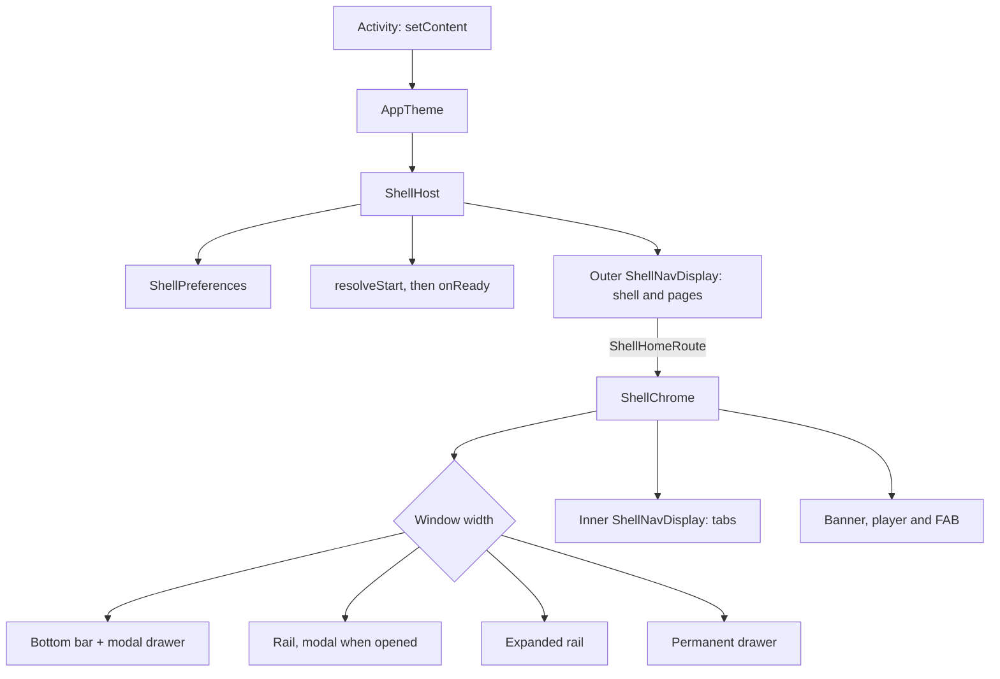

# `:library:shell` Logic Graph

## Purpose

Hosts an app's `ShellGraph` in its one activity: `ShellHost` draws every tab, page, bar, rail,
drawer and transition the graph describes. It is the chrome around the navigation core of
[`:library:navigation`](../navigation/README.md), drawn with the Toolkit's own components.

## Owns

- `ShellHost`: the settings store, layout, motion, navigator and the outer display.
- Deciding the start: the developer override, then the app's `resolveStart` or `start`, then the
  graph's own, awaited together with the settings before anything is drawn (`onReady`).
- Delivering intents: the launch intent once, and every later one from `onNewIntent`, through the
  graph's deep links to the navigator.
- Reporting the destination on top (`onDestinationChanged`).
- The floating action button slot: above the bottom bar, the banner and the mini player on tabs
  and children, in the page frame on pages.
- The chrome, in `chrome`: app bar (with the search field of searchable tabs and the overflow
  menu), navigation bar, rail, expanded rail, modal and permanent drawers with the app's header,
  banner slot, docked player, and the inner display. `ShellChromeController` and
  `LocalShellChrome` let a page's own frame open the navigation.
- The shell's developer settings, in `settings`: `ShellSettings`, `ShellPreferences`, its DataStore
  and `InMemoryShellPreferences` for tests.
- The strings the chrome adds: open, expand and collapse navigation.

## Does not own

- The navigation model, scenes and motion, owned by [`:library:navigation`](../navigation/README.md).
- The page frame, app bar, content padding and width, owned by
  [`:library:core:ui`](../core/ui/README.md).
- The theme. The app wraps `ShellHost` in `AppTheme`; theme mode and dynamic colour stay in
  [`:library:feature:theme`](../feature/theme/README.md).
- The person's navigation choices: the bottom bar labels and the start page stay in
  [`:library:feature:display`](../feature/display/README.md) and reach the shell through
  `LocalShowBottomBarLabels` and the app's `resolveStart`.
- The developer options page, owned by [`:library:feature:developer`](../feature/developer/README.md).
- The Toolkit's pages and `toolkitGraph { }`, owned by [`:library:apptoolkit`](../apptoolkit/README.md).

## Depends on

- [`:library:navigation`](../navigation/README.md) and [`:library:core:ui`](../core/ui/README.md),
  both as `api`: an app writes its graph and pages against them.
- DataStore Preferences, for the shell's settings store.

## Used by

- [`:library:feature:developer`](../feature/developer/README.md), which reads and writes the
  settings.
- [`:library:apptoolkit`](../apptoolkit/README.md), which exposes it as `api`, and through it every
  app built on the Toolkit.

## Flow chart



## Using it

```kotlin
setContent {
    AppTheme {
        ShellHost(
            graph = graph,                // from toolkitGraph { } or shellGraph { }
            resolveStart = { startKeyFor(dataStore.startupPage.first()) },
            onReady = { keepSplashVisible = false },
            onDestinationChanged = { key -> analytics.screen(key) },
        )
    }
}
```

The activity is declared `launchMode="singleTop"` or `singleTask`, so intents that arrive while it
runs reach `onNewIntent` and the shell instead of a second activity.

## Screenshot tests

`ShellScreenshotTest` draws the chrome under Robolectric and compares it with the reference images
in `src/test/screenshots`: the phone, rail, expanded rail, landscape and desktop layouts, the modal
drawer, the overflow menu, list-detail, edge to edge, the app bar's buttons mid-move, and frames of
the predictive back gesture from either edge. They run with the unit tests.

```shell
./gradlew :library:shell:verifyRoborazziDebug   # fails when the chrome no longer matches
./gradlew :library:shell:recordRoborazziDebug   # rewrites the reference images after an intended change
```

The tests are JUnit 4, so this module, and only this one, adds the JUnit vintage engine beside
JUnit 5. They start Koin with a `CommonDataStore`, which `AppTheme` reads.

## Architectural decisions

- **Two displays.** The outer display holds the shell and its pages, the inner one the tabs, so
  each level has its own transition and its own predictive back while the chrome stays still.
- **Toolkit components throughout.** Tab, rail and drawer icons are `AnimatedToolkitIcon`s with
  `bounceClick`, a click sound and haptic feedback, so an animated vector plays on each click; the
  drawer header sizes the app's `ToolkitIcon` to the title's line height; the app bar's buttons are
  `AnimatedIconButtonDirection`s.
- **The app bar's buttons move, not pop.** The navigation button is one
  `AnimatedIconButtonDirection` whose glyph crossfades between the menu and the back arrow as a
  child opens and closes; the overflow button slides out to the end while a child covers its tab
  and back in after, turning a quarter while its menu is open. The menu has Material 3 Expressive's
  `largeIncreased` corners.
- **The player sits under the navigation.** In the bottom bar layout it lives inside the modal
  drawer's content, and in the rail layouts it is drawn before the modal rail, so opening either
  covers it. On a permanent drawer it docks beside the drawer.
- **Insets are cutout-safe.** App bars, content and the rail keep clear of the display cutout as
  well as the system bars, on whichever side it is.
- **Search lives in the app bar.** A tab declared with `TabSearch` gets a field in the app bar's
  title slot, which crossfades with the title in place. The query is kept per tab and cleared by
  back.
- **Content keeps a readable width.** Tabs, children and pages are centred in a column no wider
  than `ShellLayoutPolicy.contentMaxWidth`, unless they declare `ContentWidth.Full`.
- **The app is named once.** Where the navigation shows the app's name (the permanent drawer's
  header or the expanded rail's), the app bar names the tab instead. Where it does not, the app
  bar names the app.
- **Content passes under the bottom chrome.** Tabs reach the bottom of the window, behind the
  bottom bar, the banner, the mini player and the system bar; their total height reaches the tabs
  as `LocalContentPadding`.
- **Wide windows can frame the content.** Beside a rail or a permanent drawer, the navigation and
  the app bar can share one colour with the content in a card (`NavigationTint.Always`, the
  default), take it only once content scrolls (`OnScroll`), or keep Material's own behaviour
  (`None`).
- **The shell stands down under a page.** While a page is open, even one still opening, the tabs'
  display, the drawer and the search field leave back to the page.
- **One activity.** The launch intent and every later one are turned into keys by the graph's deep
  links, so app shortcuts, notifications, widgets and system entry points open destinations. The
  launch intent is handled once, not again after rotation or process death, since the restored
  stacks already hold it. Work that needs the activity (a permission request, a consent form, a
  review or update flow, a purchase) is done from the page, through `LocalActivity.current`.
- **The start is decided before the first frame.** `resolveStart` may read stored state and is
  awaited with the settings; `onReady` then tells the activity it can drop its splash screen.
- **The shell keeps its own store.** Its settings are developer options, not the person's
  preferences, so they live in a DataStore of their own rather than in `:library:core:datastore`;
  that also keeps the datastore module free of navigation types. `ShellHost(preferences = ...)`
  takes any `ShellPreferences`, and tests pass an `InMemoryShellPreferences`.
- **A tab is selected only while it shows.** No navigation item is highlighted while a child
  covers its tab.
- **Short windows get small bars.** A large app bar becomes a small one below
  `ShellLayoutPolicy.largeTopBarFrom`, such as a phone in landscape.

## Public contracts

- `ShellHost(graph, modifier, start, resolveStart, preferences, onReady, onDestinationChanged,
  layoutPolicy)`.
- `ShellChromeController` and `LocalShellChrome`.
- `ShellSettings` and its enums, `ShellPreferences`, `ShellPreferences(context)`,
  `InMemoryShellPreferences`, `LocalShellPreferences` and `LocalShellSettings`. The DataStore's key
  names are persisted: renaming one resets that option on update.

## Current risks

- The inner display is inside a `Scaffold`, so anything that must handle back ahead of it has to
  use `ShellBackHandler`, not the activity's `BackHandler`.
- A deep link is the app's own parsing of outside input: `keyFor` drops keys the graph does not
  register, but a matcher must still validate the ids it reads before building a key from them.
- `resolveStart` runs before the first frame: it should read, not compute, or the splash screen
  stays up for as long as it takes.
