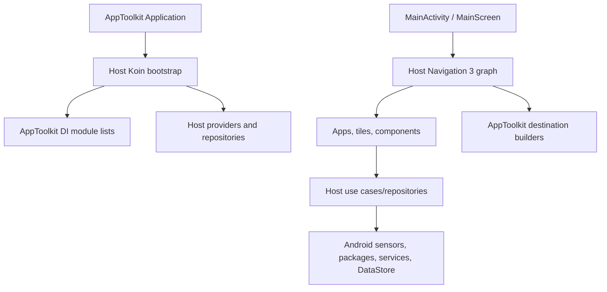

# `:sample` Logic Graph

## Purpose

Provides the installable App Toolkit for Android application and demonstrates how a host composes the reusable toolkit libraries with app-specific features, providers, resources, and platform components.

## Owns

- The Android application, manifest, startup `Application`, `MainActivity`, root screen, host navigation graph, and Koin bootstrap.
- App-specific tools/tiles and Android services, developer-app browsing/favorites, component showcase, and apps widget.
- Host implementations of startup, onboarding, settings, build/ad configuration, DataStore, and navigation provider contracts.
- Application resources, localization, store listing, icons, and host Firebase/Play configuration.

## Does not own

- Reusable AppToolkit feature screens and infrastructure, owned by `:library:*` modules.
- Shared DI/navigation assembly, owned by [`:library:apptoolkit`](../library/apptoolkit/README.md).
- SDK-neutral contracts and reusable UI/theme components, owned by the corresponding core modules.

## Depends on

- [`:library:apptoolkit`](../library/apptoolkit/README.md) for shared DI and navigation composition.
- `:library:core:common`, `:library:core:ui`, `:library:core:designsystem`, and `:library:navigation` for host contracts, presentation foundations, theming, and navigation.
- `:library:feature:about`, `:library:feature:help`, `:library:feature:issuereporter`, `:library:feature:onboarding`, `:library:feature:permissions`, `:library:feature:settings`, and `:library:feature:support` because the host exposes and configures those screens.
- `:library:integration:ads`, `:library:integration:billing`, `:library:integration:consent`, `:library:integration:firebase`, `:library:integration:review`, and `:library:integration:update` to install the optional SDK behavior.

The application does not directly declare `:library:core`, `:library:core:datastore`, or `:library:core:network`; those arrive through the façade/feature graph.

## Used by

No internal module depends on `:sample`; it is the application entry point.

## Flow chart

## Public contracts

This is an application module and is not intended as a library API. Its important integration surface is the set of host provider implementations and configuration values passed into AppToolkit DI factories.

## Internal implementations

- Developer-app remote/local repositories, DTO mapping, favorites persistence, and installed-app inspection.
- Quick-tool domain/repository implementations, Compose tools, Quick Settings tiles, and the caffeine service.
- Main/components/apps-list ViewModels and UI, widget implementation, host DI modules, and navigation builders.

## Current risks

The host module still owns substantial reusable-looking apps-list, quick-tools, widget, and component-showcase business logic. Those flows cannot currently be reused without depending on the application module or extracting dedicated feature modules.

## Migration notes

The current worktree reflects an ongoing migration from the former `:app` project to `:sample` and from the old package namespace to the published library/sample namespaces. Avoid restoring deleted `app/` sources while completing modularization.
