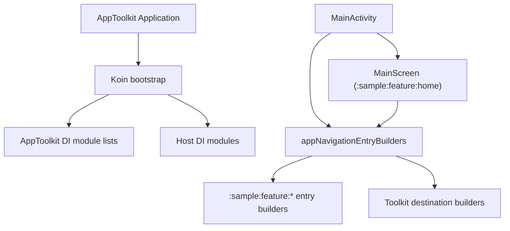

# `:sample:app` Logic Graph

## Purpose

The installable App Toolkit for Android application: the composition root that assembles the toolkit
libraries with the host's own feature modules.

## Owns

- The `AppToolkit` application class, the manifest, `MainActivity`, and the Koin bootstrap.
- `appNavigationEntryBuilders`, the one declaration that names every host feature.
- Host implementations of the startup and onboarding provider contracts.
- Application identity resources: launcher mipmaps and host-specific `xml/` configuration
  (shortcuts, locale config, widget provider info).
- Signing, ProGuard, locale filters, Play/Firebase configuration, and the app-wide `BuildConfig`
  fields.

## Does not own

- Any feature. Screens, repositories and ViewModels live in `:sample:feature:*` and
  `:sample:widget`.
- Feature strings and layouts, owned by their respective `:sample:feature:*`, core, or widget
  module. Default themes, colors and backup policies come from
  [`:library:apptoolkit`](../../library/apptoolkit/README.md); shared host artwork remains in
  [`:sample:core:ui`](../core/ui/README.md).
- Route keys and the entry-builder context, owned by
  [`:sample:core:navigation`](../core/navigation/README.md).

## Depends on

- Every `:sample:core:*`, `:sample:feature:*` and `:sample:widget` module.
- [`:library:apptoolkit`](../../library/apptoolkit/README.md) for shared DI and navigation
  composition,
  plus the toolkit feature and integration modules it configures.

## Used by

Nothing. This is the application entry point.

## Flow chart

## Public contracts

Not a library. Its integration surface is the set of host provider implementations and configuration
values passed into the AppToolkit DI factories.

The host inherits common application attributes, backup/data-extraction rules, colors and themes
from `:library:apptoolkit`. Android's manifest and resource merger gives this application higher
priority, so it can replace any inherited default without copying the toolkit files pre-emptively.
Host-specific identity remains here, including the application class, icons, label, locale config
and AdMob application ID.

## Internal implementations

- Koin module wiring, host provider bindings, and the navigation entry aggregation.

## Current risks

`appNavigationEntryBuilders` is the single place that knows the full feature set, so every new
destination touches this module. That is deliberate — it is what keeps the feature modules from
depending on each other — but it does make this file a merge point.

Components declared by feature modules (Quick Settings tile services, the caffeine foreground
service, `ComponentsActivity`, the widget receiver) are still declared in this manifest rather than
in
each feature's own. They resolve because every module is a dependency here, but a feature is not yet
self-contained: adding one to another host means editing this manifest.

## Architecture guards

`HostKoinGraphTest` verifies the dependency graph `initializeKoin` assembles, because a Koin
definition that cannot be created surfaces as a fatal `Unable to start activity` at
`MainActivity.onCreate` rather than at startup. The mechanics and the four host extension points it
pins are documented in [`:library:apptoolkit`](../../library/apptoolkit/README.md).

The list of modules in that test mirrors `initializeKoin` by hand. A module added to one and not the
other leaves the check passing while the app breaks, so they have to be edited together.

## Migration notes

The host was a single `:sample` module until the split. Three couplings had to be broken to make the
feature modules leaves rather than a chain:

- `MainScreen` imported `appNavigationEntryBuilders`, which would have made the shell depend on
  every
  feature it renders. It now takes the builders as a parameter, supplied here by `MainActivity`.
- `CaffeineService` built its notification intent from `MainActivity::class.java`; it resolves the
  launcher activity through the package manager instead.
- `APPS_LIST_AD_FREQUENCY` was a `buildConfigField` here, which no library module can read. It is a
  fixed tuning value, so it became a constant in [`:sample:core:common`](../core/common/README.md).

Quick-tool repositories in `:sample:feature:tiles` intentionally stay concrete classes: each wraps
one
Android platform source, has no alternate implementation, and does not cross a module boundary.

Pass-through use cases were removed throughout. Where one wrapped a data source rather than a
repository, a repository was introduced instead of deleting it outright, so no ViewModel ends up
holding `DatastoreInterface` directly.
