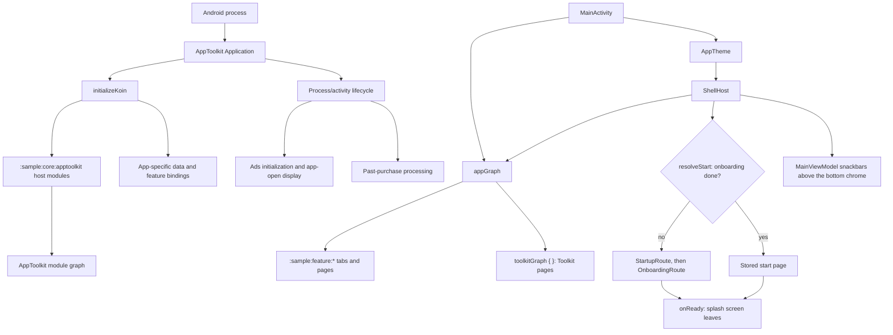

# `:sample:app` Logic Graph

## Purpose

The installable App Toolkit for Android application: the composition root that assembles the toolkit
libraries with the host's own feature modules.

## Owns

- The `AppToolkit` application class, the manifest, `MainActivity`, and the Koin bootstrap.
- `MainViewModel`, which runs the consent, in-app review and in-app update requests `MainActivity`
  sends from `onResume`.
- `sampleAppModules`, the single source of truth used by runtime startup and DI graph tests.
- App-only bridges that intentionally connect otherwise independent features, such as the About
  version-tap callback to the Components unlock repository.
- `appGraph`, the one declaration that names every host feature: the Tiles and Apps tabs, the
  components page, the drawer, the overflow menu and the settings shortcut's deep link, on top of
  the Toolkit's pages from `toolkitGraph { }`. `startKeyFor` maps the stored start page to its tab.
- The drawer header's `app_logo`.
- The sample onboarding provider; startup and settings provider adapters live in
  [`:sample:core:apptoolkit`](../core/apptoolkit/README.md).
- Application identity resources: launcher mipmaps and host-specific `xml/` configuration
  (shortcuts and widget provider info), including the shortcut target package generated from the
  released application ID.
- The `app_name` and `app_full_name` overrides that replace AppToolkit's `App Name` placeholders.
- The final-manifest link to AppToolkit's `config_locales.xml`; Android does not merge this
  application attribute from a library manifest.
- Signing, ProGuard, locale filters, Play/Firebase configuration, and the app-wide `BuildConfig`
  fields.

## Does not own

- Any feature. Screens, repositories and ViewModels live in `:sample:feature:*` and
  `:sample:widget`.
- Feature strings and layouts, owned by their respective `:sample:feature:*`, core, or widget
  module. Default themes, colors and backup policies come from
  [`:library:apptoolkit`](../../library/apptoolkit/README.md); shared host artwork remains in
  [`:sample:core:ui`](../core/ui/README.md).
- Advertising configuration, including the sample's AdMob application ID and merged-manifest
  declaration, owned by [`:sample:integration:ads`](../integration/ads/README.md).
- Route keys, owned by the feature each belongs to (`ToolkitTilesRoute`, `AppsListRoute`,
  `ComponentsRoute`).
- The chrome and navigation, owned by [`:library:shell`](../../library/shell/README.md) and
  [`:library:navigation`](../../library/navigation/README.md).

## Depends on

- Every `:sample:core:*`, `:sample:feature:*` and `:sample:widget` module, including
  `:sample:core:apptoolkit` for the host's toolkit adapter.
- [`:library:apptoolkit`](../../library/apptoolkit/README.md) for shared DI, `toolkitGraph { }` and
  `ShellHost`, plus the toolkit feature and integration modules it configures.

## Used by

Nothing. This is the application entry point.

## Flow chart

```mermaid
flowchart TD
    Process[Android process] --> App[AppToolkit Application]
    App --> Koin[initializeKoin]
    Koin --> Adapter[":sample:core:apptoolkit host modules"]
    Adapter --> AppToolkit[AppToolkit module graph]
    Koin --> HostModules[App-specific data and feature bindings]
    App --> Lifecycle[Process/activity lifecycle]
    Lifecycle --> Ads[Ads initialization and app-open display]
    Lifecycle --> Billing[Past-purchase processing]
    Launcher[MainActivity] --> Theme[AppTheme]
    Theme --> Host[ShellHost]
    Launcher --> Graph[appGraph]
    Graph --> HostPages[":sample:feature:* tabs and pages"]
    Graph --> ToolkitPages["toolkitGraph { }: Toolkit pages"]
    Host --> Graph
    Host --> Start{resolveStart: onboarding done?}
    Start -->|no| FirstRun[StartupRoute, then OnboardingRoute]
    Start -->|yes| Stored[Stored start page]
    FirstRun --> Ready[onReady: splash screen leaves]
    Stored --> Ready
    Host --> Snackbars[MainViewModel snackbars above the bottom chrome]
```

## Architectural decisions

- The application module is the only place that knows the complete runtime graph, final manifest,
  and destination set; feature modules remain unaware of their siblings.
- Host-to-toolkit provider adaptation is isolated in `:sample:core:apptoolkit`, while this module
  retains final Koin startup and app-only configuration.
- `ShellHost` decides the start in `resolveStart` before its first frame: the Toolkit's first-launch
  start screens while onboarding is not done, the stored start page after. The splash screen stays
  up until `onReady`, so a default tab never flashes before the chosen one, and first launch no
  longer leaves for a second activity.
- Android's permission manager and privacy dashboard open the privacy page through the Toolkit's
  built-in `PermissionUsageActivity`, so this manifest declares nothing for them.
- The graph's banner slot shows the bottom navigation native ad, so it sits above the bottom bar on
  every tab.
- `MainViewModel`'s messages (a consent form that fails to load) are shown by a
  `DefaultSnackbarHandler` over the shell, raised above the bottom chrome.
- The launcher shortcut's `OPEN_SETTINGS` action is a deep link in `appGraph`, so the shell opens
  the settings page for it at launch and while running, with no activity of its own.
- Both tabs declare a `TabSearch`, so the app bar holds a search field that filters the quick
  tools and the apps. The Apps tab's random-app button is declared by the list itself with
  `ScaffoldFabs`, so the graph holds no button of its own.
- The drawer's Components entry depends on the showcase being unlocked, so the graph is rebuilt
  when that changes; the back stacks are kept, since they are saved by position, not by graph. The
  drawer ends with `toolkitFooter`, so Settings, Help, Updates and Share stay last; the developer
  options are reached from Advanced settings, not the drawer.
- Process-lifetime ads, billing recovery, installing the seasonal overlay, and current-activity tracking
  stay in the application class because their lifetime exceeds any screen ViewModel.

## Public contracts

Not a library. Its integration surface is the host configuration and app-specific modules passed
through the adapter in `:sample:core:apptoolkit`, plus the final manifest/resource overrides.

The host inherits common application attributes, backup/data-extraction rules, colors and themes
from `:library:apptoolkit`. Android's manifest and resource merger gives this application higher
priority, so it can replace any inherited default without copying the toolkit files pre-emptively.
Host-specific identity remains here, including the application class, icons and label. The sample
provides its actual `app_name` and `app_full_name`, while accepting AppToolkit's copyright and
locale
defaults. The sample-specific ads integration contributes its AdMob application ID to the final
manifest. Another host can replace the app's same-named resources or locale config while retaining
the application-level locale link.

## Internal implementations

- Koin module wiring, host provider bindings, and the graph.

## Current risks

`appGraph` is the single place that knows the full feature set, so every new destination touches
this module. That is deliberate, it is what keeps the feature modules from depending on each other,
but it does make this file a merge point.

## Architecture guards

`HostKoinGraphTest` verifies the dependency graph `initializeKoin` assembles, because a Koin
definition that cannot be created surfaces as a fatal `Unable to start activity` at
`MainActivity.onCreate` rather than at startup. The reflection limits and host provider boundary are
documented in [`:library:apptoolkit`](../../library/apptoolkit/README.md).

The test and `initializeKoin` both consume `sampleAppModules`, so a module cannot be added to
runtime
startup without also becoming part of graph verification.

## Migration notes

The host was a single `:sample` module until the split. Three couplings had to be broken to make the
feature modules leaves rather than a chain:

- The old `MainScreen` imported the app's entry builders, which would have made the shell depend on
  every feature it renders. In 3.0.0 the shell became `:library:shell` and the graph moved here as
  `appGraph`; `:sample:core:shell` and `:sample:core:navigation` were removed.
- `APPS_LIST_AD_FREQUENCY` was a `buildConfigField` here, which no library module can read. It is a
  fixed tuning value, so it became a constant in [`:sample:core:common`](../core/common/README.md).

Quick-tool repositories in `:sample:feature:tiles` intentionally stay concrete classes: each wraps
one
Android platform source, has no alternate implementation, and does not cross a module boundary.

Pass-through use cases were removed throughout. Where one wrapped a data source rather than a
repository, a repository was introduced instead of deleting it outright, so no ViewModel ends up
holding `DataStoreInterface` directly.
