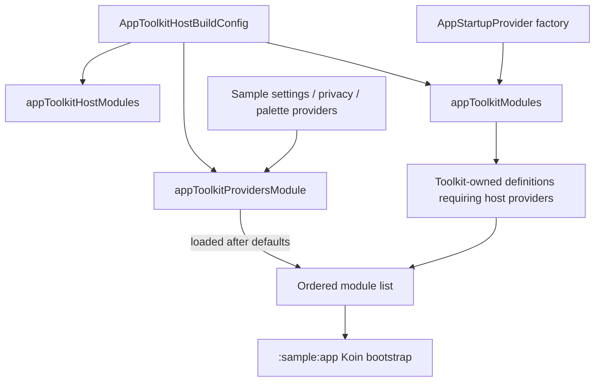

# `:sample:core:apptoolkit` Logic Graph

## Purpose

Adapts the reusable AppToolkit module to the sample product. It is the host-integration boundary for
toolkit startup, the host-wide toolkit answers, and Koin override ordering.

## Owns

- `appToolkitHostModules`, which orders the toolkit graph ahead of the host's own modules.
- `AppStartupProvider`, and the host-wide answers that belong to no single feature, currently the
  default theme palette.

## Does not own

- Toolkit provider contracts or default implementations, owned by `:library:feature:*` modules.
- The sample's FAQ questions and answers, owned by
  [`:sample:feature:faq`](../../feature/faq/README.md). They lived here only because this module
  already had a `res/` directory; a body of content belongs to its own module.
- The settings, about, display, and privacy provider implementations, owned by
  [`:sample:feature:settings`](../../feature/settings/README.md) together with their Koin bindings.
  A `:sample:core:` module may not depend on a feature, so the bindings travel with the classes.
- The About composable that contains the components-showcase unlock gesture, owned by
  [`:sample:feature:settings`](../../feature/settings/README.md).
- Application startup and final Koin bootstrapping, owned by [`:sample:app`](../../app/README.md).

## Depends on

- [`:library:apptoolkit`](../../../library/apptoolkit/README.md), exported because this adapter's
  public function names toolkit configuration and Koin types.

## Used by

- `:sample:app`, which calls `appToolkitHostModules` before adding app-specific modules.

## Flow chart

## Architectural decisions

- Toolkit modules are added before host bindings because Koin's later definitions win when the host
  intentionally replaces a toolkit binding; the ordering is part of `appToolkitHostModules`'
  contract.
- Provider implementations live in this core adapter rather than a screen feature because multiple
  toolkit features and the application composition root consume them.
- The sample keeps the provider resources here so the module that constructs each settings model
  also owns its localized text.

## Public contracts

- `appToolkitHostModules` is the module's integration entry point. Provider classes are concrete
  host implementations bound through its internal Koin module.

## Internal implementations

- Koin provider bindings and the sample's provider-specific settings model construction.

## Current risks

Reversing module order lets duplicate toolkit definitions replace host choices. Adding a new
toolkit host extension also requires a binding here and an update to the host graph verification
tests; composable `koinInject()` lookups need direct resolution tests because constructor reflection
cannot discover them.
