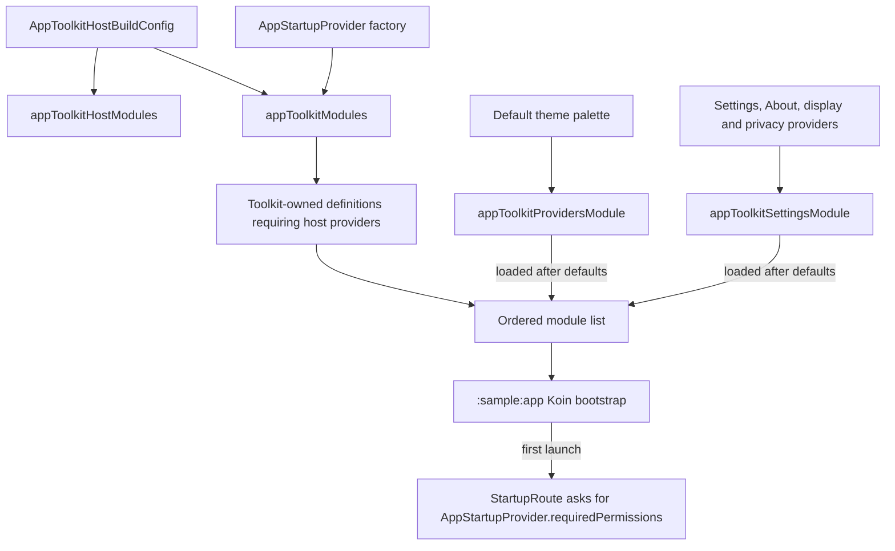

# `:sample:core:apptoolkit` Logic Graph

## Purpose

The sample's whole App Toolkit setup: the Koin graph the application loads first, and the
sample's answer to every extension point the Toolkit asks a host about.

## Owns

- `appToolkitHostModules`, which orders the Toolkit graph ahead of the host's own modules.
- `AppStartupProvider`, the sample's `StartupProvider`: notification permission on Android 13 and
  later, nothing before.
- The settings extension points: `AppSettingsProvider` (the rows of the settings list and the keys
  they open, with `SettingsConstants` for their keys), `AppAboutSettingsProvider`,
  `AppDisplaySettingsProvider` and the default `PrivacySettingsProvider`, bound by
  `appToolkitSettingsModule`.
- The host-wide answers that belong to no single screen, currently the default theme palette.

## Does not own

- Toolkit provider contracts or default implementations, owned by `:library:feature:*` modules.
  The startup screen itself is [`:library:feature:startup`](../../../library/feature/startup/README.md)'s.
- The settings pages themselves, owned by
  [`:library:feature:settings`](../../../library/feature/settings/README.md) and the modules that
  register the keys the rows open.
- The About page content and the components unlock it hosts, owned by
  [`:sample:feature:settings`](../../feature/settings/README.md).
- The onboarding pages, owned by [`:sample:feature:onboarding`](../../feature/onboarding/README.md).
- The sample's FAQ questions and answers, owned by [`:sample:feature:faq`](../../feature/faq/README.md).
- Deciding at launch whether startup runs, the startup-screen choices, and the final Koin
  bootstrap, owned by [`:sample:app`](../../app/README.md).

## Depends on

- [`:library:apptoolkit`](../../../library/apptoolkit/README.md), exported because
  `appToolkitHostModules` names Toolkit configuration and Koin types.

## Used by

- `:sample:app`, which calls `appToolkitHostModules` before adding app-specific modules.

## Flow chart

```mermaid
flowchart TD
    Config[AppToolkitHostBuildConfig] --> HostModules[appToolkitHostModules]
    Startup[AppStartupProvider factory] --> Toolkit[appToolkitModules]
    Config --> Toolkit
    Toolkit --> ToolkitGraph[Toolkit-owned definitions requiring host providers]
    Palette[Default theme palette] --> Overrides[appToolkitProvidersModule]
    Settings[Settings, About, display and privacy providers] --> SettingsModule[appToolkitSettingsModule]
    ToolkitGraph --> Ordered[Ordered module list]
    Overrides -->|loaded after defaults| Ordered
    SettingsModule -->|loaded after defaults| Ordered
    Ordered --> App[":sample:app Koin bootstrap"]
    App -->|first launch| Screen[StartupRoute asks for AppStartupProvider.requiredPermissions]
```

## Architectural decisions

- One core module holds everything that configures the Toolkit, so a host reads one place to see
  how it is set up. Code that is the sample's own, such as the About content and its unlock,
  stays in the features.
- A core module, so it may not depend on a sample feature: the providers here name only Toolkit
  types and keys, which keeps that true.
- Toolkit modules are added before host bindings because Koin's later definitions win when the host
  intentionally replaces a Toolkit binding; the ordering is part of `appToolkitHostModules`'
  contract.

## Public contracts

- `appToolkitHostModules` is the module's integration entry point. Every provider is bound through
  it.

## Internal implementations

- `appToolkitProvidersModule` (the palette) and `appToolkitSettingsModule` (the settings
  providers).

## Current risks

Reversing module order lets duplicate Toolkit definitions replace host choices. Adding a new
Toolkit host extension also requires a binding here and an update to the host graph verification
tests; composable `koinInject()` lookups need direct resolution tests because constructor reflection
cannot discover them. A settings row whose key no module registers opens nothing; `:sample:app`'s
`AppGraphTest` checks every key the rows use.
