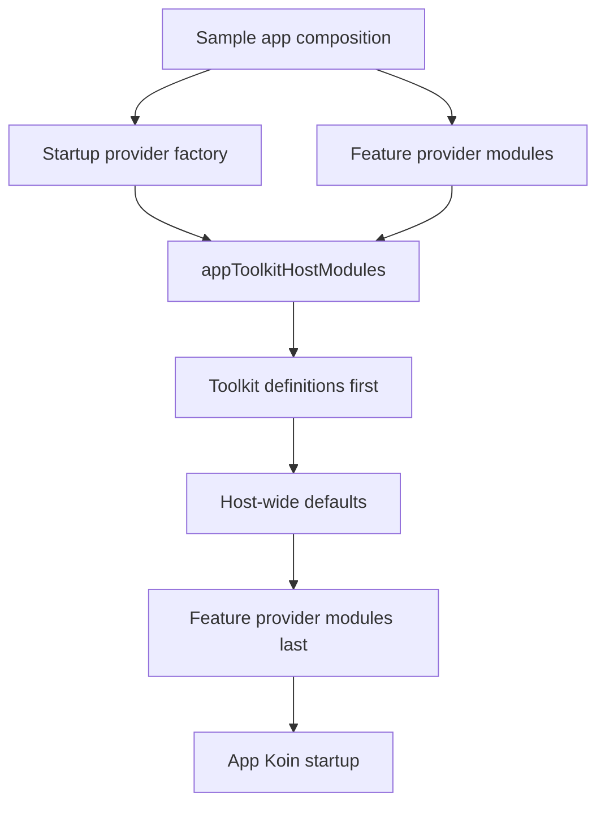

# `:sample:core:apptoolkit` Logic Graph

## Purpose

Orders the Toolkit graph and the sample's host provider modules. The app supplies feature-owned
providers, so this core module stays independent of sample features.

## Owns

- `appToolkitHostModules`, which loads Toolkit definitions before host overrides.
- The sample's default theme palette and default `PrivacySettingsProvider`, bound by
  `appToolkitProvidersModule`.
- The sample's shake-to-report configuration.

## Does not own

- Startup permission policy, owned by [`:sample:feature:startup`](../../feature/startup/README.md).
- Root settings rows and keys, owned by [`:sample:feature:settings`](../../feature/settings/README.md).
- Display customization, owned by [`:sample:feature:display`](../../feature/display/README.md).
- About build and device metadata, owned by [`:sample:feature:about`](../../feature/about/README.md).
- Final Koin startup and the connections between features, owned by
  [`:sample:app`](../../app/README.md).
- Toolkit provider contracts and screens, owned by `:library:feature:*`.

## Depends on

- [`:library:apptoolkit`](../../../library/apptoolkit/README.md), exported because
  `appToolkitHostModules` accepts Toolkit configuration, provider, and Koin types.
- No sample feature module.

## Used by

- `:sample:app`, which passes the startup provider factory and feature provider modules.

## Flow chart

```mermaid
flowchart TD
    App[Sample app composition] --> Factory[Startup provider factory]
    App --> Providers[Feature provider modules]
    Factory --> Adapter[appToolkitHostModules]
    Providers --> Adapter
    Adapter --> Toolkit[Toolkit definitions first]
    Toolkit --> Defaults[Host-wide defaults]
    Defaults --> Overrides[Feature provider modules last]
    Overrides --> Bootstrap[App Koin startup]
```

## Architectural decisions

- Feature-specific providers live with their features. The settings, startup, display, and about
  modules are separate now so each area can expand without moving its provider out of core later.
- The app passes a `StartupProvider` factory and Koin modules through library contracts. Core does
  not import sample feature implementations or depend on their modules.
- Toolkit modules load first, followed by host-wide defaults and feature modules. Koin's later
  definitions keep the host's intentional overrides.

## Public contracts

- `appToolkitHostModules(hostBuildConfig, startupProviderFactory, hostProviderModules)` returns
  the ordered integration graph. The app must supply its feature provider bindings.

## Internal implementations

- `appToolkitProvidersModule`, which binds the default palette and privacy provider.

## Current risks

Reversing module order can replace host choices with Toolkit defaults. The app's
`HostKoinGraphTest` verifies constructor dependencies, and `AppToolkitSettingsModuleTest` resolves
settings provider bindings that composables request directly. Feature modules added by the app
may also require shared app dependencies, such as the settings showcase datastore.
