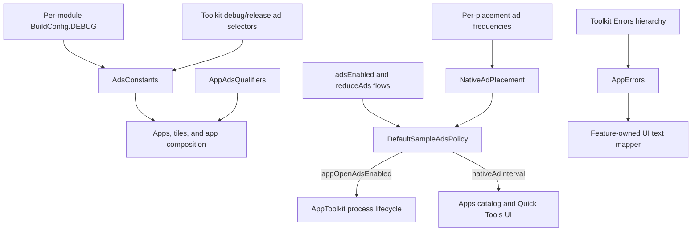

# `:sample:core:common` Logic Graph

## Purpose

Host-wide constants, the host's ad policy, and error types that carry no UI and no Android state.

## Owns

- Ad unit ids and Koin qualifiers for the host's ad placements, help-screen constants, log tags.
- `AppErrors`, the host's extension of the toolkit `Errors` hierarchy.
- `AdsConstants.APPS_LIST_AD_FREQUENCY` and `AdsConstants.QUICK_TOOLS_AD_FREQUENCY`.
- `SampleAdsPolicy`/`DefaultSampleAdsPolicy` and `NativeAdPlacement`: the host's single ad governor,
  deciding whether App Open ads are wanted and how sparse native ads are at each placement.

## Does not own

- Anything that needs `R`. Error-to-text mapping lives in [`:sample:core:ui`](../ui/README.md),
  because it returns `UiTextHelper` and resolves string resources.
- Storing the ads preferences, owned by
  [`:library:core:datastore`](../../../library/core/datastore/README.md); the policy is constructed
  from flows so it stays free of persistence.
- Initializing or rendering ads, owned by
  [`:library:integration:ads`](../../../library/integration/ads/README.md) and
  [`:library:core:ui`](../../../library/core/ui/README.md).

## Depends on

- [`:library:core:common`](../../../library/core/common/README.md) for the debug/release ad-unit
  selectors.
- [`:library:core:network`](../../../library/core/network/README.md) for the `Errors` hierarchy
  `AppErrors` extends.

## Used by

- `:sample:core:ui`, `:sample:feature:apps`, `:sample:feature:tiles`, `:sample:app`.

## Flow chart

## Architectural decisions

- This module contains only cross-feature values that need neither Android state nor resources.
- Resource-backed mappings stay with the consuming UI because moving `R` here would turn a
  constants/error module into a presentation dependency.
- Fixed tuning values are source constants; build-dependent identities use each module's generated
  `BuildConfig` and the shared debug/release selectors.
- Ad intensity is one policy object rather than a `reduceAds` check per composable, so the apps
  catalogue and Quick Tools cannot drift in what "reduced" means. Reduced spacing is derived from
  each placement's normal cadence (×2) instead of being a second set of tuning numbers.
- The policy takes preference `Flow`s rather than the preference store, which keeps this module free
  of persistence and Android state while still owning the host's ad decisions.

## Public contracts

- `AdsConstants`, `AppAdsQualifiers`, `HelpConstants`, `LogTags`, `AppErrors`, `SampleAdsPolicy`,
  `DefaultSampleAdsPolicy`, `NativeAdPlacement`.

## Internal implementations

- `DefaultSampleAdsPolicy`, the only code here with behavior. Everything else is a constant or a
  data type.

## Current risks

`AdsConstants` reads this module's own `BuildConfig.DEBUG` to pick between debug and release ad
units. That is per-module but tracks the same build type, so it stays correct; a module compiled in
isolation against a different build type would not.

## Migration notes

`APPS_LIST_AD_FREQUENCY` was an application-module `buildConfigField`. No library module can read
the
application's generated class, and the value is fixed tuning rather than a build input, so it became
a constant here when `:sample:feature:apps` was split out.
