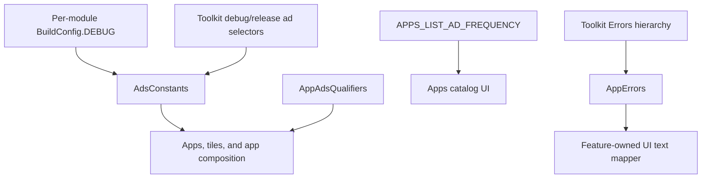

# `:sample:core:common` Logic Graph

## Purpose

Host-wide constants and error types that carry no UI and no Android state.

## Owns

- Ad unit ids and Koin qualifiers for the host's ad placements, help-screen constants, log tags.
- `AppErrors`, the host's extension of the toolkit `Errors` hierarchy.
- `AdsConstants.APPS_LIST_AD_FREQUENCY`.

## Does not own

- Anything that needs `R`. Error-to-text mapping lives in [`:sample:core:ui`](../ui/README.md),
  because it returns `UiTextHelper` and resolves string resources.

## Depends on

- [`:library:core:common`](../../../library/core/common/README.md) for the debug/release ad-unit
  selectors.
- [`:library:core:network`](../../../library/core/network/README.md) for the `Errors` hierarchy
  `AppErrors` extends.

## Used by

- `:sample:core:ui`, `:sample:feature:apps`, `:sample:feature:tiles`, `:sample:app`.

## Flow chart

## Architectural decisions

- This module contains only cross-feature values that need neither Android state nor resources.
- Resource-backed mappings stay with the consuming UI because moving `R` here would turn a
  constants/error module into a presentation dependency.
- Fixed tuning values are source constants; build-dependent identities use each module's generated
  `BuildConfig` and the shared debug/release selectors.

## Public contracts

- `AdsConstants`, `AppAdsQualifiers`, `HelpConstants`, `LogTags`, `AppErrors`.

## Internal implementations

- None. Every declaration here is a constant or a data type.

## Current risks

`AdsConstants` reads this module's own `BuildConfig.DEBUG` to pick between debug and release ad
units. That is per-module but tracks the same build type, so it stays correct; a module compiled in
isolation against a different build type would not.

## Migration notes

`APPS_LIST_AD_FREQUENCY` was an application-module `buildConfigField`. No library module can read
the
application's generated class, and the value is fixed tuning rather than a build input, so it became
a constant here when `:sample:feature:apps` was split out.
