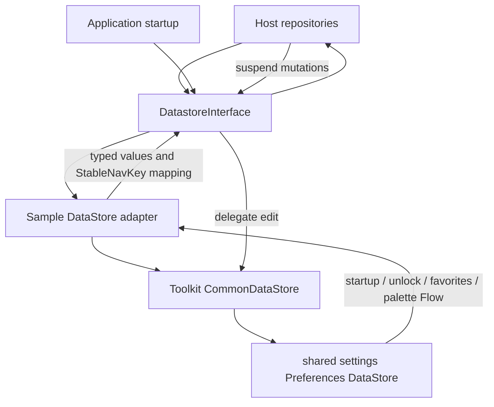

# `:sample:core:datastore` Logic Graph

## Purpose

The host's preference storage: everything the sample persists beyond what the toolkit already
stores.

## Owns

- `DatastoreInterface` and its implementation, covering the components-showcase unlock flag,
  favorites, and the host's startup destination.

## Does not own

- Toolkit preferences (ads enabled, consent, onboarding completion), owned by
  [`:library:core:datastore`](../../../library/core/datastore/README.md).
- Any decision about what the stored values mean; that belongs to the repositories that read them.

## Depends on

- [`:library:core:datastore`](../../../library/core/datastore/README.md) for `CommonDataStore`.
- :library:navigation for StableNavKey. Startup projection uses core DataStore directly; this module has no direct core:ui dependency.

## Used by

- `:sample:feature:apps`, `:sample:feature:components`, `:sample:core:shell`,
  `:sample:feature:settings`, `:sample:app`.

## Flow chart

## Architectural decisions

- The sample reuses the toolkit's single preferences file and exposes only host-required values
  through `DatastoreInterface`; feature repositories do not depend on `CommonDataStore` directly.
- Persisted routes remain strings at the storage boundary and are mapped to `StableNavKey` values by
  a caller-supplied function, keeping host route knowledge out of the toolkit DataStore.
- The contract groups sample-wide preference access because there is one implementation and one
  backing store; feature repositories still own the meaning of each value.

Startup mapping delegates to core DataStore's generic startupValueFlow while retaining the host's StableNavKey contract and caller-supplied fallback mapping.

## Public contracts

- `DatastoreInterface`.

## Internal implementations

- Preference keys and the DataStore instance.

## Current risks

`DataStoreTest` is `@Disabled`. It needs Robolectric's runner for `ApplicationProvider`, and this
build runs the JUnit platform with no vintage engine, so `@RunWith` is never honoured, the test has
never executed. It was silently skipped while the sample was one module and only surfaced when it
became this module's only test. Re-enabling it needs either a Robolectric JUnit 5 integration or a
constructor that takes the DataStore file path so no Android context is required.
