# `:sample:core:navigation` Logic Graph

## Purpose

The route vocabulary and entry-builder context that let a feature declare a destination without
knowing which shell renders it.

## Owns

- `AppNavKey` and the host route keys (`AppsListRoute`, `ToolkitTilesRoute`, `ComponentsRoute`).
- `AppNavigationEntryContext` and `RandomAppHandler`, the parameters every feature entry builder
  takes.
- `NavigationManager` and `MainNavigationDefaults` (bottom-bar items, FAB-supported routes).
- The localized destination titles and startup option arrays used by those navigation defaults.

## Does not own

- The list of entry builders. That names every feature, so it lives in `:sample:app`.
- Any destination content, owned by the feature modules.

## Depends on

- [`:library:navigation`](../../../library/navigation/README.md) for `StableNavKey` and destination
  types, plus [`:library:core:ui`](../../../library/core/ui/README.md) for shared UI state.

## Used by

- `:sample:feature:apps`, `:sample:feature:tiles`, `:sample:feature:components`,
  `:sample:core:shell`, `:sample:app`.

## Flow chart

```mermaid
flowchart TD
    Keys["AppsListRoute / ToolkitTilesRoute / ComponentsRoute"] --> Type[StableNavKey destination type]
    Feature[Feature entry builder] --> Context[AppNavigationEntryContext]
    Context --> Stack[Back stack]
    Context --> Random[RandomAppHandler]
    Feature --> Keys
    App[":sample:app"] --> Aggregate[appNavigationEntryBuilders]
    Aggregate --> Feature
    Defaults[MainNavigationDefaults] --> Bottom[Bottom-bar order]
    Defaults --> Fab[FAB-supported routes]
    Defaults --> Startup[Localized startup options]
    Bottom --> Shell[":sample:core:shell"]
    Fab --> Shell
    Keys --> Shell
```

## Architectural decisions

- Route vocabulary and entry-builder context are separated from aggregation: every feature may
  depend on the former, while only the app may know the complete builder list.
- `MainNavigationDefaults` is the host product's authoritative top-level order and startup-option
  mapping, not a generic toolkit default.
- Cross-feature actions such as random-app selection are callbacks in the entry context so the
  navigation contract does not depend on the apps feature implementation.

## Public contracts

- Route keys, `AppNavigationEntryContext`, `RandomAppHandler`, `NavigationManager`,
  `MainNavigationDefaults`.

## Internal implementations

- None; this module is contracts and constants.

## Current risks

`MainNavigationDefaults` hardcodes the bottom-bar item order. Adding a top-level destination means
editing this module as well as the feature that provides it.

## Migration notes

`AppNavigationEntryContext` was declared alongside `appNavigationEntryBuilders` in the main package.
Splitting them is what allows features to be leaves: the context is a parameter every feature needs,
while the builder list names them all. Keeping them together would have made each feature depend on
the module that wires all the others.
