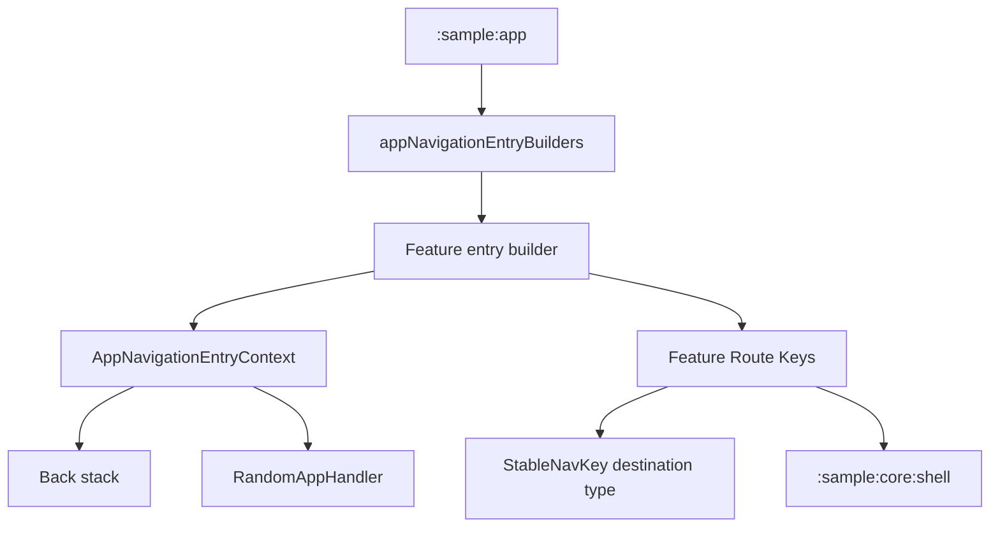

# `:sample:core:navigation` Logic Graph

## Purpose

The route vocabulary and entry-builder context that let a feature declare a destination without
knowing which shell renders it.

## Owns

- `AppNavKey`, the base interface for all navigation route keys in the sample app.
- `AppNavigationEntryContext` and `RandomAppHandler`, the parameters every feature entry builder
  takes.
- `NavigationManager`, which allows different components to request navigation events.
- `NavigationItemContribution` and `StartupScreenContribution`, the contracts a feature implements
  to appear in the shell's drawer and in the startup-screen setting.

## Does not own

- The list of entry builders or the specific navigation routes (e.g., `NavigationRoutes`). Those
  live in `:sample:app`.
- Any destination content, owned by the feature modules.

## Depends on

- [`:library:navigation`](../../../library/navigation/README.md) for `StableNavKey` and destination
  types, plus [`:library:core:ui`](../../../library/core/ui/README.md) for shared UI state.

## Used by

- `:sample:feature:apps`, `:sample:feature:tiles`, `:sample:feature:components`,
  `:sample:core:shell`, `:sample:app`.

## Flow chart

## Architectural decisions

- Route vocabulary and entry-builder context are separated from aggregation: every feature may
  depend on the former, while only the app may know the complete builder list.
- Cross-feature actions such as random-app selection are callbacks in the entry context so the
  navigation contract does not depend on the apps feature implementation.

## Public contracts

- `AppNavKey`, `AppNavigationEntryContext`, `RandomAppHandler`, `NavigationManager`,
  `NavigationItemContribution`, `StartupScreenContribution`.

## Internal implementations

- None; this module is contracts and constants.

## Current risks

Both contribution contracts are aggregated with Koin's `getAll()`, which returns one instance per
definition. A feature that registers its contribution without a unique qualifier overrides another
feature's binding instead of adding to it, and the missing entry fails silently.

## Migration notes

`AppNavigationEntryContext` was declared alongside `appNavigationEntryBuilders` in the main package.
Splitting them is what allows features to be leaves: the context is a parameter every feature needs,
while the builder list names them all. Keeping them together would have made each feature depend on
the module that wires all the others.
