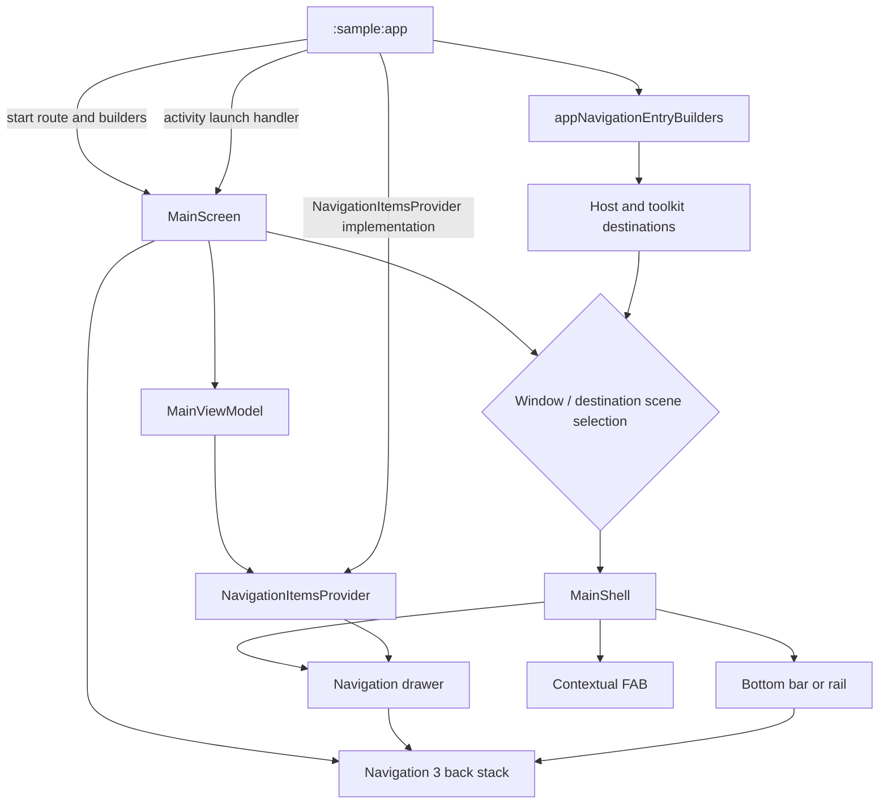

# `:sample:core:shell` Logic Graph

## Purpose

The application shell: the scaffold, navigation drawer, bottom bar and FAB that host every
destination.

## Owns

- `MainScreen` and `MainShell`, the drawer, the FAB, and the changelog dialog trigger.
- `MainViewModel` and its contracts.
- `NavigationItemsProvider`, the port the shell reads drawer items from. `:sample:app` implements
  it, so the shell renders the drawer without knowing which features fill it.

## Does not own

- Which destinations exist. `MainScreen` receives its entry builders as a parameter; `:sample:app`
  supplies them.
- `MainActivity`, which lives in `:sample:app` because it is the launcher activity and the place
  where the feature set is named.
- `ComponentsActivity`, which lives in `:sample:feature:components`.

## Depends on

- `:sample:core:navigation` and `:sample:core:analytics`.
- [`:library:apptoolkit`](../../../library/apptoolkit/README.md) for the toolkit's own destinations,
  top bar and drawer content.

## Used by

- `:sample:app`.

## Flow chart

## Architectural decisions

- The app injects destination builders into `MainScreen`; the shell never imports the full feature
  graph and can be tested with a smaller set.
- The shell receives an `onLaunchActivity` callback for standalone activities that it doesn't own
  (like the Components showcase), decoupling it from feature modules.
- The back stack is the navigation source of truth. Drawer, bottom/rail, FAB, and adaptive scene
  selection are projections of the current destination and window state.
- Drawer items arrive as a flow through `NavigationItemsProvider`, so an item that appears only
  once a feature unlocks it changes the drawer without the shell knowing why.
- The activity sends its GMS events from `onResume`, so each arrives again on every return from
  Settings, FAQ or Support. `MainViewModel` guards each one on its own terms, and in the ViewModel
  rather than an activity field so the guards survive configuration change:
  - `RequestReview` is answered once per instance. `RequestInAppReviewUseCase` records a session on
    each call and the prompt is a once-ever event, so answering every request would count resumes as
    sessions and cancel the in-flight flow.
  - `RequestConsent` is answered once per instance. The repository already joins a request still in
    flight, but a resume after one completed starts a fresh UMP round trip, and overlapping UMP
    requests are what drives that SDK into its failure path.
  - `RequestInAppUpdate` is **not** once per instance. Re-checking on resume is how an immediate
    update the user interrupted gets resumed. The repository's
    `DEVELOPER_TRIGGERED_UPDATE_IN_PROGRESS` branch exists for exactly that, so guarding it away
    would strand a half-applied update. Instead the check stops repeating once Play returns an
    answer that cannot change this session; `Started` keeps it open, because that is the outcome
    that may still need resuming.

## Public contracts

- `MainScreen(startRoute, entryBuilders, onLaunchActivity)`, `MainViewModel`, and
  `NavigationItemsProvider`. The app
  host resolves the persisted startup destination before composing the shell.

## Internal implementations

- Scene selection, drawer/bottom-bar state, random-app handler plumbing.

## Current risks

The shell still knows some toolkit activities (settings, help, support) by class because they are
part of the library's stable API, but app-specific standalone activities are decoupled.
