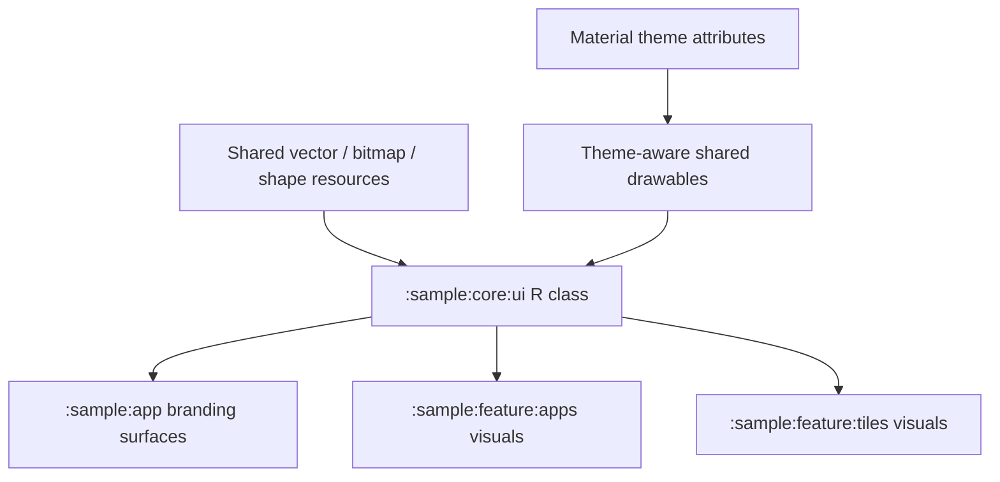

# `:sample:core:ui` Logic Graph

## Purpose

Shared host artwork used by the sample application and features.

## Owns

- Shared `drawable`, `drawable-anydpi`, and `drawable-xhdpi` artwork.

## Does not own

- Feature and application strings, which live in the module that owns each user flow.
- Default colors, themes, splash and shortcut artwork, and backup rules, owned by
  [`:library:apptoolkit`](../../../library/apptoolkit/README.md).
- Resources that identify the application, such as launcher mipmaps and the manifest's `xml/`
  configuration, which stay in `:sample:app`.
- Composables and error-to-text mappings, which live with their consuming feature.

## Depends on

- [`:library:core:designsystem`](../../../library/core/designsystem/README.md) for shared visual
  contracts exposed transitively to sample features.
- Google Material resources for the `colorPrimaryContainer` theme attribute used by the shared
  shape drawables.

## Used by

- `:sample:app` for shared application artwork.
- `:sample:feature:apps` and `:sample:feature:tiles` for shared visual assets.

## Flow chart

## Architectural decisions

- This is a resource-sharing module, not a Kotlin UI foundation; reusable composables stay in
  `:library:core:ui` or their owning feature.
- Artwork is centralized only when multiple sample modules consume it. Feature-only assets and all
  user-facing text live with the feature.
- Application identity, launcher icons, shortcuts, and widget provider XML remain in `:sample:app`
  because they participate in the final package/manifest contract.

## Public contracts

- The shared host artwork exposed through this module's `R` class.

## Internal implementations

- None.

## Current risks

Some artwork is still centralised because it is consumed across the application or has not yet
been split into a feature-specific asset. Feature text must not be added here.

## Migration notes

Feature strings, localized plurals, startup arrays, widget layouts, and application-owned string
configuration moved to their owning modules. The app-catalogue error mapper moved with the apps
feature because it resolves apps-owned error text.
