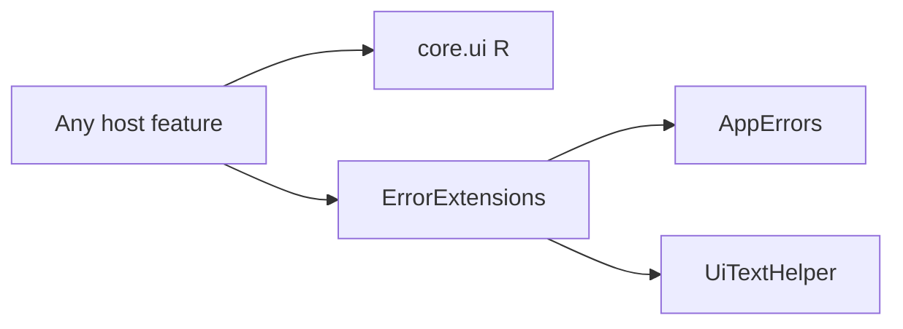

# `:sample:core:ui` Logic Graph

## Purpose

Every shared resource in the host app, plus the error-to-text mapping that resolves them.

## Owns

- All `values*` resources: 230 strings across 30 locale folders, arrays, colors, themes, ad unit ids.
- Shared `drawable`, `drawable-anydpi`, `drawable-xhdpi` and `layout` resources.
- `ErrorExtensions`, which maps `AppErrors` to `UiTextHelper`.

## Does not own

- Resources that identify the application — launcher mipmaps and the `xml/` configuration the
  manifest points at — which stay in `:sample:app`.
- Composables. Every screen lives with its feature; this module is resources plus one mapper.

## Depends on

- [`:sample:core:common`](../common/README.md) for `AppErrors`.
- [`:library:core:ui`](../../../library/core/ui/README.md) for `UiTextHelper` and the toolkit mapper it delegates to.
- [`:library:core:designsystem`](../../../library/core/designsystem/README.md) for the theme the resources feed.

## Used by

- Every `:sample` module. The generated `R` class here is the host's only resource namespace.

## Flow chart

## Public contracts

- The `R` class and `AppErrors.asUiText()`.

## Internal implementations

- None.

## Current risks

Resources are centralised rather than owned per feature, so any string change recompiles every
module that reads `R`, and nothing prevents one feature from using another's strings.

The alternative was worse: with 230 strings across 30 locale folders, splitting them per feature
means editing 30 files per module and re-splitting on every future move, with a silently missing
translation as the failure mode.

## Migration notes

`ErrorExtensions` was in the host's `core/utils` package. It moved here rather than to
`:sample:core:common` because it resolves string resources, and putting it in `common` would have
pointed the constants module at the resource module.
