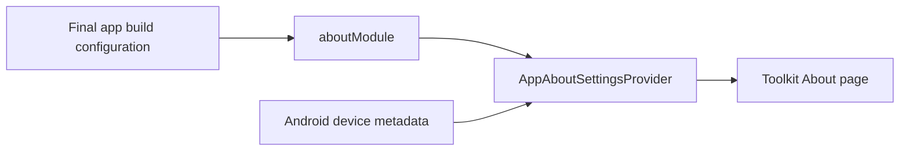

# `:sample:feature:about` Logic Graph

## Purpose

Supplies sample build and device metadata to the Toolkit About page.

## Owns

- `AppAboutSettingsProvider`, which formats metadata using Toolkit resources.
- `aboutModule(hostBuildConfig)`, which binds `AboutSettingsProvider` with the final app's build
  configuration.

## Does not own

- About UI, owned by [`:library:feature:about`](../../../library/feature/about/README.md).
- The existing showcase-unlock content, owned by `:sample:feature:settings` and passed to
  `aboutPages` by the app.
- Final application identity and build configuration, owned by `:sample:app`.
- Toolkit module ordering, owned by `:sample:core:apptoolkit`.

## Depends on

- `:library:feature:about` for its provider contract, resources, and exported dependencies.

## Used by

- `:sample:app`, which passes `aboutModule(hostBuildConfig)` to `appToolkitHostModules`.

## Flow chart

## Architectural decisions

About has a separate sample feature so future metadata and provider customization can grow here.
It uses the Toolkit About page and does not depend on another sample feature. The provider takes
`AppToolkitHostBuildConfig` rather than this module's `BuildConfig`, so it describes the final app.

## Public contracts

- `aboutModule(hostBuildConfig)` and `AppAboutSettingsProvider`.

## Current risks

The app must pass its own build configuration. Using this library module's variant metadata would
mislabel the final application build.
