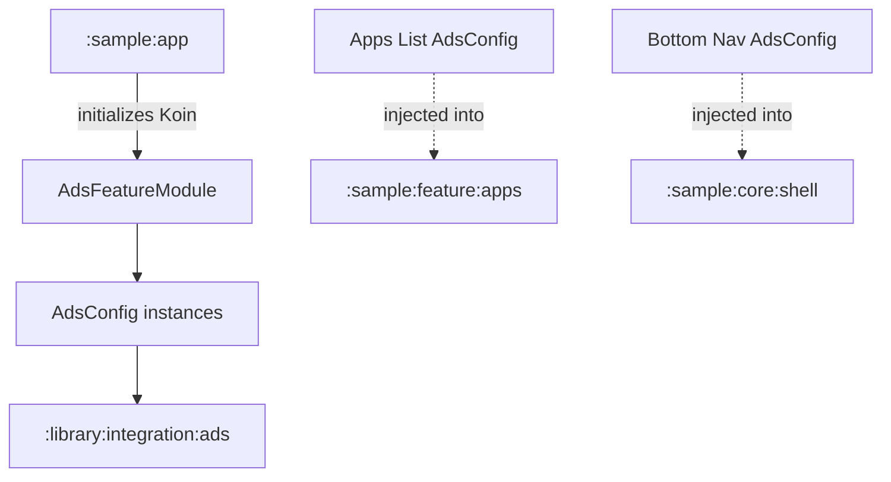

# `:sample:feature:ads` Logic Graph

## Purpose

Centralizes the Ad configuration for the sample app, bridging specific Ad Unit IDs to the App
Toolkit's Ad infrastructure.

## Owns

- `AdsFeatureModule`, which defines the `AdsConfig` instances for different surfaces (Apps List, App
  Details, Bottom Nav, etc.).
- The mapping between the sample's `AdsConstants` and the library's `AdsQualifiers`.

## Depends on

- `:sample:core:common` for `AdsConstants`.
- [`:library:apptoolkit`](../../../library/apptoolkit/README.md) for the `AdsConfig` model and
  `AdsQualifiers`.

## Used by

- `:sample:app` to compose the DI graph.
- Various features in the sample app via the library's Ad components (which inject the `AdsConfig`
  provided here).

## Flow chart

## Architectural decisions

- **Decentralized Configuration**: Ad Unit IDs are maintained in the sample's `core:common` and
  mapped to library contracts in this feature module.
- **Qualifier-based Injection**: Uses Koin's `named` qualifiers to provide different ad
  configurations for different UI contexts.
