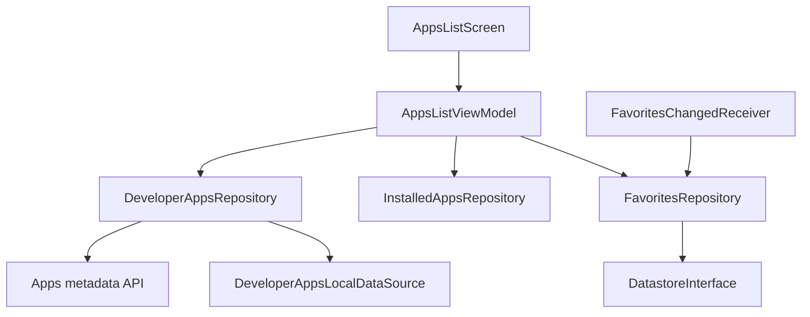

# `:sample:feature:apps` Logic Graph

## Purpose

The developer's app catalogue: listing, details, favorites, and install state.

## Owns

- `DeveloperAppsRepository`, `InstalledAppsRepository`, `FavoritesRepository` and their `Default`
  implementations, the API DTOs and their mapping.
- `DeveloperAppsLocalDataSource`, which persists the last successfully downloaded compact
  catalogue as an atomic JSON file.
- `AppsListViewModel`, the list and detail-sheet composables, and the native-ad placement in the
  list.
- `appsListEntryBuilder`, this feature's navigation entry.
- `FavoritesChangedReceiver`, which keeps the widget in step with favorites.

## Does not own

- The route keys it registers against, owned by [
  `:sample:core:navigation`](../../core/navigation/README.md).
- Widget rendering, owned by [`:sample:widget`](../../widget/README.md), which reads this module's
  repository.

## Depends on

- `:sample:core:navigation`, `:sample:core:common`, `:sample:core:datastore`, `:sample:core:ui`.
- [`:library:apptoolkit`](../../../library/apptoolkit/README.md) for ad slots, state contracts and
  Ktor.

## Used by

- `:sample:widget` for the catalogue, and `:sample:app` for DI and the navigation graph.

## Flow chart

## Public contracts

- The three repositories, `AppsListViewModel`, `appsListEntryBuilder`, `AppInfo`/`AppSummary`/
  `AppDetails`.

## Internal implementations

- DTO mapping, catalogue-file serialization, ad interleaving, and install-state inspection through
  the package manager.

## Source of truth and failure behavior

The remote endpoint remains authoritative. Each successful compact-catalogue response atomically
replaces the local JSON snapshot. When a request fails, `DeveloperAppsRepository` exposes that
snapshot as stale data together with the network error, allowing non-screen consumers such as the
widget to remain useful offline. Corrupt snapshots are deleted and treated as cache misses.

## Current risks

The module applies the Kotlin serialization plugin because its DTOs are `@Serializable`. Compiling
without it succeeds and fails only at decode time, so the plugin has to stay even though nothing
about the source makes the dependency visible.

## Migration notes

`AppsListViewModel` used to take six pass-through use cases wrapping these three repositories. It
now
takes the repositories; the use cases added a duplicated breadcrumb and nothing else.
